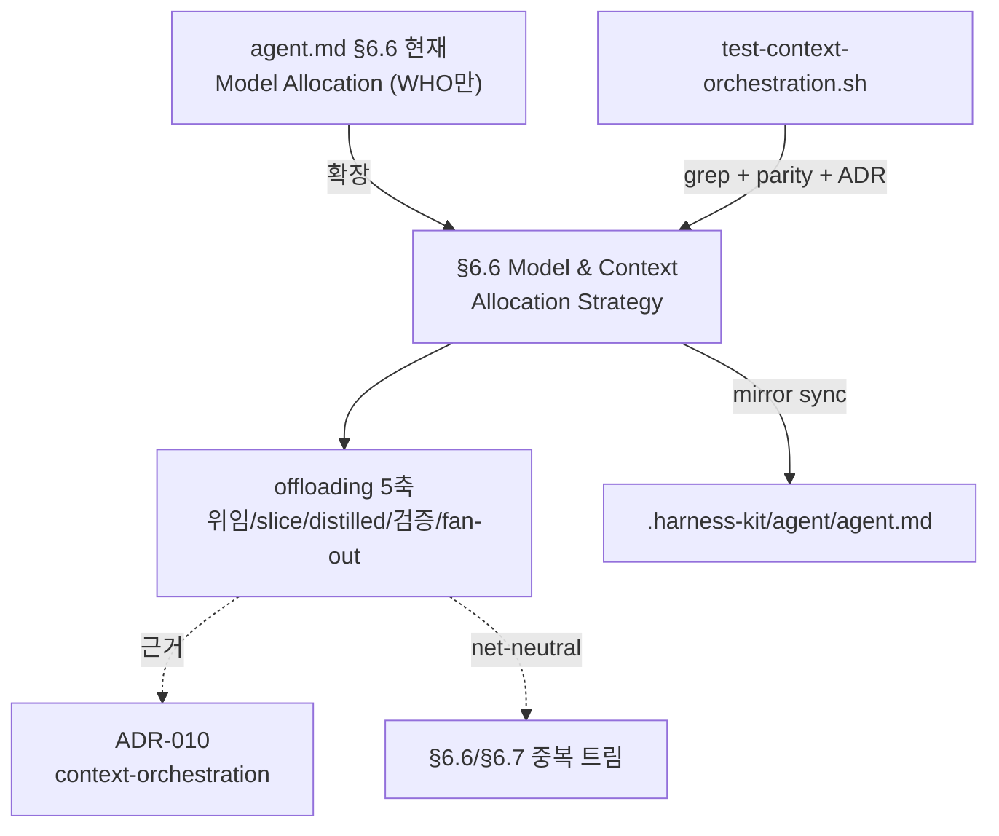

# Implementation Plan: spec-21-01

## 📋 Branch Strategy

- 신규 브랜치: `spec-21-01-context-orchestration` (브랜치 이름 = spec 디렉토리 이름, `feature/` prefix 없음)
- 시작 지점: `main` (base branch `phase-21-director-mode` 는 첫 hk-ship 시 생성되므로, 본 첫 spec 은 `main` 에서 분기)
- 첫 task 가 브랜치 생성을 수행함

## 🛑 사용자 검토 필요 (User Review Required)

> 본 Plan 을 Accept 하기 전에 사용자가 명시적으로 확인해야 할 항목들.

> [!IMPORTANT]
> - [ ] **단어 예산 스코핑**: 본 spec 의 §6.6 확장은 agent.md 단어 순증을 *최소화*(±50w 이내, 중복 다이어트 상쇄). 5축 추가(~80-100w) > 상쇄 여지(~45w)라 *완전 0* 은 비현실적. 단어 예산 테스트(Check 3)의 *완전 green*(7285w → <6000w)은 **본 spec 범위 아님** — phase 성공기준 4 로 후속 누적. 즉 spec-21-01 머지 후에도 Check 3 은 여전히 red 일 수 있음. 이 스코핑에 동의?
> - [ ] **기존 §6.6/§6.7 산문 일부 다이어트**: net-neutral 상쇄를 위해 §6.6 의 위임 지시 문장(3축으로 흡수)·docs-only 예외(§6.7 threshold 와 중복) 등 *중복만* 외과적으로 트림. 비중복 규칙은 보존. 동의?

> [!WARNING]
> - [ ] **always-on 정책**: 본 §6.6 확장은 director mode 토글과 무관하게 *항상* 메인 에이전트 행동을 규율함(토글형 아님). 모든 세션의 위임 기본값이 바뀜 — 의도된 변경.
> - [ ] **모델 표 불변**: §6.6 의 Opus/Sonnet 하드코딩은 본 spec 에서 건드리지 않음(de-hardcode 는 spec-21-04). 충돌 방지.

## 🎯 핵심 전략 (Core Strategy)

### 아키텍처 컨텍스트



### 주요 결정

| 컴포넌트 | 전략 | 이유 |
|:---:|:---|:---|
| **§6.6 확장** | 재작성 (cherry-pick 금지) | upstream agent.md 구조가 fork §6.6/§6.7 과 충돌 — fork 구조에 5축 재작성 |
| **배치** | §6.6 인라인 (always-on) | context orchestration 은 *항상 적용* 기반 정책 → 항상 로딩되는 agent.md 본문. (토글형 §6.8 protocol 만 별도 가이드 후보 — spec-21-03) |
| **단어 예산** | 순증 최소화 (±50w) | 이미 red(7285w). 5축 추가가 상쇄 여지보다 커 순증 0 비현실 — 중복 트림으로 ±50w 이내, 완전 green 은 phase 누적 |
| **ADR 번호** | fork 신규 010 | fork ADR-005 = ignore-symmetry — upstream 005 와 충돌, 참조로만 |
| **테스트** | grep 기반 | fork governance 테스트 관행(test-governance-dedup/test-director-protocol) 일치 |

### 📑 ADR 후보

- [x] ADR 가치 있는 결정 있음 → 후보 한 줄 요약: `context-orchestration` (type: **decision**) — `docs/decisions/ADR-010-context-orchestration.md`
- [ ] 없음

## 📂 Proposed Changes

### 거버넌스 (agent.md)

#### [MODIFY] `sources/governance/agent.md`
- `§6.6 Model Allocation Strategy` → `§6.6 Model & Context Allocation Strategy` 로 확장.
- 모델 표 *아래* 에 **Context offloading policy** 5축 단락 추가(영어, 간결):
  - ① delegate token-heavy/polluting labor (multi-file impl, broad search, log triage) — boundary per §6.7 dispatch threshold; keep judgment/coordination/verification on the main session.
  - ② inject a scoped slice, not full history.
  - ③ workers return a distilled result contract (commit SHA, test status, completion status full/partial/failed, key decisions) — never the full transcript.
  - ④ the orchestrator retains verification — never blindly trust worker output; on verification failure → §7 Hard Stop.
  - ⑤ fan out independent jobs (→ §6.7 parallel).
- always-on 한 줄: this policy applies to every session regardless of director mode (→ §6.8, spec-21-03).
- **net-neutral 다이어트**(중복만): 기존 "When delegating implementation to a Sonnet sub-agent, the main Opus agent MUST provide..." 문장은 ③(distilled contract) + ②(scoped slice)로 흡수해 압축. "Dispatch exception — docs-only tasks" 의 중복 설명은 §6.7 sub-agent dispatch threshold 참조로 축약.

```text
### 6.6 Model & Context Allocation Strategy
(... 기존 모델 표 유지 ...)
**Context offloading (orchestrator–worker)** — the main session is a *context orchestrator*; its context window is the single store of intent. When delegating:
1. Delegate token-heavy / polluting labor (boundary per §6.7 threshold); keep judgment, coordination, and verification on the main session.
2. Inject only a scoped slice ...
3. Workers return a distilled result contract (incl. completion status full/partial/failed) ... — never the full transcript.
4. The orchestrator retains verification ...; on failure → §7 Hard Stop.
5. Fan out independent jobs (→ §6.7).
This applies to every session regardless of director mode (→ §6.8). Rationale: ADR-010.
```

#### [MODIFY] `.harness-kit/agent/agent.md`
- 위 변경을 동일하게 미러(parity 필수 — `diff -q` 통과해야 함).

### ADR

#### [NEW] `docs/decisions/ADR-010-context-orchestration.md`
- frontmatter: `id: ADR-010`, `type: decision`, `date: 2026-06-04`, `status: accepted`.
- 본문(한국어): Context(메인 context 가 가장 비싼 자원 + WHO만 규정된 갭) / Decision(orchestrator–worker + offloading 5축, §6.6 반영) / Consequences(**always-on disambiguation**["정책 always-on, 위임은 토큰 무거운 노동 시에만, director mode 는 적극성 토글"] + **net-neutral convention** 1단락 포함) / Alternatives(fork 고유 결정 — 인라인 배치 vs 별도 가이드, net-neutral vs 적극 다이어트 — 에 초점, upstream 재탕 지양) / Related(§6.6·§6.7, fork ADR-009, *참조* upstream ADR-005).

### 테스트

#### [NEW] `tests/test-context-orchestration.sh`
- `set -uo pipefail`, bash 3.2 호환, 3 checks (단어 예산 가드 제외 — 기존 Check 3 과 이중 baseline 방지, critique 대안 C):
  - Check 1: `sources/governance/agent.md` §6.6 에 `orchestrator` / `worker` / `offloading` / `distilled` 용어 존재(grep).
  - Check 2: `sources/governance/agent.md` ↔ `.harness-kit/agent/agent.md` parity(`diff -q`).
  - Check 3: `docs/decisions/ADR-010-context-orchestration.md` 존재 + `type: decision` frontmatter.

## 🧪 검증 계획 (Verification Plan)

### 단위 테스트 (필수)
```bash
bash tests/test-context-orchestration.sh
```

### 회귀 (거버넌스 무 NEW 회귀 + 비악화)
```bash
bash tests/test-governance-dedup.sh
```
- 기대: Check 3(단어 수) TOTAL 을 머지 전후 비교 — 순증 ±50w 이내. Check 1/2/4/5/6 무 NEW 회귀(여전히 green). Check 3 자체는 red 일 수 있음(완전 green 은 phase 범위).

### 수동 검증 시나리오
1. `git show HEAD:sources/governance/agent.md` 의 §6.6 에 5축 단락 존재 — 기대: orchestrator/worker/distilled 용어 확인.
2. `diff sources/governance/agent.md .harness-kit/agent/agent.md` — 기대: 차이 없음(parity).
3. `wc -w sources/governance/constitution.md sources/governance/agent.md` 합계 — 기대: 머지 전 baseline 대비 +50w 이내.

## 🔁 Rollback Plan

- 거버넌스 문서 + ADR + 테스트 추가뿐이므로 브랜치 폐기로 즉시 롤백(코드/상태 변경 없음).
- 미러 불일치 발생 시: `sources/governance/agent.md` 를 SSOT 로 보고 `.harness-kit/agent/agent.md` 재동기화.

## 📦 Deliverables 체크

- [ ] task.md 작성 (다음 단계)
- [ ] 사용자 Plan Accept 받음
- [ ] (실행 후) 모든 task 완료
- [ ] (실행 후) walkthrough.md / pr_description.md ship
