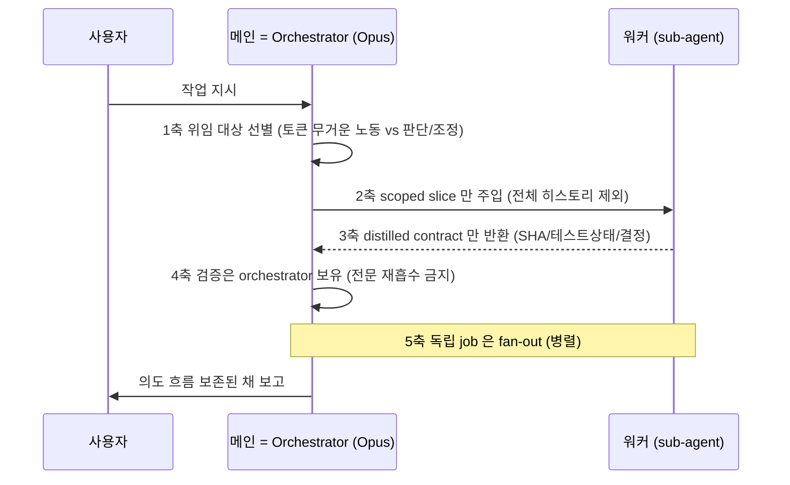

# spec-21-01: 컨텍스트 오케스트레이션 정책 (메인 = orchestrator)

## 📋 메타

| 항목 | 값 |
|---|---|
| **Spec ID** | `spec-21-01` |
| **Phase** | `phase-21` |
| **Branch** | `spec-21-01-context-orchestration` |
| **상태** | Planning |
| **타입** | Feature (거버넌스 규약) |
| **Integration Test Required** | no |
| **작성일** | 2026-06-04 |
| **소유자** | Leo |

## 📋 배경 및 문제 정의

### 현재 상황

fork 의 `agent.md §6.6` 은 **Model Allocation Strategy** — *누가(WHO)* 어떤 모델로 작업하는지(메인=Opus, task 실행=Sonnet sub-agent, review=Opus)만 규정한다. 그러나 **무엇을 위임하고, 무엇을 주입하고, 무엇을 반환받을지**(context 정책)는 비어 있다. `§6.7` 은 parallel/background/dispatch threshold 같은 워크플로 패턴을 다루지만 위임 시의 *context 계약*은 명시하지 않는다.

upstream 은 이 갭을 `ADR-005-context-orchestration` 으로 메우며 "메인 세션 = context orchestrator" 를 규약화했다. 핵심 관찰은 에이전트 작업에서 가장 비싼 자원이 메인 세션의 context 창이며, 토큰 무거운 노동(다파일 구현·광역 탐색·로그 분류)을 메인이 직접 하면 raw 산출물이 context 를 오염시켜 *의도의 흐름*을 잃는다는 것이다.

### 문제점

- 위임이 임의적이다 — *모델*만 정하고 *무엇을/어떻게* 위임할지 계약이 없어 세션마다 일관성이 없다.
- 워커가 전체 transcript 를 반환하면 그게 바로 메인 context 를 오염시키는 원인인데 이를 막는 규칙이 없다.
- 검증 책임 소재가 불명확하다 — 워커 결과를 맹신하면 silent 결함이 유입된다.
- 이 정책은 director mode(phase-21 후속 spec) 토글과 *무관하게 항상 적용*되어야 하는 기반인데 그 always-on 성격이 명문화되지 않았다.

### 해결 방안 (요약)

`sources/governance/agent.md §6.6` 을 **orchestrator–worker + context offloading 정책**(5축)으로 확장하고 근거를 신규 `ADR-010-context-orchestration` 에 자산화한다. cherry-pick 이 아니라 fork 구조에 맞춰 재작성한다. 확장은 **agent.md 단어 수가 순증하지 않도록**(net-neutral) 기존 §6.6/§6.7 중복을 다이어트하며 진행하여 이미 red 인 거버넌스 단어 예산 테스트를 *악화시키지 않는다*. `sources ↔ .harness-kit` 미러를 동기화하고 grep 기반 단위 테스트(`tests/test-context-orchestration.sh`)로 검증한다.

## 📊 개념도

## 🎯 요구사항

### Functional Requirements

1. **§6.6 확장 — context offloading 5축**: `agent.md §6.6` 에 다음 5축을 명문화한다.
   - 1축 **위임 대상**: 토큰 무거운/오염성 노동(다파일 구현·광역 탐색·로그 분류)은 위임, 판단·조정·검증은 메인 보유. 위임 경계는 §6.7 sub-agent dispatch threshold 를 따름.
   - 2축 **scoped slice 주입**: 워커에 전체 히스토리가 아닌 작업에 필요한 최소 컨텍스트만 주입.
   - 3축 **distilled result contract**: 워커는 증류된 결과(커밋 SHA·테스트 상태·**완료 상태(성공/부분/실패)**·주요 결정 목록)만 반환. transcript 전문 반환 금지.
   - 4축 **검증 보유**: orchestrator 가 검증 의무를 보유 — 워커 결과를 맹신하지 않음. 검증 실패 시 §7 Hard Stop 으로 (절차 본격 정의는 §6.8/spec-21-03).
   - 5축 **fan-out**: 의존성 없는 독립 job 은 병렬 디스패치(§6.7 parallel 연계).
2. **always-on 명시**: 본 정책은 director mode 토글과 무관하게 *항상 적용*되는 기반 정책임을 명시한다(후속 spec-21-03 의 토글형 protocol 과 구별).
3. **ADR-010 작성**: `docs/decisions/ADR-010-context-orchestration.md` (type: `decision`) — Context/Decision/Consequences/Alternatives 구조. 본문은 *fork 고유 3결정*(인라인 배치 / net-neutral 스코핑 / 010 번호)에 초점(upstream Alternatives 재탕 지양). Consequences 에 always-on disambiguation("정책은 항상 적용되나 위임은 토큰 무거운 노동이 있을 때만 — director mode 는 위임 *적극성* 토글이지 정책 on/off 아님") + net-neutral 작업 관행(convention) 1단락 흡수. upstream ADR-005 는 *참조*로만 표기(번호 충돌).
4. **미러 동기화**: `sources/governance/agent.md` 변경을 `.harness-kit/agent/agent.md` 에 동일 반영(parity).
5. **단위 테스트**: `tests/test-context-orchestration.sh` — 3 checks: §6.6 핵심 용어(orchestrator/worker/offloading/distilled) grep + 미러 parity + ADR-010 존재. **단어 예산 가드는 본 테스트에 넣지 않는다** — 동일 지표 이중 baseline 방지를 위해 기존 `test-governance-dedup.sh` Check 3 의 before/after 비교(walkthrough 증빙)로 처리(critique 대안 C).

### Non-Functional Requirements

1. **단어 예산 순증 최소화**: 본 spec 의 §6.6 확장은 agent.md 단어 순증을 **최소화한다**(±50w 이내, 기존 중복 다이어트로 상쇄). 5축 추가(~80-100w) > 상쇄 여지(~45w)라 *완전 0* 은 비현실적이므로 잔여 순증은 후속 다이어트(phase 성공기준 4)로 흡수한다. 머지 전후 `test-governance-dedup.sh` Check 3 의 TOTAL 을 walkthrough 에 before/after 기록. (Check 3 의 *완전 green*(7285w→<6000w)은 본 spec 범위 아님, 누적 달성.)
2. **거버넌스 언어**: agent.md 내 본문은 영어(constitution/agent.md 영어 전용 원칙). ADR 본문은 한국어(fork ADR 관행).
3. **중복 없음**: §6.7(workflow patterns)와 내용 중복 없이 *참조*만(예: fan-out → §6.7 parallel).
4. **fork 정합**: §6.6 의 기존 모델 표(Opus/Sonnet 하드코딩)는 *건드리지 않는다* — de-hardcode 는 spec-21-04 범위.

## 🚫 Out of Scope

- **§6.8 Director Mode Protocol** (intent handshake / scoped brief 명세 등) → spec-21-03.
- **`/hk-director` 토글 + `sdd config director-mode` + status/doctor 노출** → spec-21-02.
- **역할 기반 모델 config de-hardcode** (director/worker/scout 매핑) → spec-21-04.
- **페르소나 리뷰 패널** → spec-21-05.
- **단어 예산 테스트의 *완전 green*** (7285w → <6000w 대규모 다이어트) → phase 성공기준 4, 후속 spec 누적(필요 시 spec-21-06 분리). 본 spec 은 *비악화*까지만.
- **단어 예산 상한 *값* 재설정**(6000 유지 vs 상향) → 본 spec 에서 결정하지 않음(phase 결정 기록의 OPEN 항목, 다이어트 spec 에서 확정).

## 📑 ADR 후보 (Architecture Decision Records)

- [x] ADR 가치 있는 결정 있음 → 후보 한 줄 요약: `context-orchestration` (type: **decision**) — 메인 세션 = context orchestrator, offloading 5축. `docs/decisions/ADR-010-context-orchestration.md`.
- [ ] 없음

## 🔍 Critique 결과 (선택)

Opus 서브에이전트 비평 완료(전체: `critique.md`). 5축은 Anthropic lead-researcher / orchestrator–worker 패턴의 충실한 포팅으로 *방향성 견고* 확인. 반영한 6개 개선:
- **[모순]** 단어 예산 가드를 신규 테스트 Check 4(7285 하드코딩)로 두지 않고 기존 Check 3 before/after 증빙으로(대안 C) — 동일 지표 이중 baseline 제거.
- **[모순]** NFR1 "순증 0" → "순증 최소화(±50w)" (5축 추가가 상쇄 여지보다 큼).
- **[누락]** 3축에 완료 상태(성공/부분/실패), 4축에 검증 실패 시 §7 Hard Stop 포인터.
- **[모호]** 1축 위임 경계를 §6.7 dispatch threshold 참조.
- **[과잉/모호]** ADR-010 본문을 fork 고유 결정 + always-on disambiguation 에 집중.

추적만(spec-21-03 이연): no-nested-dispatch 불변식, always-on-vs-toggle 배치 invariant.

## ✅ Definition of Done

- [ ] `tests/test-context-orchestration.sh` 전체 PASS (§6.6 용어 + 미러 parity + ADR-010 존재)
- [ ] `tests/test-governance-dedup.sh` Check 3 TOTAL 을 머지 전후 walkthrough 에 before/after 기록(순증 ±50w 이내), 그 외 Check 무 NEW 회귀
- [ ] `walkthrough.md` 와 `pr_description.md` 작성 및 ship commit
- [ ] `spec-21-01-context-orchestration` 브랜치 push 완료
- [ ] 사용자 검토 요청 알림 완료
