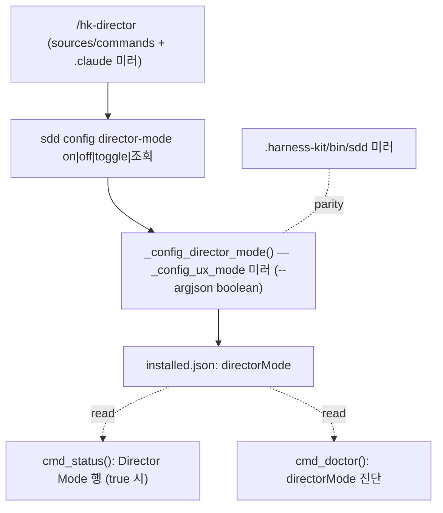

# Implementation Plan: spec-21-02

## 📋 Branch Strategy

- 신규 브랜치: `spec-21-02-director-mode-switch` (브랜치 이름 = spec 디렉토리 이름)
- 시작 지점: **`phase-21-director-mode`** (base branch 모드 — spec-21-01 머지 완료된 최신 base 에서 분기)
- 첫 task 가 브랜치 생성을 수행함

## 🛑 사용자 검토 필요 (User Review Required)

> [!IMPORTANT]
> - [ ] **switch-only 스코프**: 본 spec 은 director mode 의 *스위치*(플래그 + 노출)만 포팅한다. `directorMode=true` 가 *무엇을 하는지*(에이전트 행동 규약)는 **§6.8/spec-21-03** 책임. 즉 본 spec 머지 후 `sdd config director-mode on` 은 동작하지만 *행동 변화는 아직 없다*. 이 분리에 동의?
> - [ ] **이중 sdd 미러**: `sources/bin/sdd`(키트 원본) + `.harness-kit/bin/sdd`(installed — 본 세션이 실제 실행)를 **둘 다** 수정·동기화. installed 본도 고쳐야 도그푸딩 세션에서 토글이 실제 동작.

> [!WARNING]
> - [ ] **jq 타입 차이**: `ux-mode` 는 `--arg`(문자열 interactive|text), `director-mode` 는 `--argjson`(boolean true/false). 미러링 시 이 차이 주의 (Explore 맵 §5).
> - [ ] **기존 config 무회귀**: `cmd_config` 디스패치에 `director-mode)` 케이스만 추가 — `ux-mode`/`precheck` 불변.

## 🎯 핵심 전략 (Core Strategy)

### 아키텍처 컨텍스트



### 주요 결정

| 컴포넌트 | 전략 | 이유 |
|:---:|:---|:---|
| **config 구현** | `_config_ux_mode` 미러 + boolean | 기존 패턴 재사용, churn 최소. `--argjson` 으로 타입만 변경 |
| **포팅 방식** | upstream spec-20-01 표면 복사 | 자족적(sdd config 분기·gh 비의존) — 거버넌스 재구현 불요 |
| **테스트 범위** | upstream T01~T10 부분집합 | T11~T14(§6.6 roles/config models/persona)는 21-04/21-05 |
| **동작 분리** | switch-only | 행동 규약은 §6.8(21-03) — 본 spec 은 플래그+노출만 |
| **미러** | sources + .harness-kit / sources + .claude | 도그푸딩(installed 실행) + 키트 배포 동시 충족 |

### 📑 ADR 후보

- [ ] 있음
- [x] 없음 — 기계적 포팅. 아키텍처 결정은 ADR-010 / ADR-011(21-03) 보유.

## 📂 Proposed Changes

### 슬래시 커맨드

#### [NEW] `sources/commands/hk-director.md`
- frontmatter `description: 디렉터 모드 토글 — on/off/toggle/상태 조회`.
- 본문: `bash .harness-kit/bin/sdd config director-mode $ARGUMENTS` 실행 + 결과 출력. "on 시 디렉터 프로토콜(spec-21-03)이 적용된다 / 인수 없으면 조회 / 다음 세션부터 적용" 안내.

#### [NEW] `.claude/commands/hk-director.md`
- 위 파일의 미러 (parity — `diff -q` 통과).

### sdd CLI (이중 미러)

#### [MODIFY] `sources/bin/sdd` (+ `.harness-kit/bin/sdd` 동일 반영)
- **help 텍스트** (config 섹션, ~line 54-58): `config director-mode [on|off|toggle]` 행 추가.
- **`cmd_config()` 디스패치** (~line 1533-1540): `director-mode)  _config_director_mode "$@" ;;` 케이스 추가 + die 사용법 문자열 갱신.
- **`_config_director_mode()` 신규 함수** (`_config_ux_mode` 바로 뒤 ~line 1681): 인수 없음→`jq -r '.directorMode // false'` 조회 출력(`directorMode: on|off`); `on/off/toggle`→boolean 결정; `jq --argjson v "$value" '.directorMode = $v'` 로 installed.json 갱신; `ok "directorMode = on|off"`.
- **`cmd_status()` Director Mode 행** (Plan Accept 행 직후 ~line 709): `directorMode=true` 일 때만 `printf "  Director Mode: on\n"`.
- **`cmd_doctor()` 진단** (설정 섹션 ~line 2300): directorMode on/off 한 줄.

```text
# _config_director_mode (의사코드, bash 3.2)
sub="${1:-}"
cur=$(jq -r '.directorMode // false' "$INSTALLED")
case "$sub" in
  "")     echo "directorMode: $([ "$cur" = true ] && echo on || echo off)"; return ;;
  on)     v=true ;;  off) v=false ;;
  toggle) [ "$cur" = true ] && v=false || v=true ;;
  *)      die "사용법: sdd config director-mode [on|off|toggle]" ;;
esac
tmp=$(mktemp); jq --argjson v "$v" '.directorMode = $v' "$INSTALLED" > "$tmp" && mv "$tmp" "$INSTALLED"
ok "directorMode = $([ "$v" = true ] && echo on || echo off)"
```

#### [MODIFY] `.harness-kit/installed.json`
- `directorMode: false` 기본값 추가 (선택 — jq `// false` fallback 으로 미존재 시에도 안전; 명시값 권장).

### 테스트

#### [NEW] `tests/test-director-mode.sh`
- upstream T01~T10 부분집합, `tests/lib/fixture.sh` 사용, `HARNESS_DRIFT_FETCH=0`:
  - T01/T02: `hk-director.md` 존재+`description` / `.claude` 미러 parity.
  - T03: `config director-mode`(인수 없음) → `directorMode:` 출력.
  - T04/T05: `on`→true / `off`→false (installed.json).
  - T06/T07: `toggle` off→on / on→off.
  - T08/T09: `status` directorMode=true 시 "Director Mode" 행 포함 / false 시 미포함.
  - T10: `doctor` → directorMode 텍스트 포함.

## 🧪 검증 계획 (Verification Plan)

### 단위 테스트 (필수)
```bash
bash tests/test-director-mode.sh
```

### 회귀 + 실제 동작 (도그푸딩)
```bash
bash tests/test-governance-dedup.sh
bash .harness-kit/bin/sdd config director-mode on
bash .harness-kit/bin/sdd status --no-drift
```
- 기대: test-director-mode 전체 PASS; governance 무 NEW 회귀; 실제 `sdd config director-mode on` → installed.json directorMode=true + status 에 "Director Mode" 행.

### 수동 검증 시나리오
1. `sdd config director-mode toggle` 2회 → off→on→off 왕복 — 기대: installed.json 값 반전.
2. `diff sources/bin/sdd .harness-kit/bin/sdd` (director 관련 부분) — 기대: parity.
3. `diff sources/commands/hk-director.md .claude/commands/hk-director.md` — 기대: 차이 없음.

## 🔁 Rollback Plan

- sdd 변경은 `cmd_config` 케이스 추가 + 신규 함수 + status/doctor 한 줄 — 브랜치 폐기로 롤백. installed.json `directorMode` 필드는 무해(미사용 시 fallback).
- 미러 불일치 시 `sources/bin/sdd` 를 SSOT 로 `.harness-kit/bin/sdd` 재동기화.

## 📦 Deliverables 체크

- [ ] task.md 작성 (다음 단계)
- [ ] 사용자 Plan Accept
- [ ] (실행 후) 모든 task 완료
- [ ] (실행 후) walkthrough.md / pr_description.md ship
