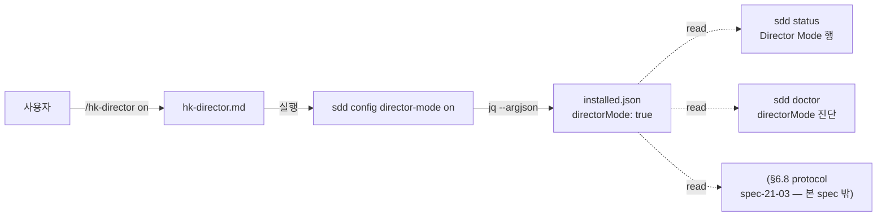

# spec-21-02: 디렉터 모드 토글 스위치 (`/hk-director` + sdd config)

## 📋 메타

| 항목 | 값 |
|---|---|
| **Spec ID** | `spec-21-02` |
| **Phase** | `phase-21` |
| **Branch** | `spec-21-02-director-mode-switch` |
| **상태** | Planning |
| **타입** | Feature (포팅) |
| **Integration Test Required** | no |
| **작성일** | 2026-06-04 |
| **소유자** | Leo |

## 📋 배경 및 문제 정의

### 현재 상황

spec-21-01 에서 context orchestration 정책(agent.md §6.6, ADR-010)을 *always-on* 기반으로 확립했다. 그러나 사용자가 director mode 를 **명시적으로 켜는 스위치**가 없다. upstream 은 이를 `/hk-director` 슬래시 커맨드 + `sdd config director-mode` 토글 + `installed.json` 영속화 + `sdd status`/`sdd doctor` 노출로 구현했다(spec-20-01).

fork 의 `sdd config` 는 현재 `ux-mode`(interactive|text)·`precheck` 만 지원한다(`_config_ux_mode` 패턴). director-mode 를 추가하면 같은 패턴을 boolean 으로 재사용할 수 있다.

### 문제점

- director mode 를 켜고 끌 사용자 진입점이 없다 — 후속 protocol(§6.8/spec-21-03)이 읽을 *플래그*가 부재.
- 현재 어떤 모드로 동작 중인지 `sdd status`/`sdd doctor` 에서 확인 불가.

### 해결 방안 (요약)

upstream spec-20-01 의 **스위치 표면**을 fork 구조에 포팅한다. `sdd config director-mode (on|off|toggle|조회)` 를 기존 `_config_ux_mode` 패턴을 미러링하되 **boolean(`--argjson`)** 으로 구현하고, `installed.json` 의 `directorMode` 필드에 영속화한다. `/hk-director` 슬래시 커맨드(+`.claude` 미러)를 추가하고, `sdd status`(directorMode=true 시 "Director Mode" 행)·`sdd doctor`(directorMode 진단 한 줄)에 노출한다. **동작/프로토콜은 본 spec 범위가 아니다** — `on` 은 플래그만 세팅하며, 그 플래그가 *무엇을 하는지*는 §6.8(spec-21-03)에서 정의한다.

## 📊 개념도

## 🎯 요구사항

### Functional Requirements

1. **`sdd config director-mode`** (인수 파싱):
   - 인수 없음 → 현재값 조회 출력 `directorMode: on|off` (또는 `directorMode:` 포함 라인).
   - `on` → `directorMode=true`, `off` → `directorMode=false`, `toggle` → 현재값 반전.
   - `installed.json` 에 `--argjson v` 로 boolean 저장 (ux-mode 의 `--arg` 문자열과 구별).
2. **`installed.json` `directorMode` 필드**: boolean, 미존재 시 `// false` fallback (안전).
3. **`/hk-director` 슬래시 커맨드**: `sources/commands/hk-director.md` + `.claude/commands/hk-director.md` 미러. `sdd config director-mode $ARGUMENTS` 호출 + 결과 출력 (frontmatter `description` 포함).
4. **`sdd status` 노출**: `directorMode=true` 일 때만 "Director Mode" 행 출력 (Plan Accept 행 근처). false 시 미출력.
5. **`sdd doctor` 노출**: directorMode on/off 진단 한 줄.
6. **이중 미러 동기화**: `sources/bin/sdd` ↔ `.harness-kit/bin/sdd` (도그푸딩 — 본 세션에서 실제 실행되는 건 installed 본). `sources/commands/hk-director.md` ↔ `.claude/commands/hk-director.md`.
7. **단위 테스트**: `tests/test-director-mode.sh` — upstream T01~T10 부분집합 (커맨드 존재/미러, config on/off/toggle/조회, installed.json 반영, status 행, doctor 텍스트).

### Non-Functional Requirements

1. **bash 3.2 호환**: `--argjson`·jq 사용, bash 4+ 기능 금지 (constitution).
2. **기존 config 무회귀**: `ux-mode`·`precheck` 동작 불변 (같은 `cmd_config` 디스패치에 케이스만 추가).
3. **동작 없음(switch-only)**: `directorMode=true` 가 에이전트 행동을 바꾸는 규약은 본 spec 에 없음 — §6.8(spec-21-03) 책임. 본 spec 은 *플래그 + 노출*만.
4. **fixture 기반 테스트**: `tests/lib/fixture.sh` 사용 (upstream 테스트 관행), 실제 repo state 비오염.

## 🚫 Out of Scope

- **§6.8 Director Mode Protocol** (directorMode=true 의 *행동* 규약) → spec-21-03.
- **`sdd config models` + director/worker/scout 역할 매핑** (upstream T12, §6.6 role 용어) → spec-21-04.
- **review 커맨드 페르소나 패널** (upstream T13/T14) → spec-21-05.
- **agent.md §6.6 의 director/worker/scout 용어 추가** (upstream T11) → spec-21-04 (model config 와 함께).

## 📑 ADR 후보 (Architecture Decision Records)

- [ ] ADR 가치 있는 결정 있음
- [x] 없음 — 기계적 포팅(스위치 표면). 아키텍처 결정은 ADR-010(context-orch)·ADR-011(director protocol, spec-21-03)이 보유.

## 🔍 Critique 결과 (선택)

<!-- 미실행. -->

## ✅ Definition of Done

- [ ] `tests/test-director-mode.sh` 전체 PASS (T01~T10 부분집합)
- [ ] `sdd config director-mode on/off/toggle/조회` 동작 + `installed.json` 반영 (실제 실행 검증)
- [ ] `sources ↔ .harness-kit` (sdd) / `sources ↔ .claude` (hk-director.md) 미러 parity
- [ ] 기존 `test-governance-dedup.sh` 등 무 NEW 회귀
- [ ] `walkthrough.md` / `pr_description.md` ship + 브랜치 push + 알림
