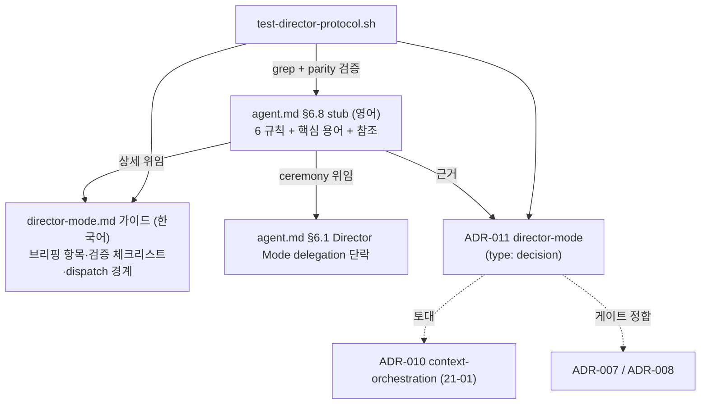

# Implementation Plan: spec-21-03

## 📋 Branch Strategy

- 신규 브랜치: `spec-21-03-director-protocol` (브랜치 이름 = spec 디렉토리 이름, `feature/` prefix 없음)
- 시작 지점: **`phase-21-director-mode`** (phase base 브랜치 모드 — main 아님). 직전 spec(21-02) PR 은 phase base 에 머지 완료(constitution §5.1 충족).
- 첫 task 가 브랜치 생성을 수행함. Spec PR target = `phase-21-director-mode`.

## 🛑 사용자 검토 필요 (User Review Required)

> 본 Plan 을 Accept 하기 전에 사용자가 명시적으로 확인해야 할 항목들.

> [!IMPORTANT]
> - [ ] **§6.8 배치 = 별도 가이드 + stub** (§11.3 재검증서 확정): agent.md 에는 간결 stub(영어, 핵심 용어 보유), 운영 상세는 `director-mode.md`(한국어) 분리. inline 전체 작성이 아님.
> - [ ] **단어 예산 green 은 본 spec DoD 아님**: 본 spec 은 agent.md 순증만 → `test-governance-dedup.sh` Check 3 는 red 유지(예상됨). green 복구는 spec-21-06 + phase Done 조건.
> - [ ] **검증 불변식**: 디렉터는 워커 transcript 전문 재흡수 금지 — 테스트 재실행 + 동작 스모크 + 증류 계약 대조로만 검수(ADR-010 ④축 운영화).

> [!WARNING]
> - [ ] **거버넌스 문서 변경**: agent.md(§6.8 stub + §6.1 단락) 는 *모든 세션에 로딩*되는 강제 규약. 설치 대상에도 `update.sh` 로 전파됨. 신규 `director-mode.md` 도 install glob 으로 자동 배포.
> - [ ] **이중 미러 필수**: `sources/governance/` 수정 시 `.harness-kit/agent/` 미러 동시 반영(parity 테스트가 강제).

## 🎯 핵심 전략 (Core Strategy)

### 아키텍처 컨텍스트



### 주요 결정

| 컴포넌트 | 전략 | 이유 |
|:---:|:---|:---|
| **§6.8 배치** | agent.md 간결 stub + 별도 `director-mode.md` 가이드 | native-feature-usage.md 패턴. agent.md 순증 최소화로 단어 예산 압박을 21-06 으로 안 넘김. 21-01 이 §6.8 을 분리 후보로 표시 |
| **언어** | stub/§6.1 = 영어, 가이드 = 한국어 | agent.md 영어 전용(거버넌스). 가이드는 native-feature-usage.md 와 동일 위상(한국어 사용 지침) |
| **구현 주체** | 메인 직접 작성 | governance prose 는 판단·정합 검토가 핵심(orchestrator 보유 노동). 위임 ROI 낮음 (ADR-010 docs-only dispatch 예외) |
| **테스트 단어예산** | `test-director-protocol.sh` 에 6000w 게이트 미포함 | 동일 지표 이중 baseline 금지(21-01 결정). Check 3 SSOT = `test-governance-dedup.sh`. 본 spec 은 red 유지가 정상 |
| **ADR 번호** | fork 신규 011 | upstream ADR-006 은 번호 충돌(fork 006=code-review-gate). upstream 005/006 은 참조만 |
| **task 순서** | test(red) → ADR → 가이드 → agent.md(green) | agent.md stub 이 ADR-011·가이드를 참조하므로 참조 대상을 먼저 생성. green 은 마지막 구현 task(§6.8 stub)에서 달성 |

### 📑 ADR 후보

- [x] ADR 가치 있는 결정 있음 → 후보 한 줄 요약: `director-mode` (type: **decision**) — directorMode 토글의 사용자 호출형 운영 프로토콜. ADR-011 로 본 spec 내 작성(Task 2).
- [ ] 없음

## 📂 Proposed Changes

### 거버넌스 (governance)

#### [MODIFY] `sources/governance/agent.md` + `.harness-kit/agent/agent.md` (미러)
- **§6.8 Director Mode Protocol stub 신규** (§6.7 뒤, §7 앞): 영어, 6개 규칙 간결 bullet. 핵심 용어(intent handshake / scoped brief / distilled contract / verification by action·no full-transcript re-ingestion / gates stay with director / no over-dispatch) 보유. 상세는 `director-mode.md` + ADR-011 참조. 게이트 규칙은 ADR-008·§5/§9 정합 1줄.
- **§6.1 Director Mode delegation 단락 신규** (§6.1 Strict Loop 뒤): Strict Loop 실행을 워커에 위임할 때의 분업 계약. 워커 커밋 범위에 **planning/artifact files** 포함 명시. §6.8 에서 `→ §6.1 Director Mode delegation` 로 참조.

```text
### 6.8 Director Mode Protocol
Active when `directorMode` is enabled (→ `/hk-director`). Full guide: director-mode.md; rationale: ADR-011.
1. Intent handshake — confirm intent before dispatch.
2. Scoped brief dispatch — files / expected behaviour / test cmd / commit format / artifact commit scope. Never the full history.
3. Distilled contract return — SHA + test status + decisions only; full transcript is a VIOLATION.
4. Verification by action — test re-run + live smoke + contract review; re-ingesting the worker's full transcript is PROHIBITED (→ ADR-010 ④).
5. Gates stay with director — Plan Accept / Ship / §5·§9 notification gates held by director + user, never delegated (→ ADR-008).
6. No over-dispatch — respect §6.7 threshold; director mode raises the delegation default, not mandates it.
(SDD ceremony execution delegation → §6.1 Director Mode delegation.)
```

#### [NEW] `sources/governance/director-mode.md` + `.harness-kit/agent/director-mode.md` (미러)
- 목적: §6.8 운영 상세의 자족적 한국어 가이드(설치 대상 배포). native-feature-usage.md 와 동일 위상.
- 내용: 6규칙 운영 절차 / 워커 scoped brief 필수 항목 표 / 검증 체크리스트(전문 재흡수 금지) / over·under-dispatch 경계 예시 / 게이트 보유 원칙(ADR-008·§5/§9 연결).

### ADR

#### [NEW] `docs/decisions/ADR-011-director-mode.md`
- frontmatter: `id: ADR-011`, `type: decision`, `status: accepted`. upstream ADR-006 의 fork 재구현 — Context/Decision/Consequences(검증 불변식 포함)/Alternatives/Related(ADR-010 토대, ADR-007/008 정합).

### 테스트

#### [NEW] `tests/test-director-protocol.sh`
- upstream `test-director-protocol.sh` fork 적응. Check: (1) §6.8 섹션 존재, (2) 핵심 용어 grep, (3) §6.1 Director Mode delegation 단락 + artifact files 용어, (4) 이중 미러 parity(agent.md + director-mode.md), (5) `director-mode.md` 존재, (6) ADR-011 존재 + `type: decision`. **단어 예산(6000w) 체크 미포함**(SSOT 분리).

## 🧪 검증 계획 (Verification Plan)

### 단위 테스트 (필수)
```bash
bash tests/test-director-protocol.sh
```

### 회귀 (거버넌스 무 NEW 회귀)
```bash
bash tests/test-governance-dedup.sh
# 기대: Check 1/2/4/5/6 PASS, Check 3(단어 예산)만 red 유지(예상 — 21-06 책임)
bash tests/test-director-mode.sh
bash tests/test-context-orchestration.sh
# 기대: 둘 다 무 회귀 PASS
```

### 수동 검증 시나리오
1. `grep "6.8 Director Mode Protocol" sources/governance/agent.md` — 기대: stub 헤더 검출.
2. `diff -q sources/governance/director-mode.md .harness-kit/agent/director-mode.md` — 기대: 차이 없음(parity).
3. `diff -q sources/governance/agent.md .harness-kit/agent/agent.md` — 기대: 차이 없음(parity).
4. `wc -w sources/governance/agent.md` 의 before/after — 기대: 순증 ≤ ~150w(NFR2).

## 🔁 Rollback Plan

- 모든 변경이 *추가형*(신규 §6.8 stub·신규 가이드·신규 ADR·신규 테스트)이고 기존 로직 무변경 — 브랜치 폐기 또는 commit revert 로 즉시 원복.
- 상태/데이터 영향 없음(거버넌스 문서 + 테스트 스크립트만).

## 📦 Deliverables 체크

- [ ] task.md 작성 (다음 단계)
- [ ] 사용자 Plan Accept 받음
- [ ] (실행 후) 모든 task 완료
- [ ] (실행 후) walkthrough.md / pr_description.md ship
