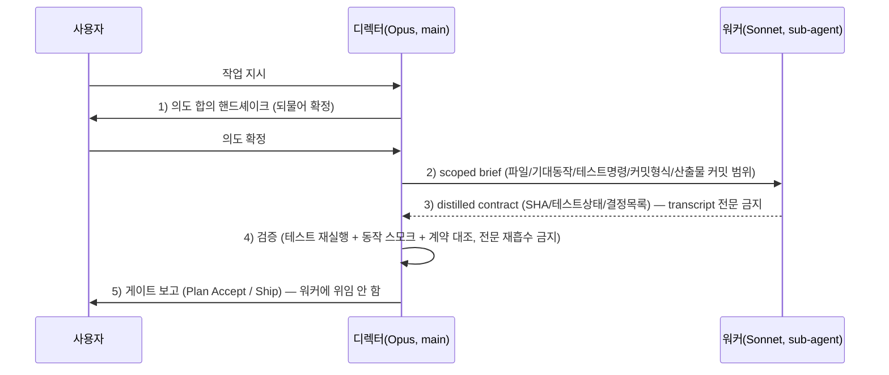

# spec-21-03: 디렉터 운영 프로토콜 명문화 (§6.8 + §6.1 위임 + ADR-011)

## 📋 메타

| 항목 | 값 |
|---|---|
| **Spec ID** | `spec-21-03` |
| **Phase** | `phase-21` |
| **Branch** | `spec-21-03-director-protocol` |
| **상태** | Planning |
| **타입** | Feature |
| **Integration Test Required** | no |
| **작성일** | 2026-06-05 |
| **소유자** | Leo |

## 📋 배경 및 문제 정의

### 현재 상황

phase-21 의 앞선 두 spec 이 *기반* 과 *표면* 을 깔았다.

- **spec-21-01** (context-orchestration, merged): agent.md §6.6 을 orchestrator–worker + context offloading 5축 정책으로 확장하고 ADR-010 을 작성했다. director mode 토글과 무관하게 *항상 적용*되는 always-on 정책이다.
- **spec-21-02** (director-mode-switch, merged): `/hk-director` 토글 + `sdd config director-mode` + `installed.json` `directorMode` 영속화 + `sdd status`/`doctor` 노출을 포팅했다. 즉 **플래그는 켤 수 있으나 켰을 때의 *행동* 이 비어 있다**.

### 문제점

`directorMode=true` 가 *무엇을 바꾸는지* 가 거버넌스에 명문화돼 있지 않다. 구체적으로.

- 디렉터가 의도를 확정하는 절차(되물어 합의 → 팀 편성 → 위임)가 비구조화되어 세션마다 일관성이 없다.
- 워커 위임 시 "scoped brief" 에 무엇을 담아야 하는지 명세가 없어 위임 품질이 불안정하다 (특히 *기획 산출물도 커밋 범위* 누락 위험 — upstream 도그푸딩 발견).
- ADR-010 ④축("검증은 orchestrator 보유")이 *운영 절차* 로 구체화되지 않았다. 디렉터가 검수를 위해 워커 transcript 전문을 재흡수하면 context 보존 목적이 반감된다.
- over-dispatch(단발 작업도 위임)와 under-dispatch(전부 직접) 경계가 불분명하다.
- **게이트 위임 위험**: Plan Accept·Ship 게이트(human-gate, ADR-008)나 §5/§9 알림 게이트를 워커에 내리면 사용자 응답 기회가 박탈된다 — 명시 금지가 없다.

### 해결 방안 (요약)

agent.md 에 **§6.8 Director Mode Protocol** 을 *간결한 stub* 으로 추가하고(영어, 핵심 불변식 용어 보유), 운영 상세는 별도 **`director-mode.md` 가이드**(한국어, native-feature-usage.md 패턴)로 분리한다. §6.1 에 **Director Mode delegation** 단락을 추가하고, 결정을 **ADR-011** 로 박는다. 검증은 신규 `tests/test-director-protocol.sh` (용어 grep + §6.1 단락 + 이중 미러 parity + 가이드 존재)로 한다.

> **단어 예산**: 본 spec 은 agent.md 에 *순증만* 하므로 `test-governance-dedup.sh` Check 3(6000w)은 red 로 유지된다. green 복구는 **spec-21-06(governance-diet)** + phase Done 조건이며, **본 spec 의 DoD 가 아니다** (phase.md §11.3 재검증 결정). stub 분리 전략으로 agent.md 순증을 최소화해 21-06 의 다이어트 목표를 키우지 않는다.

## 📊 개념도

## 🎯 요구사항

### Functional Requirements

1. **§6.8 Director Mode Protocol stub** (agent.md, 영어): `directorMode` 활성 시 적용. 6개 규칙을 간결 bullet 로 — (1) intent handshake, (2) scoped brief dispatch, (3) distilled contract return, (4) verification by action (no full-transcript re-ingestion), (5) gates stay with director, (6) no over-dispatch. 상세·예시는 `director-mode.md` + ADR-011 참조로 위임.
2. **director-mode.md 운영 가이드** (`sources/governance/director-mode.md`, 한국어): 6개 규칙의 운영 상세 — 워커 브리핑 필수 항목(대상 파일/기대 동작/테스트 명령/커밋 형식/**산출물 커밋 범위**), 검증 체크리스트, over/under-dispatch 경계 예시. native-feature-usage.md 와 동일 위상(설치 대상 자족 지침).
3. **§6.1 Director Mode delegation 단락** (agent.md, 영어): Strict Loop 실행을 워커에 위임할 때의 분업 계약 — 워커는 task.md 의 task 를 실행·커밋하고 **산출물(planning/artifact files)까지 커밋 범위에 포함**하며, 디렉터는 게이트·검증을 보유. §6.8 에서 본 단락 참조(`→ §6.1 Director Mode delegation`).
4. **ADR-011** (`docs/decisions/ADR-011-director-mode.md`, type: decision): upstream ADR-006 의 fork 재구현 — ADR-010(토대)·ADR-007/008(게이트 정합) 참조. upstream 005/006 은 번호 충돌로 *참조만*.
5. **검증 불변식 명문화**: 디렉터 검수 = *테스트 재실행 + 동작 스모크 + 증류 계약 대조*. 워커 transcript 전문 재흡수는 명시적 VIOLATION (ADR-010 ④축의 운영화).
6. **신규 테스트** `tests/test-director-protocol.sh`: §6.8 stub 존재 + 핵심 용어(intent handshake / distilled contract / re-ingestion·full transcript / Plan Accept) + §6.1 Director Mode delegation 단락 + 이중 미러 parity(agent.md + director-mode.md) + ADR-011 존재 + 가이드 존재.

### Non-Functional Requirements

1. **언어 분리**: agent.md §6.8 stub·§6.1 단락은 **영어**(constitution/agent.md 영어 전용). `director-mode.md` 가이드는 **한국어**(native-feature-usage.md 와 동일 — 설치 대상 사용 지침).
2. **agent.md 순증 최소화**: §6.8 stub + §6.1 단락의 agent.md 순증은 가능한 한 작게(목표 ≤ ~150w). 운영 상세는 별도 가이드로 빼서 단어 예산 압박을 21-06 으로 넘기지 않는다.
3. **이중 미러 parity**: `sources/governance/{agent.md, director-mode.md}` ↔ `.harness-kit/agent/{agent.md, director-mode.md}` 항상 동일. install.sh 의 governance glob 이 신규 가이드를 자동 복사(별도 install 수정 불요).
4. **fork 정합 — 충돌 없음**: §6.6(model allocation)·§6.7(workflow patterns)와 내용 중복 없이 *참조만*. §6.8 (5)(게이트 보유)는 ADR-008(human-gate-model)·CLAUDE.fragment §5/§9 알림과 정합 — 디렉터가 게이트를 워커에 내리지 않음을 명문화.
5. **단어 예산**: 본 spec 으로 `test-governance-dedup.sh` Check 3 가 *더 나빠질 수 있으나*(순증), Check 1/2/4/5/6 은 무 NEW 회귀. 6000w green 은 본 spec 의 DoD 아님(→ spec-21-06 / phase Done).
6. **테스트 그린**: `test-director-protocol.sh` 전체 PASS + 기존 단위 테스트(`test-director-mode.sh`, `test-context-orchestration.sh`) 무 회귀.

## 🚫 Out of Scope

- **거버넌스 다이어트(6000w green 복구)** → spec-21-06 (본 spec 은 순증 전용, green 책임 없음).
- **역할 기반 모델 config de-hardcode** (`sdd config models`) → spec-21-04.
- **페르소나 패널 리뷰 오케스트레이션** → spec-21-05.
- **도메인 에이전트 간 설계 대화 중재** (upstream spec-20-05) → research-only, 후순위.
- **`/hk-director` 명령 파일·`sdd config` 분기 변경** → spec-21-02 에서 완료(본 spec 은 *행동 규약* 만).
- **§6.6 재변경** → spec-21-01 에서 완료(§6.8 은 §6.6 을 참조만).

## 📑 ADR 후보 (Architecture Decision Records)

- [x] ADR 가치 있는 결정 있음 → 후보 한 줄 요약: `director-mode` — "directorMode 토글의 사용자 호출형 운영 프로토콜(의도 합의·증류 위임·검증 불변식·게이트 보유)" (type: **decision**). ADR-011 로 작성. upstream ADR-006 의 fork 재구현(번호 010/011).
- [ ] 없음

## ✅ Definition of Done

- [ ] agent.md §6.8 Director Mode Protocol stub 추가 (source + 미러)
- [ ] `director-mode.md` 운영 가이드 작성 (source + 미러)
- [ ] agent.md §6.1 Director Mode delegation 단락 추가 (source + 미러)
- [ ] `docs/decisions/ADR-011-director-mode.md` 작성 (type: decision)
- [ ] `tests/test-director-protocol.sh` 신규 작성 및 전체 PASS
- [ ] `test-governance-dedup.sh` Check 1/2/4/5/6 무 NEW 회귀 (Check 3 red 유지 — 21-06 책임, 예상된 결과)
- [ ] `walkthrough.md` 와 `pr_description.md` 작성 및 ship commit
- [ ] `spec-21-03-director-protocol` 브랜치 push 완료
- [ ] 사용자 검토 요청 알림 완료
