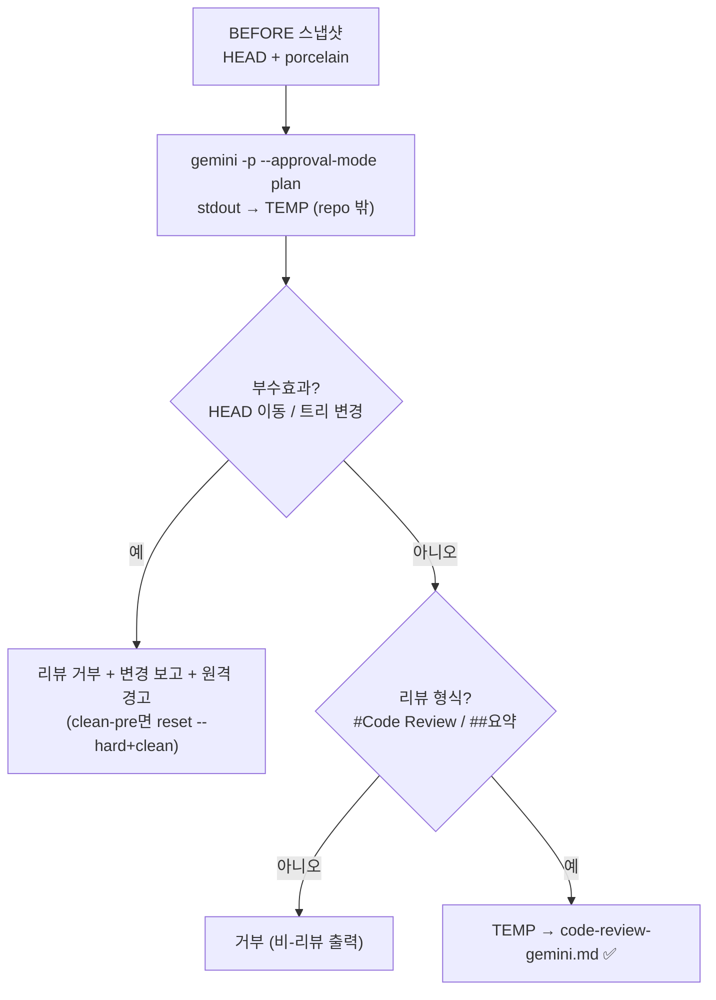

# Implementation Plan: spec-x-gemini-review-sandbox

## 📋 Branch Strategy

- 브랜치: `spec-x-gemini-review-sandbox` — **이미 `main` 에서 생성됨**(spec-x 는 main 타깃, phase-21 base 누수 회피 위해 사전 분기).
- PR target = **`main`** (spec-x). `sdd status` 의 leaked `baseBranch`(phase-21-director-mode)는 무시하고 `gh pr create --base main` 명시.
- 첫 task 는 브랜치 재생성이 아니라 *테스트 작성*부터(브랜치는 이미 존재).

## 🛑 사용자 검토 필요 (User Review Required)

> [!IMPORTANT]
> - [ ] **방어 정본 = 감지+거부** (not `--sandbox`): `--approval-mode plan` read-only 보장 불가 판명 → 스크립트가 부수효과를 감지·거부. `--sandbox`/`--worktree` 는 portability 리스크로 비채택(Out of Scope).
> - [ ] **자동 원복은 clean-pre 가드 한정**: `git reset --hard`/`clean -fd` 는 사전 워킹트리가 clean 일 때만. dirty 면 원복 생략(사용자 작업 보호).
> - [ ] **원격(push/PR) 자동 원복 불가**: 감지 시 경고만. 사용자가 직접 확인.

> [!WARNING]
> - [ ] `gemini-review.sh` 는 매 ship 의 기본 리뷰 도구 — 정상 경로 무회귀가 중요(정상 gemini 응답은 기존과 동일 동작).
> - [ ] 본 spec-x 의 ship 코드 리뷰는 (고치는 대상인) gemini 대신 **Opus(/hk-code-review)** 사용.

## 🎯 핵심 전략 (Core Strategy)

### 아키텍처 컨텍스트



### 주요 결정

| 컴포넌트 | 전략 | 이유 |
|:---:|:---|:---|
| **방어 방식** | 감지+거부 (실행 전후 스냅샷 비교) | `--approval-mode plan` 신뢰 불가 실증. 감지는 portable·testable |
| **stdout 격리** | repo 밖 TEMP → 검증 후 이동 | gemini 출력이 검증 전 repo 에 안착하지 않게 |
| **자동 원복** | clean-pre 가드 시 `reset --hard`+`clean -fd` | UX(자동 정리) + 사용자 작업 보호(가드). ship 게이트는 통상 clean |
| **원격** | 경고만 | push/PR 자동 원복은 위험·불가. 알림으로 사용자 처리 |
| **출력 검증** | `# Code Review` / `## 요약` grep | 21-04 비-리뷰(구현 요약) 오저장 방지 |
| **테스트** | stub gemini (PATH 주입) | 실 gemini 없이 결정적 검증 |

### 📑 ADR 후보
- [x] 없음 — 도구 하드닝(fix). 원칙 자산화는 RCA(누적 시)로.

## 📂 Proposed Changes

### 리뷰 도구

#### [MODIFY] `sources/bin/gemini-review.sh` + `.harness-kit/bin/gemini-review.sh` (미러)
- gemini 호출 직전: `BEFORE_HEAD=$(git rev-parse HEAD)`, `PRE_STATUS=$(git status --porcelain)`.
- gemini stdout → `OUT_TMP=$(mktemp)` (repo 밖). 기존 `> "$OUTPUT_FILE"` 직접 저장 제거.
- gemini 호출 후:
  - `AFTER_HEAD`, `POST_STATUS` 재취득.
  - 부수효과(HEAD 변경 OR status 변경) → 변경 내역 보고 + 원격 경고 + (PRE clean 시) `git reset --hard "$BEFORE_HEAD"` + `git clean -fd` + `exit 1`.
  - 정상 → `OUT_TMP` 가 리뷰 형식인지 검증(`grep -qE '# Code Review|## 요약'`). 실패 시 거부 `exit 1`.
  - 통과 → `mv "$OUT_TMP" "$OUTPUT_FILE"` + 기존 요약 출력.
- 헤더 주석의 "실행 모드: read-only" → "방어적 래퍼(read-only 미신뢰 — 부수효과 감지·거부)" 로 정정.

```text
BEFORE_HEAD=$(git rev-parse HEAD 2>/dev/null || echo "")
PRE_STATUS=$(git status --porcelain 2>/dev/null)
OUT_TMP=$(mktemp)
gemini -p "$INSTRUCTION" --approval-mode plan < "$INPUT_FILE" > "$OUT_TMP" 2>"$GEMINI_STDERR" || { 보고; cleanup; exit 1; }
AFTER_HEAD=$(git rev-parse HEAD 2>/dev/null || echo "")
POST_STATUS=$(git status --porcelain 2>/dev/null)
if [ "$AFTER_HEAD" != "$BEFORE_HEAD" ] || [ "$PRE_STATUS" != "$POST_STATUS" ]; then
   echo "✗ Gemini 가 워크스페이스를 변조했습니다 (read-only 위반)" >&2
   # 변경 내역 보고 (커밋 / 파일)
   if [ -z "$PRE_STATUS" ] && [ -n "$BEFORE_HEAD" ]; then git reset --hard "$BEFORE_HEAD"; git clean -fd; echo "로컬 자동 원복 완료" >&2;
   else echo "사전 워킹트리 dirty → 자동 원복 생략, 수동 확인" >&2; fi
   echo "⚠ 원격(push/PR)은 자동 원복 불가 — 직접 확인하세요" >&2
   rm -f "$OUT_TMP"; exit 1
fi
grep -qE '# Code Review|## 요약' "$OUT_TMP" || { echo "✗ 비-리뷰 출력 — 거부" >&2; rm -f "$OUT_TMP"; exit 1; }
mv "$OUT_TMP" "$OUTPUT_FILE"
```

#### [NEW] `tests/test-gemini-review-guard.sh`
- stub `gemini`(PATH 주입) + make_fixture 기반. 시나리오:
  - T1 rogue commit: stub 이 파일 생성+commit → 스크립트가 감지·거부(exit≠0) + HEAD 원복 + `code-review-gemini.md` 미생성.
  - T2 rogue 파일쓰기(미커밋): stub 이 untracked 파일 작성 → 감지·거부 + 파일 정리.
  - T3 비-리뷰 출력: stub 이 부수효과 없이 "구현 요약" 출력 → 거부(exit≠0).
  - T4 정상 리뷰: stub 이 부수효과 없이 `# Code Review...` 출력 → 성공(exit 0) + `code-review-gemini.md` 생성.

## 🧪 검증 계획 (Verification Plan)

### 단위 테스트 (필수)
```bash
bash tests/test-gemini-review-guard.sh
```

### 회귀
```bash
bash tests/test-governance-dedup.sh    # 무관하나 무회귀 확인
# (gemini-review.sh 직접 테스트는 신규 test-gemini-review-guard.sh 가 커버)
```

### 수동 검증 시나리오
1. stub gemini 로 rogue commit 시뮬 → 스크립트 거부 + 원복 + 리뷰 파일 부재 확인.
2. stub gemini 정상 리뷰 → `code-review-gemini.md` 생성 확인.

## 🔁 Rollback Plan

- 단일 스크립트 + 신규 테스트 변경 — 브랜치 폐기/revert 로 즉시 원복. 기존 정상 경로 보존(무회귀)이므로 영향 없음.

## 📦 Deliverables 체크

- [ ] task.md 작성 (다음 단계)
- [ ] 사용자 Plan Accept 받음
- [ ] (실행 후) 모든 task 완료
- [ ] (실행 후) walkthrough.md / pr_description.md ship
