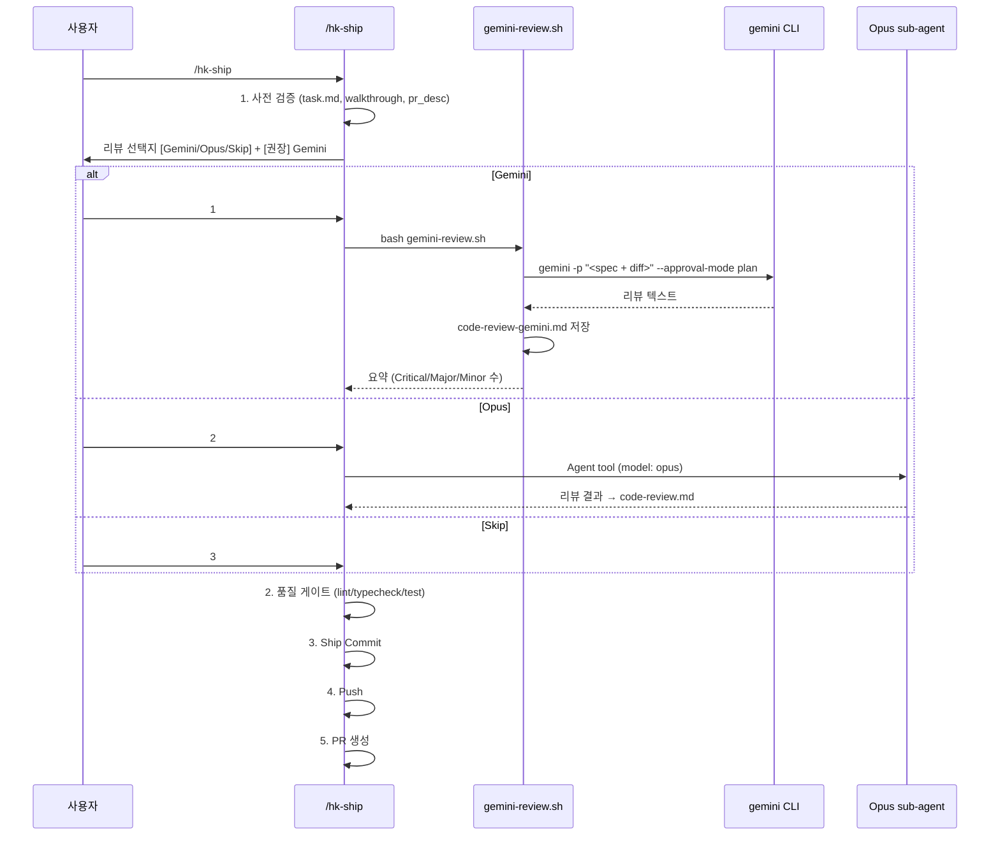

# Implementation Plan: spec-x-gemini-review

## 📋 Branch Strategy

- 신규 브랜치: `spec-x-gemini-review` (브랜치 이름 = spec 디렉토리 이름, `feature/` prefix 없음)
- 시작 지점: `main` (LeoYoon7/harness-kit fork main)
- PR base: fork main (memory: `harness-kit-pr-target-fork`)
- 첫 task 가 브랜치 생성을 수행함

## 🛑 사용자 검토 필요 (User Review Required)

> [!IMPORTANT]
> - [ ] **신규 커맨드 추가 vs 기존 `/hk-code-review` 교체** → 추가 (사용자 명시 결정 — Telegram msg #2995)
> - [ ] **Ship pre-flight 의 강제성** → 명시적 3지선다 (Gemini / Opus / Skip), Skip 기본 아님 — 사용자가 매번 선택
> - [ ] **결과 파일 분리** → `code-review.md` (Opus) vs `code-review-gemini.md` (Gemini)

> [!WARNING]
> - [ ] **gemini CLI 의존성 추가** — 본 키트의 의존성은 기존 bash 3.2+ / jq / git 외에 gemini CLI 가 *선택적* 으로 추가됨. 미설치 시 Skip 으로 fallback 가능하지만, 신규 사용자에게 README 안내 필요 (본 spec 범위 외 — README 갱신은 별도 spec-x 가능).
> - [ ] **`/hk-ship` 흐름 변경** — Plan Accept 이후 자동 진행 흐름에 사용자 선택 게이트 1개 추가됨. 자동화도 (constitution §5.7 "push 는 fully automatic") 와 충돌 여지 있음 — 본 게이트는 *리뷰 선택* 이지 *push 확인* 이 아니므로 §5.7 위반 아님.

## 🎯 핵심 전략 (Core Strategy)

### 아키텍처 컨텍스트



### 주요 결정

| 컴포넌트 | 전략 | 이유 |
|:---:|:---|:---|
| **Gemini 호출 방식** | `gemini -p "<prompt>" --approval-mode plan` (headless, read-only) | 워크스페이스 수정 차단 + 자동화 가능 |
| **프롬프트 구성** | spec.md 본문 + `git diff <base>...HEAD` 를 bash here-string 으로 stdin/argv 결합 | gemini CLI 가 워크스페이스 인지하므로 추가 파일 첨부 불필요. 단, 안정성 위해 명시적 전달 |
| **결과 저장 위치** | `specs/<spec-dir>/code-review-gemini.md` | Opus 결과 (`code-review.md`) 와 분리 → cross-validation 가능 (사용자 답변 a-안1) |
| **`/hk-code-review` 변경** | 변경 없음 | 사용자 명시 결정 — 신규 추가 (Telegram msg #2995) |
| **Ship 게이트 강제성** | 명시적 3지선다 (Skip 도 사용자 선택) | 사용자 답변 b-안2. Critical 이슈 발견 시 ship 진행 재확인 |
| **`/hk-pr-gh` / `/hk-pr-bb` 영향** | 손대지 않음 | 사용자 답변 c-안1. hk-ship 이 정상 경로이므로 충분 |

### 📑 ADR 후보

- [ ] ADR 가치 있는 결정 있음
- [x] 없음

## 📂 Proposed Changes

### [신규] Gemini 리뷰 실행 스크립트

#### [NEW] `sources/bin/gemini-review.sh`

```bash
#!/usr/bin/env bash
# gemini-review.sh
# 현재 spec 브랜치의 변경을 Gemini CLI 로 cross-model 리뷰
#
# 출력: specs/<spec-dir>/code-review-gemini.md
# 의존성: bash 3.2+, jq, git, gemini CLI

set -uo pipefail

SCRIPT_DIR="$(cd "$(dirname "${BASH_SOURCE[0]}")" && pwd)"
PROJECT_ROOT="$(cd "$SCRIPT_DIR/.." && pwd)"
cd "$PROJECT_ROOT" || exit 1

# 1. gemini CLI 존재 확인
command -v gemini >/dev/null 2>&1 || {
    echo "✗ gemini CLI 가 설치되지 않았습니다 (https://geminicli.com)" >&2
    exit 1
}

# 2. 활성 spec 식별
STATUS_JSON=$(bash .harness-kit/bin/sdd status --json --no-drift 2>/dev/null)
SPEC_ID=$(echo "$STATUS_JSON" | jq -r '.spec // empty')
[ -z "$SPEC_ID" ] && { echo "✗ 활성 spec 이 없습니다" >&2; exit 1; }

# spec 디렉토리 추적 (spec-x 면 spec-x-{slug}, 일반은 spec-{N}-{seq}-{slug})
SPEC_DIR=$(find specs -maxdepth 1 -type d -name "${SPEC_ID}*" | head -1)
[ -z "$SPEC_DIR" ] && { echo "✗ spec 디렉토리를 찾을 수 없습니다: $SPEC_ID" >&2; exit 1; }

# 3. PR base 결정 (phase base 또는 main)
BASE_BRANCH=$(echo "$STATUS_JSON" | jq -r '.baseBranch // "main"')
[ "$BASE_BRANCH" = "null" ] && BASE_BRANCH="main"

# 4. diff 범위 확인
DIFF_STAT=$(git diff "$BASE_BRANCH...HEAD" --stat 2>/dev/null)
[ -z "$DIFF_STAT" ] && { echo "✗ 리뷰할 변경이 없습니다 ($BASE_BRANCH...HEAD)" >&2; exit 1; }

# 5. 프롬프트 구성 (spec.md + git diff)
SPEC_BODY=$(cat "$SPEC_DIR/spec.md")
DIFF_BODY=$(git diff "$BASE_BRANCH...HEAD")

PROMPT=$(cat <<EOF
당신은 독립적인 시니어 개발자 코드 리뷰어입니다. 아래 spec 의 요구사항과
실제 코드 변경을 비교하여, 다음 3가지 관점에서 리뷰하세요.

(1) Spec 대비 구현 검증
(2) 코드 품질 (KISS / DRY / Feature Envy / Dead Code / 네이밍 / 에러 처리)
(3) 테스트 커버리지

발견된 문제마다 심각도 (Critical / Major / Minor) 를 매기고, 반드시 파일경로:라인번호 형식으로 위치를 명시하세요.

출력은 한국어 마크다운 형식:

# Code Review (Gemini): $SPEC_ID

## 요약
- 전체 평가: (Approve / Request Changes / Comment)
- Critical: N / Major: N / Minor: N

## 상세 리뷰
### 1. Spec 대비 구현 검증
- [심각도] \`파일:라인\` — 내용

### 2. 코드 품질
- [심각도] \`파일:라인\` — 내용 (위반 원칙: ...)

### 3. 테스트 커버리지
- [심각도] 내용

## 권고사항
- (수정 제안)

---

# Spec

$SPEC_BODY

---

# Diff ($BASE_BRANCH...HEAD)

\`\`\`diff
$DIFF_BODY
\`\`\`
EOF
)

# 6. Gemini 호출 (read-only)
OUTPUT_FILE="$SPEC_DIR/code-review-gemini.md"
echo "🔍 Gemini 리뷰 실행 중 ($SPEC_ID)..." >&2
gemini -p "$PROMPT" --approval-mode plan > "$OUTPUT_FILE" 2>/dev/null || {
    echo "✗ gemini CLI 호출 실패" >&2
    rm -f "$OUTPUT_FILE"
    exit 1
}

# 7. 요약 추출
echo "✅ Gemini 리뷰 완료: $OUTPUT_FILE" >&2
grep -E "^- (전체 평가|Critical|Major|Minor)" "$OUTPUT_FILE" | head -4 >&2
```

#### [NEW] `sources/commands/hk-gemini-review.md`

```markdown
---
description: 현재 SPEC 브랜치의 코드 변경을 Gemini CLI 로 cross-model 리뷰 (Opus 리뷰와 별개)
---

현재 브랜치의 코드 변경사항을 Gemini CLI (cross-model) 로 리뷰합니다.

## 1. 실행

bash .harness-kit/bin/gemini-review.sh

내부 동작:
1. gemini CLI 존재 확인
2. sdd status --json 으로 활성 spec / base branch 식별
3. spec.md + git diff <base>...HEAD 를 프롬프트로 구성
4. gemini -p "<prompt>" --approval-mode plan 헤드리스 호출 (read-only)
5. 결과를 specs/<spec-dir>/code-review-gemini.md 에 저장

## 2. 결과 보고

✅ Gemini Code Review 완료: <spec-id>
- 결과: specs/<spec-dir>/code-review-gemini.md
- 전체 평가: (Approve / Request Changes / Comment)
- Critical: N / Major: N / Minor: N

Critical 이슈가 있으면 ship 전에 해결을 권고합니다. Opus 리뷰 (/hk-code-review) 와 cross-validation 도 가능합니다.
```

### [수정] Ship 워크플로우

#### [MODIFY] `sources/commands/hk-ship.md`

§1 (사전 검증) 직후, §2 (품질 게이트) 직전에 새 §1.5 섹션을 삽입.

```markdown
## 1.5 코드 리뷰 게이트 (선택)

Push 직전 cross-model 또는 self-model 리뷰를 옵션으로 제공합니다.

다음 선택지를 사용자에게 제시:

[상황 / 맥락]
Ship 직전 코드 리뷰 옵션 — push/PR 후에는 리뷰 비용이 커집니다.

[선택지]
1. Gemini (cross-model, 다른 모델 관점)
2. Opus (기존 /hk-code-review)
3. Skip — 리뷰 없이 §2 품질 게이트로 진행

[권장]
1 — cross-model 리뷰가 self-evaluation 편향을 줄입니다 (LLM-as-judge 연구 일관). gemini CLI 가 없거나 빠른 ship 이 필요하면 3.

[의사결정 요청]
어떤 리뷰로 진행할까요?

선택 후 동작:
- 1 → bash .harness-kit/bin/gemini-review.sh
- 2 → /hk-code-review 절차 실행
- 3 → 바로 §2 로

리뷰 결과에 Critical 이슈가 있으면 ship 진행 여부를 사용자에게 한 번 더 확인합니다.
```

#### [MODIFY] `sources/governance/agent.md`

§6.3 Commit & Ship Enforcement 의 "Walkthrough & Description Protocol" 마지막에 한 줄 추가:

```text
8. **Code Review Gate (선택)**: Push 직전 `/hk-gemini-review` (cross-model, 권장) 또는 `/hk-code-review` (Opus) 로 리뷰. hk-ship 이 자동 게이트로 노출함.
```

### [도그푸딩 sync] 본 PR 안에서 즉시 작동 가능하도록 설치본도 동시 갱신

- `.harness-kit/bin/gemini-review.sh` ← `sources/bin/gemini-review.sh` (cp)
- `.claude/commands/hk-gemini-review.md` ← `sources/commands/hk-gemini-review.md` (cp)
- `.claude/commands/hk-ship.md` ← `sources/commands/hk-ship.md` (cp)
- `.harness-kit/agent/agent.md` ← `sources/governance/agent.md` (cp)

## 🧪 검증 계획 (Verification Plan)

### 단위 테스트 (해당 없음)

본 spec 은 bash 스크립트 + 마크다운 문서 변경이라 자동화된 단위 테스트가 직접 적용되지 않습니다. 대신 수동 smoke test 로 검증합니다.

### 수동 검증 시나리오

1. **gemini CLI 존재 + 활성 spec 있음** — 본 spec 브랜치에서 `bash .harness-kit/bin/gemini-review.sh` 실행 → `specs/spec-x-gemini-review/code-review-gemini.md` 가 생성되고 요약이 stderr 로 출력됨.
2. **gemini CLI 없음 시뮬레이션** — `PATH` 임시 수정 후 실행 → `✗ gemini CLI 가 설치되지 않았습니다` 에러 + exit 1.
3. **활성 spec 없음** — main 으로 checkout 후 실행 → `✗ 활성 spec 이 없습니다` + exit 1.
4. **변경 없음** — base 와 동일 상태에서 실행 → `✗ 리뷰할 변경이 없습니다` + exit 1.
5. **hk-ship 통합** — 본 spec 자체 ship 시 실제 §1.5 게이트가 발화되는지 확인.

### Lint / Format

bash 스크립트는 `shellcheck` 가 있으면 실행 (없으면 skip).

## 🔁 Rollback Plan

- 본 PR 머지 후 문제 발생 시 revert PR 로 되돌리면 됨. 기존 `/hk-code-review` 는 손대지 않았으므로 영향 없음.
- 도그푸딩 sync 파일은 install/update.sh 의 다음 실행 시 sources 기준으로 재동기화되므로 별도 정리 불필요.

## 📦 Deliverables 체크

- [x] task.md 작성 (다음 단계)
- [ ] 사용자 Plan Accept 받음
- [ ] (실행 후) 모든 task 완료
- [ ] (실행 후) walkthrough.md / pr_description.md ship
