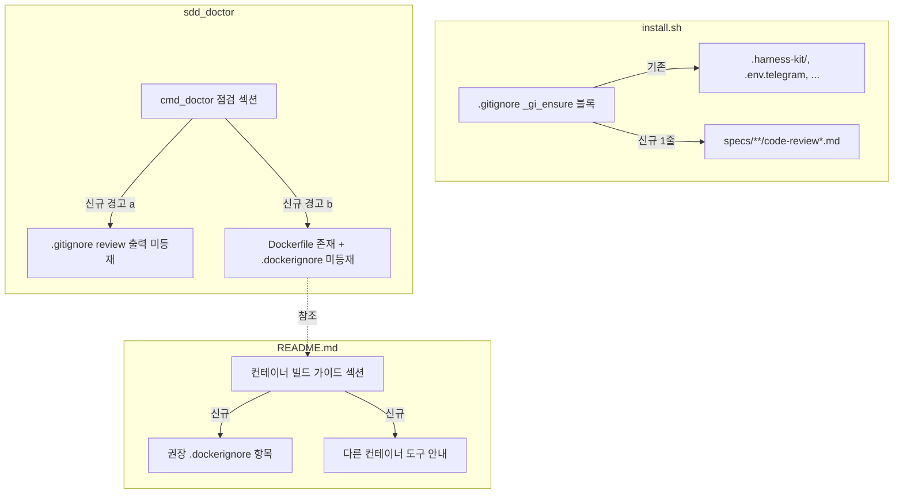

# Implementation Plan: spec-x-install-ignore-coverage

## 📋 Branch Strategy

- 신규 브랜치: `spec-x-install-ignore-coverage` (브랜치 이름 = spec 디렉토리 이름, `feature/` prefix 없음)
- 시작 지점: `main` (commit `e7b61ec` 기준 — 직전 drift 정리 push 완료된 시점)
- 첫 task 가 브랜치 생성을 수행함

## 🛑 사용자 검토 필요 (User Review Required)

> [!IMPORTANT]
> - [ ] 정책 비대칭 명시 확인: `.gitignore` 는 자동 갱신(install.sh + uninstall.sh 대칭), `.dockerignore` 는 경고만(doctor). spec.md §해결방안 + walkthrough.md §결정 에 명시.
> - [ ] 신규 `.gitignore` 항목이 self-host guard 와 무관하게 항상 추가되는 정책 확인 — *단 self-host 시 헤더 부재면 헤더도 같이 추가* (고아 라인 방지). critique 발견 사항.
> - [ ] `Containerfile` / `compose.yml` 등 다른 컨테이너 도구는 Out of Scope — README 한 줄 안내로만 처리.
> - [ ] **invariant ADR 작성 합의**: install.sh 추가 라인 ↔ uninstall.sh awk 패턴 대칭성 invariant 를 `ADR-005` 로 박는다 (`type: invariant`). 본 spec 내 task 로 작성.

> [!WARNING]
> - [ ] 기존 사용자의 `.gitignore` 는 자동 갱신되지 않음 (install.sh / update.sh 재실행 필요). doctor 경고가 안내 역할.
> - [ ] `specs/**/code-review*.md` 글롭 패턴은 git 1.8.2+ 필요 — 최소 git 버전 요구사항 변동 없음 (이미 일반적 요구).
> - [ ] **uninstall awk 대칭성 위반의 후속 위험**: 본 spec 의 신규 라인을 uninstall awk 에 등재하지 않으면 update 다중 라운드에서 *인접 라인* (`.env.discord` 등) 까지 손상될 위험 (블록 조기 종료 부작용). 본 spec 의 critical fix.

## 🎯 핵심 전략 (Core Strategy)

### 아키텍처 컨텍스트



### 주요 결정

| 컴포넌트 | 전략 | 이유 |
|:---:|:---|:---|
| **install.sh `.gitignore` 신규 항목** | self-host guard 와 *부분 결합* — 항목은 항상 추가, 단 self-host 시 헤더 부재면 헤더도 같이 추가 | 헤더 cosmetic 노이즈 회피 정책 (`_hk_self_host=1` 시 헤더 skip) 은 옵션 항목 (`.harness-kit/`) 만 없을 때 의미 있음. 신규 항목이 있는데 헤더가 없으면 *고아 라인* 이 되어 uninstall awk 가 영원히 못 지움. 헤더 강제는 critique 권장 (대안 D). |
| **uninstall.sh awk 패턴 대칭성** | install 추가 라인은 uninstall awk 에 *명시 매칭 라인 등재 필수* | critique 의 critical 발견. awk 의 `inblk==1 { inblk=0 }` 는 알려지지 않은 라인에서 블록 조기 종료 — 인접 라인 추출 실패 + stale 잔존. invariant 로 ADR-005 박음. |
| **`.dockerignore` 처리** | 자동 갱신 거부, 경고만 | Dockerfile 구조 (`COPY . .` vs 선택적 COPY) 와 빌드 정책이 사용자별로 달라 자동 침입 위험. critique 의 산업 패턴 조사 (Terraform / dockerignore-generate) 와 정합. |
| **`.dockerignore` 매칭 패턴 관대성** | `.harness-kit/`, `.harness-kit` (슬래시 없이), `**/.harness-kit/` 모두 인정 | 정확 매치 (`^\.harness-kit/$`) 강제 시 사용자 자유도 침해 + false positive WARN. critique 권장. |
| **doctor 경고 등급** | `WARN` (FAIL 아님) | 두 경고 모두 즉시 빌드/설치 차단 사유 아님. 사용자 정책 우선. 기존 `_doc_warn` 헬퍼 재사용. |
| **doctor 신규 섹션 헤더** | `ignore 위생` (짧은 한국어, 기존 `설치 파일` / `훅 파일` 패턴과 일관) | critique 의 명명 일관성 지적 — `.gitignore / .dockerignore 위생` 같은 영어+한국어 mix 회피. |
| **테스트 fixture 패턴** | 기존 `make_fixture()` 재사용 + 신규 test 파일 1개 | `test-gitignore-config.sh` 의 fixture 헬퍼는 잘 정착됨. 신규 doctor 점검은 별도 파일 (책임 분리, 회귀 추적 용이). |

### 📑 ADR 후보

- [x] **ADR 가치 있는 결정 있음** → `ADR-005-kit-managed-ignore-line-symmetry-invariant` (type: invariant) — 본 spec 내 별도 task 로 작성.
- [x] **추가 후보 (별도 작업으로 분리)** → `tool-output-in-tree-vs-out-of-tree` (type: tradeoff) — Icebox 등재 완료, 본 spec 외부.
- [ ] 없음

## 📂 Proposed Changes

### install.sh

#### [MODIFY] `install.sh`
**위치 1**: line 475-528 `.gitignore` 자동 갱신 블록

기존 `_gi_ensure` 호출 시퀀스의 끝에 1줄 추가:

```bash
  # 리뷰 도구 출력물 — /hk-code-review, /hk-gemini-review 가 매 review 마다 생성하는
  # ephemeral 산출물. PR 에 포함 안 됨. specs/ 하위로 한정해 .claude/commands/ 의
  # 슬래시 커맨드 정의 파일에는 영향 없음.
  _gi_ensure '^specs/\*\*/code-review\*\.md$' 'specs/**/code-review*.md'
```

**self-host guard 처리**: `_hk_self_host` 변수 분기 *밖* 에 위치 — 항상 실행. 기존 `.harness-backup-*/`, `.claude/state/`, `.env.telegram`, `.env.discord` 와 같은 분기 (line 521-525 영역) 에 배치.

**위치 2 (critique 보강)**: line 513-517 헤더 처리 블록

기존:
```bash
  if [ "$_hk_self_host" -eq 0 ] && ! grep -qE '^# harness-kit$' "$GI" 2>/dev/null; then
    [ -s "$GI" ] && echo "" >> "$GI"
    echo "# harness-kit" >> "$GI"
  fi
```

self-host 시에도 헤더 강제 추가하도록 조건 완화:
```bash
  # 헤더 — 부재 시 빈 줄 + 헤더. self-host 시에도 신규 라인이 추가되므로 헤더 필요
  # (헤더 없으면 신규 라인이 고아 라인이 되어 uninstall awk 가 시작점을 못 찾음).
  if ! grep -qE '^# harness-kit$' "$GI" 2>/dev/null; then
    [ -s "$GI" ] && echo "" >> "$GI"
    echo "# harness-kit" >> "$GI"
  fi
```

⚠ 이 변경의 영향: self-host 사용자도 `.gitignore` 에 `# harness-kit` 헤더가 생김 (이전엔 cosmetic 노이즈 회피 목적으로 skip 했음). critique 의 invariant 분석상 헤더 부재가 더 큰 위험 — 정책 전환.

### uninstall.sh

#### [MODIFY] `uninstall.sh`
**위치**: line 159-167 awk 블록 (알려진 패턴 enumeration)

기존:
```awk
inblk==1 && /^!?\.harness-kit\/$/   { next }
inblk==1 && /^\.harness-backup-\*\/$/ { next }
inblk==1 && /^\.claude\/state\/$/   { next }
inblk==1 && /^\.env\.telegram$/     { next }
inblk==1 && /^\.env\.discord$/      { next }
```

신규 라인 매칭 추가 (5개 → 6개):
```awk
inblk==1 && /^!?\.harness-kit\/$/   { next }
inblk==1 && /^\.harness-backup-\*\/$/ { next }
inblk==1 && /^\.claude\/state\/$/   { next }
inblk==1 && /^\.env\.telegram$/     { next }
inblk==1 && /^\.env\.discord$/      { next }
inblk==1 && /^specs\/\*\*\/code-review\*\.md$/ { next }
```

**Critical rationale**: 신규 라인 미등재 시 awk 의 `inblk==1 { inblk=0 }` 후행 로직이 해당 라인에서 블록을 *조기 종료* → 인접한 다른 라인 (`.env.discord` 등) 까지 추출 실패. critique 의 가장 큰 발견.

### sources/bin/sdd

#### [MODIFY] `sources/bin/sdd`
**위치**: `cmd_doctor()` 함수 (line 2154-2244)

기존 점검 섹션 (`설치 파일`, `Claude Code 설정`, `훅 파일`) 사이에 신규 섹션 `ignore 위생` 추가 (critique 의 명명 일관성 권장 반영):

```bash
  printf "\nignore 위생\n"

  # (a) .gitignore 에 리뷰 출력 패턴 등재 여부
  if [ -f "$SDD_ROOT/.gitignore" ] && grep -qE '^specs/\*\*/code-review\*\.md$' "$SDD_ROOT/.gitignore" 2>/dev/null; then
    _doc_pass ".gitignore — 리뷰 출력 패턴 등재 (specs/**/code-review*.md)"
  else
    _doc_warn ".gitignore 에 'specs/**/code-review*.md' 미등재 — /hk-code-review, /hk-gemini-review 출력이 untracked 로 누적될 수 있음. 갱신: bash update.sh ."
  fi

  # (b) Dockerfile 존재 시 .dockerignore 점검 (사용자 자유도 보장 — 일반적 패턴 모두 인정)
  if [ -f "$SDD_ROOT/Dockerfile" ]; then
    # `.harness-kit/`, `.harness-kit`, `**/.harness-kit/`, `**/.harness-kit` 등 일반적 패턴 인정.
    # 정확 매치 강제 시 사용자 자유도 침해 + false positive WARN 발생.
    if [ -f "$SDD_ROOT/.dockerignore" ] && grep -qE '(^|/)\.harness-kit/?$' "$SDD_ROOT/.dockerignore" 2>/dev/null; then
      _doc_pass ".dockerignore — .harness-kit 항목 등재 (컨테이너 빌드 컨텍스트 안전)"
    else
      _doc_warn "Dockerfile 존재 but .dockerignore 에 '.harness-kit' 관련 항목 미등재 — 빌드 컨텍스트 비대화/토큰 유출 위험. README '컨테이너 빌드 가이드' 참조."
    fi
  fi
```

**매칭 패턴 설명** (b):
- `(^|/)` — 라인 시작 또는 슬래시 직후 (서브디렉토리 패턴 `**/.harness-kit/` 같은 케이스도 인정)
- `\.harness-kit` — literal `.harness-kit`
- `/?$` — 선택적 trailing slash + 라인 끝

이 패턴은 `.harness-kit/`, `.harness-kit`, `**/.harness-kit/`, `**/.harness-kit` 매칭. `.h*` 같은 와일드카드 패턴은 못 잡지만 그건 사용자가 의도적으로 한 일이라 검사 책임 외.

**bash 3.2+ 호환**: `[ -f ... ]`, `grep -qE`, `printf` 만 사용. 4+ 전용 기능 없음.

### README.md

#### [MODIFY] `README.md`
"설치" 섹션 직후 또는 "주의 사항" 인접 위치에 신규 섹션:

```markdown
## 컨테이너 빌드 컨텍스트 (Dockerfile 사용자)

`harness-kit` 산출물은 *애플리케이션 코드가 아닌* 거버넌스 메타데이터입니다. 컨테이너 빌드 시 이미지에 포함될 필요가 없으며, 빌드 컨텍스트에 들어가면 다음 비용이 발생합니다.

- `specs/`, `archive/` 의 수백 파일이 매 빌드 컨텍스트 전송 (WSL2 + Docker Desktop 환경에서 특히 느림)
- `COPY . .` 패턴 사용 시 `.env.telegram` / `.env.discord` 토큰이 이미지에 포함될 위험

프로젝트 루트에 `Dockerfile` 이 있다면 `.dockerignore` 에 다음 항목을 추가하세요:

\```
.harness-kit/
.claude/
backlog/
specs/
archive/
\```

> ℹ `Containerfile` (Podman), `compose.yml` (Docker Compose), `Earthfile` (Earthly) 등 다른 컨테이너 도구도 동일한 빌드 컨텍스트 정책이 필요합니다. 본 가이드는 Dockerfile 기준이며, 다른 도구는 등가 설정을 권장합니다.

`sdd doctor` 가 `Dockerfile` 존재 + `.dockerignore` 미등재 상황을 자동 감지하여 경고합니다.
```

### docs/decisions

#### [NEW] `docs/decisions/ADR-005-kit-managed-ignore-line-symmetry-invariant.md`
**type**: `invariant`

내용:
- **Invariant**: `install.sh` 가 `.gitignore` 의 `# harness-kit` 헤더 블록에 추가하는 모든 라인은 `uninstall.sh` 의 awk 블록 (line 159-167) 에 *명시 매칭 라인 (next 액션)* 으로 *반드시* 등재되어야 한다.
- **Why**: `uninstall.sh` 의 awk 는 `inblk==1 { inblk=0 }` 로 헤더 블록 시작점부터 *알려진 패턴 라인이 연속되는 동안만* 블록으로 인정. 알려지지 않은 라인을 만나면 그 라인에서 블록 조기 종료 — 그 뒤의 다른 알려진 라인 (`.env.discord` 등) 도 추출 실패하고 stale 잔존.
- **Reproduction**: install.sh 가 신규 라인 X 추가 → uninstall.sh awk 가 X 를 모름 → X 가 블록 중간에 오면 X 직전까지만 제거되고 X + 그 뒤 라인 모두 잔존.
- **Prevention**:
  1. 신규 라인 추가 PR 의 self-check: install.sh + uninstall.sh + 회귀 테스트 3군데 동시 수정 확인.
  2. `sdd doctor` 의 자가 검증 (long-term TODO): self-host 시 install.sh 의 `_gi_ensure` 호출 목록과 uninstall.sh awk 패턴 enumeration 의 일치성 검증.
  3. CHANGELOG / 본 ADR 참조 강제 (헤더 주석).
- **Adopted by**: spec-x-install-ignore-coverage (PR #TBD).

### tests

#### [MODIFY] `tests/test-gitignore-config.sh`
**위치**: Scenario A 의 마지막 `check` 블록 (현 line ~57) 직후 추가

```bash
check
if grep -qE '^specs/\*\*/code-review\*\.md$' "$FIX_A/.gitignore" 2>/dev/null; then
  pass "A-4: .gitignore 에 'specs/**/code-review*.md' 포함 (리뷰 출력 ignore)"
else
  fail "A-4: .gitignore 에 'specs/**/code-review*.md' 없음"
fi
```

**다중 라운드 시나리오 (critique 보강)**:
Scenario E (update.sh 후 보존) 다음에 신규 Scenario I 추가 — *다중 라운드 안정성*:

```bash
echo "▶ Scenario I: 다중 라운드 안정성 (update × 3회 후 .gitignore 형태 유지)"
for _ in 1 2 3; do
  bash "$UPDATE" --yes "$FIX_A" > /dev/null 2>&1
done

check
_count=$(grep -c '^specs/\*\*/code-review\*\.md$' "$FIX_A/.gitignore" 2>/dev/null || echo "0")
if [ "$_count" -eq 1 ]; then
  pass "I-1: update × 3 후 'specs/**/code-review*.md' 라인 1개 (중복/누락 없음)"
else
  fail "I-1: update × 3 후 라인이 ${_count}개"
fi

check
_hdr=$(grep -c '^# harness-kit$' "$FIX_A/.gitignore" 2>/dev/null || echo "0")
if [ "$_hdr" -eq 1 ]; then
  pass "I-2: update × 3 후 헤더 1개 유지 (중복 없음)"
else
  fail "I-2: 헤더가 ${_hdr}개"
fi

# 인접 라인 손상 검증 (critique 의 awk 조기 종료 부작용 시나리오)
check
for _pat in '^\.harness-backup-\*/$' '^\.claude/state/$' '^\.env\.telegram$' '^\.env\.discord$'; do
  if ! grep -qE "$_pat" "$FIX_A/.gitignore" 2>/dev/null; then
    fail "I-3: 인접 라인 손실 — 패턴 $_pat"
    break
  fi
done
pass "I-3: 인접 라인 (.harness-backup-*/, .claude/state/, .env.telegram, .env.discord) 모두 유지"
```

#### [MODIFY] `uninstall.sh` 회귀 검증
신규 awk 라인의 동작을 기존 `tests/test-update.sh` 또는 `tests/test-gitignore-config.sh` 에서 다음 시나리오로 검증:
- install → `.gitignore` 에 6개 라인 + 헤더 → uninstall → `# harness-kit` 블록 전체 제거 (6개 라인 + 헤더 모두 사라짐) 확인

#### [NEW] `tests/test-doctor-ignore-coverage.sh`
신규 테스트 파일. 4 시나리오 매트릭스 (Dockerfile 유/무 × `.dockerignore` 유/무):

| 시나리오 | Dockerfile | .dockerignore | 기대 |
|---|:---:|:---|---|
| 1 | 없음 | 없음 | `.dockerignore` 점검 자체가 발화 안 함 (silent skip) |
| 2 | 있음 | 없음 | WARN: `.dockerignore 미등재` |
| 3 | 있음 | `.harness-kit/` 없음 | WARN: `.harness-kit/ 미등재` |
| 4 | 있음 | `.harness-kit/` 있음 | PASS |

추가: `.gitignore` 신규 항목 점검 2 시나리오 (등재 / 미등재 × WARN).

```bash
#!/usr/bin/env bash
set -euo pipefail
# (헤더 + 한국어 설명 생략)

ROOT="$(cd "$(dirname "$0")/.." && pwd)"
INSTALL="$ROOT/install.sh"
SDD="$ROOT/sources/bin/sdd"
# (시나리오 셋업 + assertion)
```

## 🧪 검증 계획 (Verification Plan)

### 단위 테스트 (필수)

```bash
bash tests/test-gitignore-config.sh
bash tests/test-doctor-ignore-coverage.sh
```

### 회귀 테스트 (영향 가능 항목 일부)

```bash
bash tests/test-hk-doctor.sh             # cmd_doctor 출력 형식 회귀
bash tests/test-install-layout.sh        # install.sh 멱등성
bash tests/test-update.sh                # update.sh 후 .gitignore 보존
bash tests/test-update-stateful.sh       # update 후 state 보존 (uninstall awk 변경 영향)
bash tests/test-doctor-bash-version.sh
```

### 통합 테스트

해당 없음 (Integration Test Required = no).

### 수동 검증 시나리오

1. **본 저장소 self-host 검증**:
   - `bash update.sh .` 실행 → `.gitignore` 에 `specs/**/code-review*.md` 추가됨 확인
   - 이미 `.gitignore` 에 self-host 한정 패턴이 있으므로 멱등성 확인 (중복 없음)
   - `bash .harness-kit/bin/sdd doctor` 실행 → 신규 점검 섹션 PASS 확인
   - 기대 결과: drift 재발 없음, doctor PASS

2. **신규 target 프로젝트 시뮬레이션** (tests/fixtures/):
   - 빈 git repo 생성 → `bash install.sh .` → `.gitignore` 확인
   - 모의 review 산출물 `specs/foo/code-review.md` 생성 → `git status` 가 untracked 로 잡지 않음 확인

3. **Dockerfile 시나리오**:
   - fixture 에 `Dockerfile` 추가 → `sdd doctor` 가 `.dockerignore` 경고 발화 확인
   - `.dockerignore` 에 `.harness-kit/` 추가 → 경고 사라짐 확인

## 🔁 Rollback Plan

- **install.sh 변경 롤백**: `git revert <commit>` 으로 1줄 추가 되돌림. 기존 `.gitignore` 항목 영향 없음 (라인별 멱등 + 사용자가 직접 제거할 필요 없음 — 무해한 추가 항목).
- **sdd doctor 신규 점검 롤백**: 신규 섹션 제거. 기존 점검에 영향 없음.
- **README 섹션 롤백**: 신규 섹션 제거. 다른 문서 영향 없음.
- **테스트 롤백**: 신규 `test-doctor-ignore-coverage.sh` 삭제 + `test-gitignore-config.sh` A-4 시나리오 제거.

전체 롤백 시 데이터/상태 영향 없음 (코드/문서 변경만).

## 📦 Deliverables 체크

- [ ] task.md 작성 (다음 단계)
- [ ] 사용자 Plan Accept 받음
- [ ] (실행 후) 모든 task 완료
- [ ] (실행 후) walkthrough.md / pr_description.md ship
