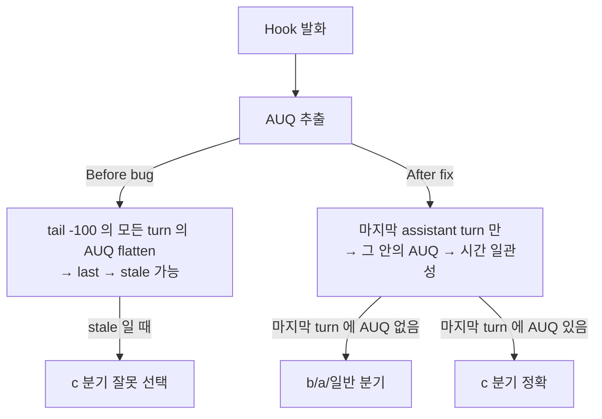

# Implementation Plan: spec-x-notify-auq-scope-fix

## 📋 Branch Strategy

- 신규 브랜치: `spec-x-notify-auq-scope-fix`
- 시작 지점: `main` (현재 HEAD: 9bed212, spec-x-notify-choice-context 머지 후)
- PR base: fork main (LeoYoon7/harness-kit)

## 🛑 사용자 검토 필요

> [!IMPORTANT]
> - [ ] **scope 좁힘 안 1 (마지막 turn 만)** — fast follow-up AUQ 시나리오는 Out-of-Scope
> - [ ] **PR #8 의 4 케이스 회귀 검증** 필수 — 기존 동작 무변경 보장

> [!WARNING]
> - [ ] **jq syntax 변경 — null 처리 주의** — `last // null` 후 `.message.content` 접근. assistant turn 0개 시 null safe.

## 🎯 핵심 전략 (Core Strategy)

### 변경 요지



### 주요 결정

| 컴포넌트 | 전략 | 이유 |
|:---:|:---|:---|
| **scope 좁힘 범위** | 마지막 assistant turn 1개만 | 보수적 안전. fast follow-up 은 Out-of-Scope |
| **null 처리** | `last // null` 후 `// empty` chain | assistant turn 0개 시 jq error 방지 |
| **첫 발견 vs 마지막** | `.[0]` (첫 발견 = 마지막 turn 안 단일 AUQ 가정) | AUQ tool_use 가 같은 turn 에 2개 이상은 unrealistic |

### 📑 ADR 후보

- [ ] ADR 가치 있는 결정 있음
- [x] 없음 — ADR-004 의 컨벤션 구현 보강

## 📂 Proposed Changes

### [MODIFY] `sources/hooks/notify-on-input-wait.sh`

기존 AUQ_JSON 쿼리 (line ~80, PR #8 결과):

```bash
AUQ_JSON=$(tail -100 "$TRANSCRIPT" 2>/dev/null | \
    jq -rs '[.[] | select(.type == "assistant") | .message.content[]? | select(.type == "tool_use" and .name == "AskUserQuestion")] | last // empty' 2>/dev/null || echo "")
```

수정 후:

```bash
# 마지막 assistant turn 안에 AskUserQuestion 가 있는 경우만 추출
# (이전 turn 의 stale AUQ 가 (c) 분기로 잘못 선택되는 false positive 차단)
AUQ_JSON=$(tail -100 "$TRANSCRIPT" 2>/dev/null | \
    jq -rs '[.[] | select(.type == "assistant")] | last // null |
            if . == null then empty
            else (.message.content // []) | map(select(.type == "tool_use" and .name == "AskUserQuestion")) | .[0] // empty
            end' 2>/dev/null || echo "")
```

핵심 차이:
1. `[.[] | select(.type == "assistant")] | last` — 마지막 assistant *turn 전체* 선택 (그 turn 의 모든 content 보존)
2. `if . == null then empty else ... end` — assistant turn 0개 시 빈 결과 안전
3. `(.message.content // []) | map(...) | .[0] // empty` — 그 turn 안의 AUQ tool_use 만 검색

### [SYNC] `.harness-kit/hooks/notify-on-input-wait.sh`

`cp sources/hooks/notify-on-input-wait.sh .harness-kit/hooks/notify-on-input-wait.sh` — 도그푸딩 sync.

## 🧪 검증 계획 (Verification Plan)

### 단위 테스트 (해당 없음)

### 수동 검증 시나리오

PR #8 의 4 케이스 (a)/(b)/(c)/(FP 회고텍스트) **회귀 PASS** + 신규 1 케이스 (FP-stale).

#### 신규 케이스 (FP-stale) — 본 spec 핵심

- **입력 transcript**:
  ```jsonl
  {"type":"assistant","message":{"content":[{"type":"tool_use","name":"AskUserQuestion","input":{"questions":[{"question":"이전 질문","header":"테스트","options":[{"label":"A"},{"label":"B"}]}]}}]}}
  {"type":"user","message":{"content":[{"type":"tool_result","content":"A"}]}}
  {"type":"assistant","message":{"content":[{"type":"text","text":"응답 받음. 다음 작업 진행."},{"type":"tool_use","name":"Bash","input":{"command":"git status"}}]}}
  ```
- **hook 입력**: `{"hook_event_name":"Notification","message":"Claude needs your permission to use Bash"}` (현재 trigger = Bash 권한)
- **기대 본문 (fix 후)**: `"권한 승인 대기\nBranch: ...\nClaude needs..."` — (a) brief
- **버그 시 본문 (fix 전 = PR #8)**: `"사용자 질문 대기\n...\n[질문 1개]\n1. [테스트] 이전 질문\n   옵션: A / B"` — (c) 잘못 선택

#### 회귀 케이스 — PR #8 의 4 케이스

- (a) 순수 권한 → "권한 승인 대기" brief
- (b) 텍스트 선택지 (마지막 5줄에 `[선택지]`) → "사용자 선택 대기" + transcript 발췌
- (c) AUQ — 마지막 turn 안 — 정상
- (FP) 회고텍스트 `1) 2)` → 일반 입력 대기

### Lint / Format

- `shellcheck` 미설치 환경 skip

## 🔁 Rollback Plan

- 본 PR revert 로 hook 한 부분 + sync 되돌리기 가능. PR #8 상태로 복구.

## 📦 Deliverables 체크

- [x] task.md 작성 (다음 단계)
- [ ] 사용자 Plan Accept
- [ ] (실행 후) 모든 task 완료
- [ ] (실행 후) walkthrough.md / pr_description.md ship
