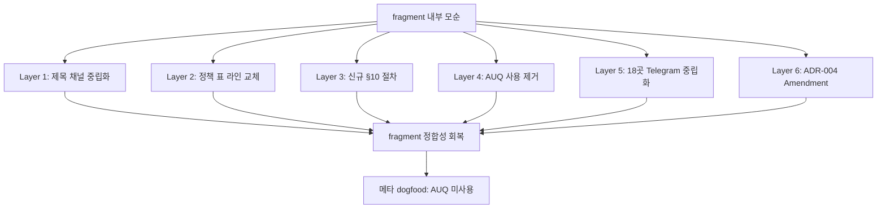

# Implementation Plan: spec-x-notify-bidirectional-policy

## 📋 Branch Strategy

- 신규 브랜치: `spec-x-notify-bidirectional-policy`
- 시작 지점: `main` (현재 HEAD: fc56f6c, spec-x-notify-channel-coherence 머지 후)
- PR base: fork main (LeoYoon7/harness-kit)

## 🛑 사용자 검토 필요

> [!IMPORTANT]
> - [ ] **정책 전환** — "보조 채널" (응답 비활성) → "양방향 채널" (응답 인식). fragment 내부 모순 해소
> - [ ] **AUQ 사용 제거** — 모든 게이트 텍스트 통일. multi-device 응답 가능성 확보.
> - [ ] **Layer 5 축소** (Critique #1) — 18곳 일괄 → 정책 표/제목/§10/line 122 등 7-8곳 핵심만. 안내성 텍스트는 보호.
> - [ ] **Layer 7 신규** (Critique #8) — governance/agent.md L401 영문 출처 정합
> - [ ] **dead branch/text 솔직 인지** (Critique #2/#3) — hook (c) AUQ 분기 + §5 의 AUQ 조건부 생략 = 사실상 dead. Amendment 부정 절에 명시

> [!WARNING]
> - [ ] **정책 변경의 ADR 가치** — ADR-004 Amendment 로 통합. ADR-005 분리는 premature
> - [ ] **메타 dogfood** — 본 spec 의 모든 의사결정 응답에 AUQ 미사용. 텍스트만

## 🎯 핵심 전략 (Core Strategy)

### 정합성 회복 4 layer



### 주요 결정

| 컴포넌트 | 전략 | 이유 |
|:---:|:---|:---|
| **정책 전환 시점** | 본 spec 머지 후 즉시 | fragment 모순 해소가 본 spec 의 가치 |
| **AUQ 코드 처리** | 사용 제거, 코드 유지 | 외부 sub-agent / 도구 가 AUQ 사용 가능. defensive |
| **18곳 중립화 방식** | 패턴별 일괄 + 역사 사례 명시 보호 | sed 일괄 risk → Edit 으로 case-by-case |
| **§10 위치** | §9 직후 | 응답 ack (§9) 와 응답 인식 (§10) 의 자연 순서 |
| **ADR 처리** | ADR-004 Amendment | history 추적성. parent/child 구조 회피 |

### 📑 ADR 후보

- [x] ADR-004 Amendment 추가 (정책 전환)

## 📂 Proposed Changes

### [MODIFY] `sources/claude-fragments/CLAUDE.fragment.md`

#### Layer 1: 제목 채널 중립화 (line 91)
```diff
- ## Telegram 의사결정 알림 프로토콜
+ ## 의사결정 알림 프로토콜 (Telegram/Discord)
```

#### Layer 2: 정책 표 라인 교체 (line 379)
```diff
- | **보조 채널** | 알림은 정보 전달용. Telegram 답장으로 명령을 수행하지 않음. |
+ | **양방향 채널** | 알림 발송 + 응답 인식. Telegram/Discord 답장을 의사결정 응답으로 처리 (§10). |
```

#### Layer 3: 신규 §10 응답 채널 인식 절차

§9 절 *직후*, "### Strict Loop 중 Task 완료 알림 정책" 직전에 신규 §10 삽입 (Critique #10 — 위치 통일):

```markdown
#### 10. 채널 답장을 의사결정 응답으로 인식 (응답 측 양방향) 【필수】

사용자가 Telegram/Discord 등 *원격 채널* 에서 답장으로 응답하면, 에이전트는 이를 *해당 의사결정 게이트의 응답* 으로 처리합니다.
multi-device 환경에서 외부 작업 시나리오 (모바일에서 plan accept, 모바일에서 옵션 선택 등) 의 핵심 절차.

**트리거 신호**:
- 사용자 메시지에 `<channel source="telegram" ...>` 또는 `<channel source="discord" ...>` 태그 포함
- 직전 에이전트 발화가 *의사결정 게이트* (선택지 제시, [Y/n], Plan Accept 등)

**처리 절차**:
1. 채널 메시지 본문을 PC chat 응답과 *동일 자격* 으로 의사결정 응답으로 처리
2. **응답 매핑 알고리즘** (Critique #5 — ChatOps 패턴):
   - 숫자 변형 (`1`, `1번`, `첫번째`, `옵션 1`) → 옵션 번호 매핑
   - 권장 키워드 (`권장`, `recommended`) → 권장 옵션 매핑
   - 옵션 라벨 substring 매칭 (예: 옵션 "Gemini (cross-model)" 에 `"Gemini"` / `"제미니"` 매칭)
   - 매핑 실패 또는 모호 → 사용자에게 명시적 확인 요청 (round trip)
3. §9 ack 발송 — 같은 채널의 reply 도구 사용 (단일 소스 원칙):
   - Telegram: `mcp__plugin_telegram_telegram__reply` (reply 본문에 `[ack]` 포맷 포함)
   - Discord: 등가 MCP 도구 (active 시)
4. 에이전트 작업 진행

**모호 케이스 처리** (간결화 — Critique 평가):
- 응답 형식 모호 (자유 텍스트, "잘 모르겠어", 제3 제안) → *사용자에게 명시적 확인 요청* (단일 원칙)
- 직전 게이트가 *둘 이상* 활성 → *가장 최근* 게이트 우선 매핑. 모호 시 확인 요청
- 같은 게이트 PC + 채널 양쪽 응답 → 먼저 도착 채택, 두 번째 무시 + 사용자 알림

**권한 검증**: MCP 가 담당 (chat_id 화이트리스트 등). 본 fragment 는 MCP 신뢰 전제 — 응답은 *선택지 매핑* 만 수행, 임의 명령 실행 안 함.

**관련 ADR**: `docs/decisions/ADR-004-notification-twofold-decision-flow.md` Amendment 절.
```

#### Layer 4: AUQ 사용 제거 + dead branch/text 솔직 인지

§10 본문에 "AUQ 미사용 (텍스트 선택지만)" 명시. §5 (Ad-hoc 선택지) 절의 AUQ 조건부 생략 규칙은 *dead text 솔직 인지* (Critique #3 — "legacy 보호" 표현 제거):

§5 의 "AUQ 사용 시 §5 stop 조건부 생략" 문단 *상단* 에 한 줄 추가:

```markdown
> **현재 정책 (spec-x-notify-bidirectional-policy 이후)**: 에이전트는 AUQ 사용 안 함 — 모든 게이트 텍스트 형식 통일 (multi-device 응답 지원). 본 조건부 생략 규칙은 *이론상 발화 불가* — 본 에이전트 절차에서는 사용 안 됨. 향후 dead 상태 6개월 누적 시 별도 spec 으로 완전 제거 재평가 (Critique #2).
```

**적용 범위** (Critique #7):
- 본 에이전트 (Claude Code main 세션): 적용 — 모든 게이트 텍스트
- Sub-agent (Opus critique, code review 등): 동일 절차 권장. fragment 미수신이므로 자율 판단
- 외부 도구 (Gemini CLI 모달, Codex 자체 UI 등): OOS — 본 키트 통제 밖

#### Layer 5: Telegram 명시 *축소* 채널 중립화 (Critique #1)

**변경 대상 (7곳)**:

| Line | 기존 | 수정 | 이유 |
|---|---|---|---|
| 85 | "Telegram 알림 / Remote Control" | "원격 채널 알림 (Telegram/Discord) / Remote Control" | 일반 설명 |
| 91 | (제목) | Layer 1 | — |
| 93 | "Telegram으로 알림을 발송" | "Telegram/Discord 로 알림을 발송" | 일반 설명 |
| 120 | "Telegram 만 보고도" | "원격 채널만 보고도" | 일반 설명 |
| 122 | "에이전트는 이 알림에 대해 아무것도 하지 않아도 됩니다 — 시스템이 자동으로 처리" | "입력 *대기* 시점의 알림 발화는 시스템이 자동 처리. 사용자 *응답* 도착 시점의 처리는 §10 절차 (양방향 채널)" | Critique #4 — 모순 해소 |
| 140 | "Telegram에도 발송" | "원격 채널에도 발송" | 일반 설명 |
| 379 | (정책 표) | Layer 2 | — |

**보호 (변경 안 함, Discord active 시점의 별도 spec)**:
- line 102-107: `.env.telegram` 환경변수 예시 (TELEGRAM_BOT_TOKEN 등)
- line 233: PR #9 역사 사례 (Telegram=3 Skip / Desktop=1 Skip)
- line 299, 300, 353: `mcp__plugin_telegram_telegram__reply` 도구명 (실제 도구 식별자)
- line 316: PR #9 의 `notify-telegram.sh` 역사 사례
- line 373: `.env.telegram` dedupe config 안내 (향후 미정 기능)
- line 380, 389, 392: `.env.telegram` 비활성화 안내

### [MODIFY] `docs/decisions/ADR-004-notification-twofold-decision-flow.md`

`## 🔄 Amendments` 절에 새 entry 추가 (PR #10 Amendment 직후):

```markdown
### 2026-05-29 (spec-x-notify-bidirectional-policy)

**정책 전환 — 보조 채널 → 양방향 채널 + AUQ 사용 제거**

**배경 — fragment 내부 모순 식별**:
- 섹션 서두 (line 93): "원격 판단을 내릴 수 있도록 지원" (양방향 의도)
- 정책 표 (line 379): "보조 채널 — Telegram 답장으로 명령을 수행하지 않음" (응답 차단)
- → 정책 표 라인이 *anomaly*. 서두 의도와 모순.
- 추가: 제목 "Telegram 의사결정..." vs Discord 병행 현실. fragment 내 18곳 Telegram 명시.
- line 122 "에이전트는 아무것도 안 함" 도 양방향 정책과 모순 (응답 도착 시 처리 필요).

**라이브 사례**:
- Telegram msg #3054: AUQ 모달이 모바일 응답 불가 → "이런경우 상호작용 안됨"
- Telegram msg #3113: §1.5 AUQ 알림에 선택지 미노출 → hook (c) 분기 발화 실패 가설

**결정**:

1. **정책 전환**: "보조 채널 (응답 비활성)" → "양방향 채널 (알림 + 응답 인식)". Telegram/Discord 답장을 *해당 의사결정 게이트의 응답* 으로 처리.
2. **AUQ 사용 제거**: 에이전트 절차에서 AskUserQuestion 도구 호출 금지. 모든 게이트 텍스트 형식 통일. 적용: 본 에이전트 + sub-agent. 외부 도구는 OOS.
3. **dead branch/text 솔직 인지**: hook (c) AUQ 분기 + §5 AUQ 조건부 생략 규칙 = AUQ 미사용 정책 하 *이론상 발화 불가*. "legacy 보호" 표현 대신 *dead 인지*. 6개월 누적 후 완전 제거 별도 spec 트리거.
4. **채널 중립화 — 축소 적용**: fragment 의 Telegram 명시 7곳 (제목/정책/§10/line 122 등 핵심) 만 채널 중립화. 환경변수 예시/dedupe/비활성화 안내는 Discord active 시점 별도 spec 보호.
5. **신규 §10**: 채널 답장 → 의사결정 응답 처리 절차 명문화. 응답 매핑 알고리즘 (숫자/권장 키워드/라벨 substring) 포함.
6. **Layer 7 — cross-document 정합**: governance/agent.md L401 영문 출처도 채널 중립화.

**Consequences 의 긍정 절 추가**:
- multi-device 환경의 *외부 지속 작업* (사용자 원래 의도) 가 정상화. 모바일에서 plan accept, 옵션 선택 가능.

**Consequences 의 부정 절 추가**:
- AUQ 의 native UI 장점 (PC 클릭) 상실. 사용자는 텍스트 입력 필요. UX 트레이드오프.
- 채널 응답 처리는 *에이전트 절차 의존* — MCP 신뢰 전제. 위반/race 케이스의 사후 학습.
- **결정 ID 부재로 복수 게이트 사이 응답은 휴리스틱 매핑** — 동시 활성 게이트 다수 시 누락 위험. 본 프로젝트 규모에서 trade-off 수용 (Slack action_id / Step Functions taskToken 패턴 미도입).
- **dead branch/text 잔존**: hook (c) AUQ 분기 + §5 의 AUQ 조건부 생략 규칙이 이론상 발화 불가 상태로 유지. 6개월 후 완전 제거 재평가.

**관련 spec**: `specs/spec-x-notify-bidirectional-policy/` — fragment 전 layer 정합화.
```

### [MODIFY] `sources/governance/agent.md` (Critique #8 — Layer 7)

L401 영문 줄:
```diff
-     - The User often reviews these decisions on mobile (via Telegram notifications or Remote Control) where reading long options is slow.
+     - The User often reviews these decisions on mobile (via remote channel notifications — Telegram/Discord — or Remote Control) where reading long options is slow.
```

### [SYNC] `.harness-kit/CLAUDE.fragment.md`

cp 도그푸딩 sync.

## 🧪 검증 계획 (Verification Plan)

### 단위 테스트 (해당 없음)

마크다운 + ADR 변경.

### 수동 검증 시나리오

1. **fragment grep**:
   - 사후 `grep -ci "telegram" sources/claude-fragments/CLAUDE.fragment.md` — 18 → 약 8 (역사 사례 + Telegram 전용 도구명만)
   - `grep -c "보조 채널"` — 1 → 0
   - `grep -c "양방향 채널"` — 0 → 1

2. **§10 절차 dogfood**:
   - 본 spec 의 모든 의사결정 게이트 응답 시 — AUQ 미사용 (텍스트만)
   - Telegram 답장 응답 시 → mcp reply 단독 + [ack] 포함
   - PC chat 응답 시 → notify.sh 단독

3. **ADR-004 Amendment 추적**:
   - `## 🔄 Amendments` 절에 2026-05-29 entry 추가 확인

### Lint / Format

- 마크다운 lint 미적용

## 🔁 Rollback Plan

- 본 PR revert 로 fragment + ADR 일괄 복구. PR #10 상태로.

## 📦 Deliverables 체크

- [x] task.md 작성 (다음 단계)
- [ ] 사용자 Plan Accept
- [ ] (실행 후) 모든 task 완료
- [ ] (실행 후) walkthrough.md / pr_description.md ship
