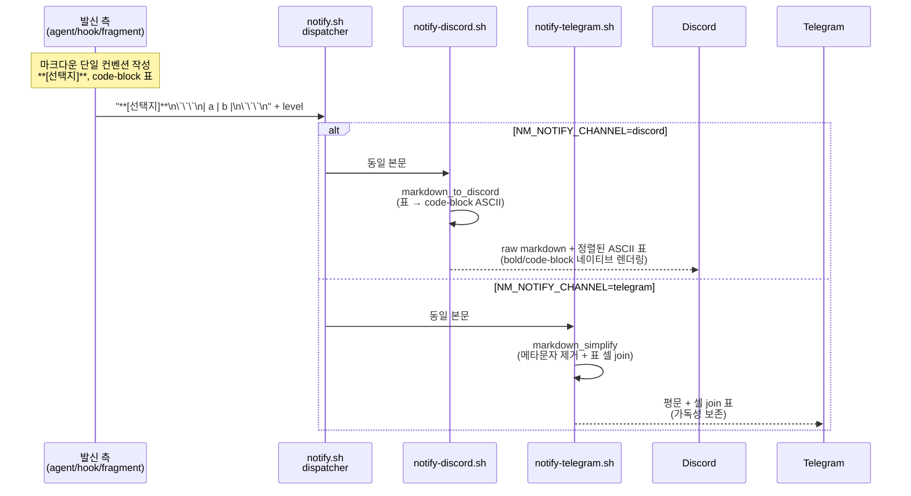

# Implementation Plan: spec-x-notify-channel-formatter

## 📋 Branch Strategy

- 신규 브랜치: `spec-x-notify-channel-formatter` (브랜치 이름 = spec 디렉토리 이름, `feature/` prefix 없음)
- 시작 지점: `main` (현재 HEAD `d011849`)
- 첫 task 가 브랜치 생성을 수행함

## 🛑 사용자 검토 필요 (User Review Required)

> [!IMPORTANT]
> - [ ] **발신 측 컨벤션 채택**: bold 라벨 (`**[선택지]**`), code-block 표, separator (`---`) 를 단일 컨벤션으로 강제. 신규 알림 추가 시 본 컨벤션 준수가 강제됨 — 거버넌스 영향
> - [ ] **인프라 책임 분담 원칙**: "발신 측은 마크다운 단일 작성, 인프라 측이 채널별 변환" 원칙 (ADR 후보). 향후 신규 채널 추가 시 인프라 측에만 변환 로직 추가하면 발신 측 무변경

> [!WARNING]
> - [ ] **Telegram 가독성 회귀 잠재 위험**: 발신 측이 마크다운 (`**bold**`) 으로 작성하면 markdown_simplify 가 메타문자 제거. 모든 마크다운 메타문자 누락 없는 제거 보장 필요 → F4 회귀 테스트
> - [ ] **Discord 표 처리 활성화 영향**: 기존에 표 사용하던 알림 (있다면) 의 렌더링 모양 변경됨. CLAUDE.md fragment 의 §1~§10 예시 검토 시 영향 평가
> - [ ] **도그푸딩 동기화 누락 시 본 레포 알림은 plain 유지**: 단위 테스트 + 통합 테스트가 sources 기반이라 PASS 해도 .harness-kit 미동기화 시 실제 사용 시 가독성 회복 안 됨 → F6 task 필수

## 🎯 핵심 전략 (Core Strategy)

### 아키텍처 컨텍스트



### 주요 결정

| 컴포넌트 | 전략 | 이유 |
|:---:|:---|:---|
| **notify-discord.sh** | `markdown_to_discord` 함수 중 **표 변환부만 활성화**. 변환 방식: 표 → code-block (정렬 ASCII). 함수 분리는 채택 안 함 — `[text](url)` sed 호출만 주석 처리 (A3) | Discord 가 markdown table 미지원이지만 code-block 안 등폭 폰트 렌더링은 지원. 통합 함수 유지가 향후 link 변환 도입 시 cohesion 높음 |
| **표 변환 ↔ chunking 순서** | **변환은 chunking 전에 적용**. `MESSAGE` 전체 변환 후 awk chunking 진입 — 변환으로 생성된 펜스는 기존 fence-balance 로직이 청크 경계에서 자동 처리 (A2) | 변환을 chunking 후로 미루면 표 일부 청크에서 separator 행 누락으로 변환 실패. 전 적용이 단순·안전 |
| **CJK 한글 폭** | **정렬 보장 미흡 허용 (명시 한계)** — 한글/ASCII 혼합 표는 정렬 깨짐 허용. 한글 전용·ASCII 전용 표는 정렬 보존. UAX #11 보정은 별도 spec (A1·NF6) | CJK 폭 보정 알고리즘 surface 가 본 spec 의 minor refactor 범위 초과. 한글 셀 사용 빈도 낮음 |
| **notify-telegram.sh** | 변경 없음. F4 회귀 테스트 + edge case 보강 (nested, unbalanced, backtick branch) — A4 | 기존 `markdown_simplify` 가 메타문자 제거 + 셀 join 으로 평문화 완료. 추가 변경은 회귀 위험만 증가 |
| **notify-on-input-wait.sh** | (a)/(b)/(c) 본문 분기에 bold 라벨 적용 | hook 자동 알림이 사용자 첫 접점. 컨벤션 모범 사례로 활용 |
| **CLAUDE.md fragment** | §1~§10 알림 예시 본문 마크다운화 + 신설 "마크다운 컨벤션" 섹션. §9 ack 는 `**[ack]**` 채택 (A5·B10 펜스 디테일 포함) | 발신 측 일관성 + 신규 알림 작성 가이드. `[ack]` substring 정책 유지 (markdown_simplify 후 평문화 → grep 호환) |
| **도그푸딩 동기화** | ADR-003 표준 절차 (`update.sh --self` 또는 동등 표준 명령) 단일 task. 파일별 cp 분리 안 함 (B8) | ADR-003 (dogfood-sync-policy) 이 표준 절차 정의 — 본 spec 의 특별 처리 불필요 |
| **agent.md 처리** | pre-flight grep 1회 후 발견 시만 task 추가 (B6) — 발견 없으면 pass (`[-]`) | 추정상 발견 가능성 낮음. 별도 task 분리 ROI 낮음 |
| **ADR 작성 타이밍** | **본 spec 안에서 ADR 작성 안 함**. C12 후보 (`notify-channel-adapter-responsibility`, type: **invariant**) 는 신규 채널 추가 spec 트리거 시점에 작성. C13 후보 (`discord-table-rendering-policy`, type: tradeoff) 는 walkthrough.md 의 "주요 결정" 섹션에 한 단락 기록 (B7) | 문제-실증 기반 ADR 원칙. ADR-005 직후 ADR 인플레이션 회피. walkthrough.md 가 미래 ADR 의 근거 자료 |

### 📑 ADR 후보

- [x] **본 spec 머지 시점 ADR 작성 안 함** (B7). 다음 두 후보는 spec.md ADR 섹션에 트리거 조건과 함께 기록:
  - **C12**: `notify-channel-adapter-responsibility` (type: **invariant**) — 신규 채널 추가 spec 트리거 시 작성
  - **C13**: `discord-table-rendering-policy` (type: tradeoff) — walkthrough.md 에 한 단락 기록만, ADR 격상은 embed 도입 spec 트리거 시

## 📂 Proposed Changes

### A. 인프라 (Discord 표 처리 활성화)

#### [MODIFY] `sources/bin/notify-discord.sh`

`markdown_to_discord` 함수 중 **표 변환 부분만 활성화** + `[text](url)` 변환 sed 호출만 주석 처리 (A3 결정). 통합 함수 유지 — 함수 분리 안 함.

#### 표 변환 알고리즘 명세 (B9)

**입력 식별 패턴**:
- **헤더 행**: `^\s*\|.*\|\s*$` (선두/말미 `|` + 1개 이상 셀 구분 `|`)
- **separator 행**: `^\s*\|[\s:|-]+\|\s*$` (셀 자리에 `-`, `:`, 공백, `|` 만)
- **데이터 행**: 헤더 행과 동일 패턴이되 separator 행이 아닌 경우

**블록 경계**:
- 표 블록 시작: 헤더 행 + 직후 라인이 separator 행 → 표로 인정 (separator 없으면 일반 텍스트로 통과)
- 표 블록 종료: 헤더 행 패턴이 아닌 라인 등장 또는 EOF

**셀 폭 측정 기준**:
- awk `length()` (character count, byte 아님). UTF-8 문자는 awk 가 1자로 계산 (locale=C 가정 시 byte 일 수 있어 `LANG=C.UTF-8` 또는 `LC_ALL=en_US.UTF-8` 환경 의존).
- **CJK 폭 보정 없음** (NF6 명시 한계): 한글 셀이 섞이면 시각 폭과 padding 불일치 — 정렬 깨짐 허용.
- 셀 폭 = `max(각 행의 해당 컬럼 셀 character count)`.

**Separator 행 처리**:
- 마크다운 표의 `|---|---|` separator 는 출력 ASCII 표의 *헤더-바디 구분 dash 라인* 으로 변환. 예: `| spec-id           | level |` 다음 라인에 `| ----------------- | ----- |` 출력.

**셀 데이터 내 `|` literal 처리**:
- 마크다운 escape `\|` 는 awk 입력 단계에서 placeholder (예: `<PIPE>`) 로 치환 후 출력 단계에서 `|` 복원. 미escape 된 `|` 가 셀 데이터에 있으면 잘못된 컬럼 분할로 처리 (사용자 책임).

**구분 dash 라인 출력 여부**:
- 헤더 다음에 separator dash 라인 출력 (가독성). dash 폭 = 컬럼 폭 + 2 (좌우 padding).

**Padding 방식**:
- 좌측 정렬 (`printf "%-Ns"`). 우측 정렬·중앙 정렬은 미지원 — separator 행의 `:---:`, `---:` 정렬 hint 무시 (사용자 책임).

**출력 형식**:
```text
\`\`\`
| col1_header | col2_header |
| ----------- | ----------- |
| data1_row1  | data2_row1  |
| data1_row2  | data2_row2  |
\`\`\`
```

**Edge cases**:
- 빈 표 (헤더만, 데이터 없음) → separator dash 라인만 출력 (헤더-바디 분리).
- 한 셀 표 (단일 컬럼) → 정상 처리.
- 셀 폭 불균형 (각 행 컬럼 수 다름) → 최대 컬럼 수 기준으로 빈 셀 padding.
- 표 안에 코드 펜스 (` ``` `) 가 셀 데이터로 들어오면 → 셀 텍스트로 취급 (현재 변환은 라인 단위라 안전).

세부 알고리즘은 task 3 의 TDD red 단계에서 fixture 로 *동작 검증*. 본 plan.md 의 명세가 *결정* 이고 fixture 는 *검증*.

### B. 인프라 (Telegram 회귀 보장)

#### [MODIFY] (또는 [NEW]) `tests/test-notify-telegram-markdown.sh`

기존 `tests/` 디렉토리 확인 필요. 신규 테스트 추가 또는 기존 테스트 확장.

```text
# 기본 테스트 케이스
# 1. **bold** 입력 → "bold" 출력 (메타문자 제거)
# 2. `code` 입력 → "code" 출력
# 3. # heading 입력 → "heading" 출력 (선두 마커 제거)
# 4. | a | b | 입력 → "a — b" 출력 (셀 join)
# 5. ```\n...\n``` 입력 → "..." 출력 (펜스 라인 제거)
# 6. [text](url) 입력 → "text (url)" 출력

# Edge case (A4) — 회귀 보강
# 7. ***strong italic*** → "strong italic" (별표 3겹 중첩)
# 8. ___strong___ → "strong" (밑줄 3겹 중첩)
# 9. **bold ** test (별표 사이 공백, unbalanced) → 현재 동작 명시: 메타문자 잔존 ("**bold ** test") — 사용자 의도 모호 case
# 10. **unclosed → 현재 동작 명시: 메타문자 잔존 — fixture 로 정확 출력 검증
# 11. `\`spec-x-notify\`test\`` (branch 이름에 backtick 포함) → 첫 backtick 쌍만 매칭 — 본 spec 의 허용 한계 (branch 이름에 backtick 사용 금지)
# 12. ```bash\n...\n``` (언어 hint) → "..." 출력, 언어 hint 도 제거됨 명시
```

> `notify-telegram.sh` 본체는 변경 없음. 회귀 테스트만 추가. 9·10·11 은 *현재 동작 명시* — 메타문자 잔존이 *수정 대상이 아니라 한계* 임을 fixture 로 박음.

### C. 인프라 (Hook 본문 마크다운화)

#### [MODIFY] `sources/hooks/notify-on-input-wait.sh`

본문 분기 (a)/(b)/(c)/일반 의 라벨을 bold 로 강화.

```text
# 변경 후 본문 예시
# (b) 텍스트 선택지:
NOTIFY_BODY="**사용자 선택 대기**
**Branch:** \`$BRANCH\`

**[최근 Claude 메시지]**
$CONTEXT"

# (c) AskUserQuestion (legacy 잔존):
NOTIFY_BODY="**사용자 질문 대기**
**Branch:** \`$BRANCH\`

$ASK_USER_Q_BODY"
```

### D. 발신 측 (CLAUDE.md fragment)

#### [MODIFY] `sources/claude-fragments/CLAUDE.md`

§1~§10 알림 예시 본문을 단일 마크다운 컨벤션으로 통일. **§9 ack 라벨은 `**[ack]**` 채택** (A5) — markdown_simplify 후 `[ack]` 평문화로 grep 호환 유지.

```text
# 변경 전 예시 (§5)
bash .harness-kit/bin/notify.sh "<spec-id> 의사결정 요청
상황: <1-2줄 요약>

선택지:
1. <옵션 1 요약>
2. <옵션 2 요약>

권장: <N번> — <근거>" stop

# 변경 후 예시 (§5)
bash .harness-kit/bin/notify.sh "**<spec-id> 의사결정 요청**

**[상황]** <1-2줄 요약>

**[선택지]**
1. <옵션 1 요약>
2. <옵션 2 요약>

**[권장]** <N번> — <근거>" stop

# §9 ack 예시 (A5 결정 반영)
bash .harness-kit/bin/notify.sh "✅ **[ack]** 사용자 응답: <선택지 요약>
**진행:** <다음 단계 한 줄 요약>" info
```

추가로 **신설 섹션**:

```text
## 알림 메시지 마크다운 컨벤션

본 프로젝트의 모든 notify.sh 호출 시 다음 컨벤션을 따른다. 인프라가 채널별로
적절히 변환하므로 (Discord: raw 마크다운 렌더링, Telegram: markdown_simplify
로 평문화) 발신 측은 단일 컨벤션만 알면 된다.

| 요소 | 마크다운 | Discord 렌더링 | Telegram 렌더링 |
|---|---|---|---|
| 라벨 | `**[라벨]**` | bold | 평문 |
| 강조 | `**값**` | bold | 평문 |
| 인라인 코드 | `` `값` `` | code | 평문 |
| 표 | ` ```\n| a | b |\n``` ` | 정렬 ASCII 표 (CJK 혼합 시 정렬 깨짐 허용) | 셀 — join |
| 구분선 | `---` | horizontal rule | 제거 |
| 코드 블록 | ` ```lang\n...\n``` ` | code block (lang hint 적용) | 펜스 제거, 본문 보존, **언어 hint 도 제거** |

**금지**:
- 표를 plain text 로 작성 (Discord 가독성 손실)
- bold/italic 메타문자 (`**`, `*`, `_`) 를 평문 의도로 사용
- 라벨 없이 본문만 나열 (구조화 손실)

**한계**:
- 한글 셀과 ASCII 셀이 혼합된 표는 Discord 등폭 폰트에서 정렬 보장 미흡 (NF6).
  한글 전용·ASCII 전용 표는 정렬 보존.
- `***nested***`, `**unbalanced ** text` 같은 중첩·비균형 메타문자는 Telegram 측
  markdown_simplify 에 메타문자 잔존 가능 — 단순 `**[라벨]**` 만 사용 권장.
- Branch 이름·식별자 등에 backtick (`` ` ``) 포함 금지 — markdown_simplify sed 매칭 깨짐.
```

### E. 발신 측 (agent.md)

#### [MODIFY] `sources/governance/agent.md` (조건부 — B6)

Pre-flight 단계에서 `sources/governance/agent.md` grep:

```bash
grep -nE 'notify\.sh|notify-(telegram|discord)' sources/governance/agent.md
```

**발견 시**: 단일 task 로 마크다운 컨벤션 통일.
**발견 없음**: task 자체 pass (`[-]`) 처리, 한 줄 사유 기록 — *agent.md 는 알림 호출이 §8.5 인용에 한정되어 fragment 와 분리된 surface*.

별도 task 분리 안 함 (B6 결정).

### F. 단위 테스트

#### [NEW] `tests/test-notify-discord-format.sh`

`notify-discord.sh` 의 표 처리 변환 검증 (Critique 반영).

```text
# 테스트 케이스
# T1. 표 없는 입력 (bold/code/quote 만) → raw 그대로 출력
# T2. 마크다운 표 입력 → code-block 안 정렬된 ASCII 표 출력 (헤더 + dash separator + 데이터)
# T3. 표 + bold 혼합 입력 → 표는 변환 + 그 외는 raw 통과
# T4. ASCII 전용 표 → 정렬 보존
# T5. 한글 전용 표 → 정렬 보존
# T6. 한글 + ASCII 혼합 표 → 정렬 깨짐 허용 (NF6 한계, fixture 로 현재 동작 명시)
# T7. Edge cases: 빈 표 (헤더만), 한 셀 표, 셀 폭 불균형 (컬럼 수 다름)
# T8. 셀 데이터 내 escape \| → | 복원
```

본 테스트는 실제 Discord API 를 호출하지 않고, 변환 함수의 출력만 검증 (function isolation 또는 환경변수로 dry-run 모드).

#### [NEW] `tests/test-notify-discord-chunking.sh` (Task 4, NF4 적극 검증)

표 변환 ↔ chunking 상호작용 검증.

```text
# 테스트 케이스
# C1. 3000+ byte 표 입력 → 2개 이상 청크 분할
# C2. 각 청크가 valid 마크다운 (펜스 균형 유지)
# C3. 청크 경계가 표 중간이면 양쪽 청크 모두 ``` 포함
# C4. 표 변환 후 본문이 CHUNK_SIZE 이하면 단일 청크
```

### G. 도그푸딩 동기화 (ADR-003 표준 절차 — B8)

#### 표준 명령

ADR-003 (`dogfood-sync-policy`) 의 표준 절차를 따른다 — 본 spec 특별 처리 없음.

```bash
# Pre-flight 에서 표준 명령 확인
bash update.sh --self
# 또는 update.sh 가 --self 미지원 시 ADR-003 의 권장 절차 따름
```

명령 실패 또는 ADR-003 미준수 사례 발견 시 *별도 spec 후보* — 본 spec 의 surface 외.

별도 파일별 cp 분리 안 함 (B8 결정).

## 🧪 검증 계획 (Verification Plan)

### 단위 테스트 (필수)

```bash
# notify-discord.sh 표 처리 변환
bash tests/test-notify-discord-format.sh

# notify-telegram.sh markdown_simplify 회귀
bash tests/test-notify-telegram-markdown.sh
```

### 통합 테스트 (Integration Test Required = yes)

본 레포 자체에 변경 적용 후 실제 Discord/Telegram 채널에 샘플 메시지 발송하여 시각 검증.

```bash
# Discord 채널 적용 상태에서
NM_NOTIFY_CHANNEL=discord bash .harness-kit/bin/notify.sh "**테스트 알림**

**[표 예시]**
\`\`\`
| 항목 | 값 |
| --- | --- |
| spec-id | spec-x-notify-channel-formatter |
| level | info |
\`\`\`

**[선택지]**
1. 옵션 A
2. 옵션 B

**[권장]** 1번" info

# Telegram 채널 적용 상태에서 동일 메시지 발송 후 평문 도달 확인
```

스크린샷을 `walkthrough.md` 에 첨부.

### 수동 검증 시나리오

1. **시나리오 1 — Discord 표 렌더링**: 위 통합 테스트의 표가 code-block 안 정렬된 ASCII 표로 보이는가? → 기대: 등폭 폰트 + 컬럼 정렬 보존
2. **시나리오 2 — Telegram 평문 검증**: 동일 메시지가 Telegram 에 메타문자 (`**`, `` ` ``) 노출 없이 평문 도달하는가? → 기대: bold 마커 제거, 표는 `항목 — 값 / spec-id — ...` 형태 셀 join
3. **시나리오 3 — Hook 자동 알림**: 본 레포에서 사용자 입력 대기 시 자동 발화되는 알림이 마크다운 라벨로 보이는가? → Discord 에서 `**사용자 선택 대기**`, `**Branch:**`, `**[최근 Claude 메시지]**` bold 렌더링 확인
4. **시나리오 4 — 회귀 검증**: 기존 알림 (예: `/hk-align` 직후) 본문이 정상 도달하는가? → 기능 손실 없음

## 🔁 Rollback Plan

- `notify-discord.sh` 의 표 처리 활성화가 예상 외 동작 (예: 비표준 표 입력 → 무한 루프 / 잘못된 변환) 시:
  - **Rollback**: `markdown_to_discord` 호출 라인을 다시 주석 처리. `git revert <commit>` 으로 단일 commit rollback 가능 (One Task = One Commit 원칙).
- CLAUDE.md fragment 컨벤션 변경 후 발신 측 알림이 의도와 다른 모양으로 보일 경우:
  - **Rollback**: fragment 변경 commit revert. 인프라 측 변경은 유지 (호환 가능).
- 도그푸딩 동기화 후 본 레포 알림이 깨질 경우:
  - **Rollback**: `.harness-kit/` 측 변경만 revert (`git checkout main -- .harness-kit/`).

## 📦 Deliverables 체크

- [ ] task.md 작성 (다음 단계)
- [ ] 사용자 Plan Accept
- [ ] (실행 후) 모든 task 완료
- [ ] (실행 후) walkthrough.md / pr_description.md ship
