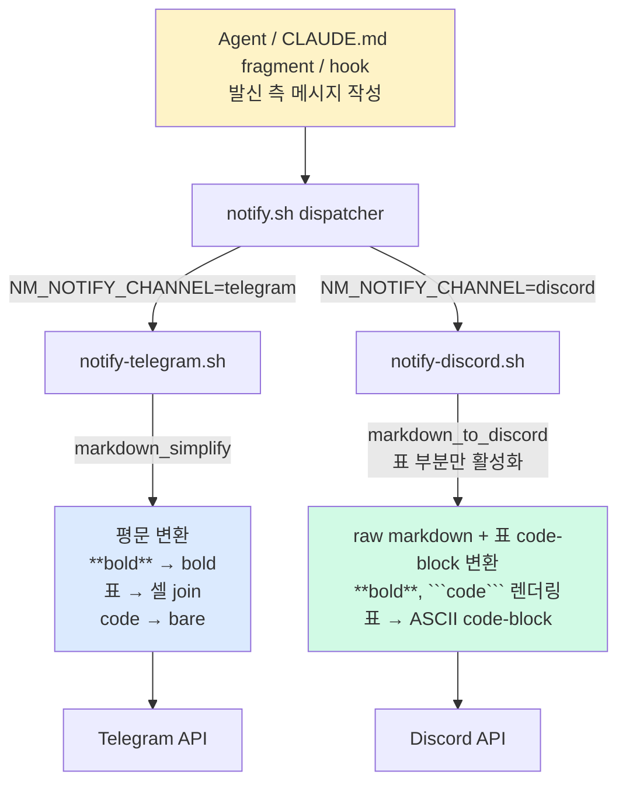

# spec-x-notify-channel-formatter: 알림 채널별 포맷터 일관화 및 Discord 마크다운 가독성 회복

## 📋 메타

| 항목 | 값 |
|---|---|
| **Spec ID** | `spec-x-notify-channel-formatter` |
| **Phase** | `phase-x` |
| **Branch** | `spec-x-notify-channel-formatter` |
| **상태** | Planning |
| **타입** | Refactor |
| **Integration Test Required** | yes (실제 채널 발송 시각 검증) |
| **작성일** | 2026-05-29 |
| **소유자** | Leo |

## 📋 배경 및 문제 정의

### 현재 상황

알림 인프라는 채널별 dispatcher 구조로 이미 구축되어 있다.

- **`sources/bin/notify.sh`** (dispatcher): `NM_NOTIFY_CHANNEL` 값에 따라 `notify-telegram.sh` / `notify-discord.sh` 로 분기. `spec-x-notify-drop-both` 이후 단일 채널 발송.
- **`sources/bin/notify-discord.sh`**: 본문을 **raw 마크다운으로 그대로 전송** (코드 주석: "Discord 는 bold/italic/code/quote/heading/bullet 등 마크다운을 네이티브 렌더링하므로 raw 그대로 전송하는 것이 가독성이 좋음"). 단, `markdown_to_discord` 함수 (표 변환 + `[text](url)` 평문화) 는 **의도적으로 비활성** 상태로 보존만 됨.
- **`sources/bin/notify-telegram.sh`**: 본문을 `markdown_simplify` 로 처리하여 `**bold**`, `\`code\``, `# heading`, `|table|`, `[text](url)` 등 모든 마크다운 메타문자를 제거하고 평문으로 전송. 표는 `|a|b|` → `a — b` 셀 join 으로 평문화.
- **발신 측**: CLAUDE.md fragment 의 §1~§10 알림 예시들, `sources/hooks/notify-on-input-wait.sh` 의 (a)/(b)/(c) 본문 분기, agent.md 의 산발적 호출 라인들. 모두 **plain text 위주**로 작성되어 있음.

### 문제점

#### P1. 사용자 채택 근거 회복 불가 (가독성)

사용자가 Telegram 대비 Discord 를 채택한 이유는 **마크다운 렌더링 우위 (bold·italic·code block·blockquote·separator)** 이다. 그러나 발신 측 메시지 본문이 plain text 위주이므로 Discord 도 평문처럼 보임 — 채택 의의가 사라짐.

라이브 사례 (2026-05-29, 사용자 스크린샷):
- `[최근 Claude 메시지]`, `[상황 / 맥락]`, `[선택지]`, `[권장]` 같은 라벨이 일반 텍스트
- 선택지 번호 `1. ... 2. ... 3. ...` 가 bold/separator 없이 평문 나열
- 표 형식 데이터가 들어오면 그대로 raw 로 전달되어 Discord 에서는 정렬 깨짐 (Discord 는 표준 markdown table 미지원)

#### P2. 발신 측 "혼용" — 일관성 부재

같은 알림 시스템 내에서 어떤 호출은 마크다운 일부 사용, 어떤 호출은 완전 평문, 어떤 호출은 표를 plain text 로 작성. 일관된 컨벤션 부재로 가독성 예측이 어렵고 신규 알림 추가 시 가이드 없음.

#### P3. Discord 표 처리 미적용

`notify-discord.sh` 의 `markdown_to_discord` 함수가 비활성이므로 발신 측이 마크다운 표 (`| col | col |`) 를 보내도 Discord 에서는 raw 로 보임 → 정렬 깨짐 + 가독성 최악. Discord 가독성 회복의 핵심 부분.

### 해결 방안 (요약)

(1) **발신 측 일관화**: CLAUDE.md fragment 알림 예시 + `notify-on-input-wait.sh` 본문 작성부 + agent.md 호출 라인을 **단일 마크다운 컨벤션**으로 통일. bold 라벨 (`**[선택지]**`), code-block 표/구조화 정보, `---` separator 활용.

(2) **인프라 측 표 처리 활성화**: `notify-discord.sh` 의 `markdown_to_discord` 함수에서 **표 부분만 code-block (정렬 ASCII 표) 으로 변환** 활성화. 표가 발신 측에 들어오면 Discord 가독성 있는 형태로 자동 변환.

(3) **컨벤션 문서화**: CLAUDE.md fragment 에 "알림 메시지 마크다운 컨벤션" 섹션 신설. 신규 알림 추가 시 따라야 할 패턴 명시 (라벨 bold, 표 code-block, 구조화 정보 separator).

(4) **Telegram 회귀 방지**: `notify-telegram.sh` 의 `markdown_simplify` 가 마크다운 메타문자를 완전 제거하는지 회귀 테스트 추가. 발신 측이 마크다운으로 작성해도 telegram 측에 메타문자가 노출되지 않음을 보장.

## 📊 개념도



## 🎯 요구사항

### Functional Requirements

1. **F1 (발신 측 일관화)**: CLAUDE.md fragment `.harness-kit/CLAUDE.fragment.md` (= `sources/claude-fragments/CLAUDE.md`) 의 §1~§10 알림 예시 본문이 단일 마크다운 컨벤션을 따른다.
   - 섹션 라벨 (`[선택지]`, `[권장]`, `[상황 / 맥락]`, `[최근 Claude 메시지]`) → `**[선택지]**` 형태 bold
   - 선택지 본문 → `1.`/`2.`/`3.` 또는 code-block 정렬
   - 표 → ` ``` ` code-block 정렬
2. **F2 (Discord 표 처리)**: `sources/bin/notify-discord.sh` 의 `markdown_to_discord` 함수 중 **표 변환 부분만 활성화**한다.
   - 입력: `| col1 | col2 |` 마크다운 표
   - 출력: code-block 안의 정렬된 ASCII 표 (Discord 에서 등폭 폰트로 렌더링되어 정렬 보존)
   - `[text](url)` 변환은 보류 (현재 사례에 영향 없음)
   - **함수 디자인 결정 (A3)**: 기존 통합 함수 (`markdown_to_discord` = 표 변환 + `[text](url)` 평문화) 를 그대로 유지하되 **`[text](url)` 변환 sed 호출만 주석 처리** 한다. 함수 분리는 채택 안 함 — 향후 link 변환 도입 시 단일 함수 안에 awk pipeline 한 단계 추가가 분리 함수보다 cohesion 높음.
   - **CJK 한글 폭 한계 (A1)**: 한글 셀이 ASCII 셀과 혼합된 표는 Discord 등폭 폰트에서 정렬 보장 미흡 (Unicode UAX #11 East Asian Width 미적용). awk `length()` 가 character count 기반이라 한글 1 char = ASCII 2 char 의 시각 폭을 padding 에 반영 못함. 본 spec 은 *명시 한계로 허용* — 한글 셀 표는 정렬 깨짐 허용, 한글 전용 또는 ASCII 전용 표는 정렬 보존. CJK 폭 보정 알고리즘은 별도 spec (`spec-x-notify-cjk-width-padding`) 의 후보.
   - **chunking 상호작용 (A2)**: 표 변환은 **chunking 전에 일어남** — `MESSAGE` 전체에 `markdown_to_discord` 적용 후 awk chunking 단계 진입. 변환으로 생성된 code-block 펜스는 기존 fence-balance 로직 (`notify-discord.sh:132-166`) 이 청크 경계에서 자동으로 닫고 재오픈하므로 표 중간에서 청크가 갈려도 양쪽 청크가 valid 마크다운 유지. **NF4 강화**: 본 변환·chunking 순서가 회귀 없이 동작함을 통합 테스트로 적극 검증 (3000+ byte 표 입력 → 청크 분할 + 양쪽 valid 검증).
3. **F3 (hook 본문 작성)**: `sources/hooks/notify-on-input-wait.sh` 의 (a)/(b)/(c) 본문 분기가 마크다운 라벨을 사용한다.
   - `[최근 Claude 메시지]` → `**[최근 Claude 메시지]**`
   - `Branch: $BRANCH` → ``` `$BRANCH` ``` inline code
4. **F4 (Telegram 회귀 방지)**: `sources/bin/notify-telegram.sh` 의 `markdown_simplify` 가 다음을 모두 제거함을 회귀 테스트로 보장한다.
   - `**bold**`, `__bold__`, `*italic*`, `_italic_`, `` `code` ``, `# heading`
   - `| a | b |` 표 → `a — b` 셀 join
   - ``` ``` ``` 코드 펜스 라인 제거
   - `[text](url)` → `text (url)` 변환
   - **Edge cases (A4)**:
     - **중첩 강조**: `***strong italic***` → `strong italic` (별표 3겹), `___strong___` → `strong` — 현재 sed 패턴이 중첩 미커버 가능성. 회귀 테스트 케이스 필수.
     - **Unbalanced 메타문자**: `**bold ** test` (별표 사이 공백), `**unclosed` → 메타문자 잔존 허용 (사용자 의도 모호 — 평문 의도일 수 있음). 회귀 테스트로 *현재 동작 명시*.
     - **Branch 이름에 backtick 포함**: `\`spec-x-notify\`test\`` 같은 입력 → 첫 backtick 쌍만 매칭되어 중간 텍스트 손실 가능. 본 spec 은 *허용 한계로 명시* — branch 이름에 backtick 사용 금지 (Git 자체도 권장 안 함).
     - **언어 hint 펜스**: ` ```bash ` 같은 라인은 `markdown_simplify:74` `/^[[:space:]]*```/` 패턴으로 라인 자체가 next 되므로 *언어 hint 도 함께 제거*. F5 컨벤션 표에 명시.
5. **F5 (컨벤션 문서화)**: CLAUDE.md fragment 에 "알림 메시지 마크다운 컨벤션" 섹션을 신설하여 다음을 명시한다.
   - 섹션 라벨은 `**[라벨]**` bold
   - 표·구조화 데이터는 ` ``` ` code-block (Discord/Telegram 양쪽 가독성 보장 — Discord 는 등폭 렌더링, Telegram 은 평문 보존)
   - 구분선은 `---` (Discord 만 렌더링, Telegram 은 제거됨)
   - 라벨 vs 본문은 빈 줄로 분리
   - **B10 (펜스 디테일)**: 언어 hint 가 있는 펜스 (` ```bash `, ` ```text `) 는 Telegram 측 `markdown_simplify` 에서 *언어 hint 도 함께 제거* 됨 (라인 자체 next). 컨벤션 표의 "Telegram 렌더링" 컬럼에 "펜스 제거, 본문 보존, 언어 hint 도 제거" 로 명시.
   - **A5 (§9 ack 라벨)**: 기존 `[ack]` substring 정책 유지 + `**[ack]**` bold 강화 채택. Telegram 측 `markdown_simplify` 가 `**` 제거 후 `[ack]` 평문화 → grep 호환 유지 + Discord 가독성 회복. fragment §9 의 모든 ack 메시지 예시 통일.
   - 향후 신규 알림 추가 시 본 컨벤션 준수
6. **F6 (도그푸딩 동기화)**: `sources/` 변경 사항을 `.harness-kit/` (installed) 에 동기화하여 본 레포 자체의 알림도 즉시 마크다운 가독성 확보. ADR-003 (dogfood-sync-policy) 의 표준 절차 따름 — 별도 task 분리 없이 단일 명령으로 처리.

### Non-Functional Requirements

1. **NF1 (Telegram 가독성 무회귀)**: 본 spec 후 Telegram 측 알림 본문에 마크다운 메타문자가 노출되어선 안 됨. 회귀 테스트로 보장.
2. **NF2 (bash 3.2 호환)**: 모든 변경 스크립트는 macOS 기본 bash 3.2 에서 동작 (project CLAUDE.md 규약).
3. **NF3 (silent skip 정책 유지)**: `.env.{telegram,discord}` 미존재·네트워크 실패 시 무음 진행 (constitution / 기존 알림 정책 유지).
4. **NF4 (chunking 로직 무회귀 + 적극 검증)**: `spec-x-notify-chunk-line-aware` 의 라인 경계 + 펜스 균형 보존 로직은 손대지 않음. **표 변환과 chunking 의 상호작용을 적극 검증**: 변환은 chunking 전에 일어나며, 변환 후 본문이 CHUNK_SIZE 를 초과해도 fence-balance 로직이 청크 경계의 펜스를 자동 닫고 재오픈함을 통합 테스트로 보장 (3000+ byte 표 입력 fixture).
5. **NF5 (단일 채널 정책 유지)**: `spec-x-notify-drop-both` 의 단일 채널 발송 정책 무변경.
6. **NF6 (CJK 폭 한계 명시)**: 한글 셀과 ASCII 셀이 혼합된 표는 Discord 등폭 폰트에서 정렬 보장하지 않음 (Unicode UAX #11 East Asian Width 미적용). 한글 전용 또는 ASCII 전용 표는 정렬 보존. CJK 폭 보정은 별도 spec 후보 (`spec-x-notify-cjk-width-padding`).

## 🚫 Out of Scope

- **Telegram MarkdownV2/HTML parse_mode 도입** — 메타문자 escape 회귀 위험 매우 큼 (notify-telegram.sh 주석에 명시된 이유). 별도 spec 으로 분리.
- **notify.sh 채널 라우팅 로직 변경** — `NM_NOTIFY_CHANNEL` 분기 무변경.
- **신규 채널 추가** (Slack, KakaoTalk 등) — 본 spec 은 기존 두 채널 가독성 회복만.
- **`.env.discord` / `.env.telegram` 설정 변경** — 사용자 환경 무영향.
- **`markdown_simplify` 함수 강화** — 현재 충분 (회귀 테스트로 확인). 추가 메타문자 발견 시 별도 spec.
- **`markdown_to_discord` 의 `[text](url)` 변환 활성화** — 현재 라이브 알림에 영향 없음. 필요 시 별도 spec.
- **`notify.sh` API 변경** — 호출 시그니처 `<message> <level>` 무변경. 호환성 유지.
- **알림 발송 빈도·dedup 정책 변경** — 기존 cooldown / fingerprint dedup 로직 무변경.

## 📑 ADR 후보 (Architecture Decision Records)

> Critique (`critique.md`) §4 에 따라 후보를 갱신 (C12·C13 반영).

- [x] **C12 후보 (작성 보류 — 트리거 대기)**: `notify-channel-adapter-responsibility` (type: **invariant**)
  - **이유**: "발신 측은 단일 마크다운 컨벤션, 인프라 측이 채널별 변환 책임" 은 *모든 채널 확장의 전제* 인 invariant — 위반 시 즉시 reject 되어야 할 성격. ADR-004 의 `convention` 보다 강함.
  - **작성 타이밍**: 본 spec 머지 직후가 아닌 **신규 채널 추가 spec (예: Slack/Kakao) 트리거 시점** 에 작성 — 문제-실증 기반 ADR 원칙 (`docs-rca-driven`) 준수, ADR 인플레이션 회피. 본 spec 의 walkthrough.md 에 결정 근거만 미리 기록.
- [x] **C13 후보 (walkthrough.md 기록)**: `discord-table-rendering-policy` (type: tradeoff)
  - **이유**: Discord 표 처리의 *code-block ASCII* vs *embed fields* vs *raw 통과* 트레이드오프 audit trail. embed 대안의 명시적 기각 근거 (surface 증가 / chunking 재설계 / API 변경) 를 박아두면 향후 embed 도입 spec 이 *기각 사유의 반박* 으로 시작 가능.
  - **작성 방식**: ADR 별도 작성은 인플레이션 우려 → **walkthrough.md 의 "주요 결정" 섹션에 한 단락 기록** 만 채택. 미래 embed spec 트리거 시 ADR 로 격상 검토.

## 🔍 Critique 결과 (선택)

`specs/spec-x-notify-channel-formatter/critique.md` (Opus 서브에이전트, 2026-05-29).

**핵심 발견 5건 + 권장안 반영 완료**: A1 CJK 폭 한계 명시 (NF6 신설) / A2 chunking ↔ 표 변환 상호작용 (F2 + NF4 강화) / A3 F2 함수 디자인 결정 spec 레벨 격상 / A4 F4 edge case 보강 / A5 §9 ack bold 강화 결정. 권장안: "현재 spec 유지 + CJK 한계 명시" 채택. 대안 B (Discord embed) / C (구조화 컴포저) 는 surface 폭증으로 별도 spec 후보.

## ✅ Definition of Done

- [ ] F1 — CLAUDE.md fragment §1~§10 알림 예시 본문이 마크다운 컨벤션 통일
- [ ] F2 — `notify-discord.sh` 의 표 처리 활성화 + code-block 변환 동작
- [ ] F3 — `notify-on-input-wait.sh` 본문 마크다운 라벨 적용
- [ ] F4 — `notify-telegram.sh` markdown_simplify 회귀 테스트 PASS
- [ ] F5 — CLAUDE.md fragment 에 "알림 메시지 마크다운 컨벤션" 섹션 신설
- [ ] F6 — `.harness-kit/` 도그푸딩 동기화 완료
- [ ] 단위 테스트 PASS (`notify-discord.sh` 표 변환, `notify-telegram.sh` markdown_simplify 회귀)
- [ ] 통합 테스트: 본 레포 알림으로 실제 Discord/Telegram 에 샘플 메시지 발송 시각 검증 (스크린샷을 walkthrough.md 에 첨부)
- [ ] `walkthrough.md` 와 `pr_description.md` 작성 및 ship commit
- [ ] `spec-x-notify-channel-formatter` 브랜치 push 완료
- [ ] 사용자 검토 요청 알림 완료
