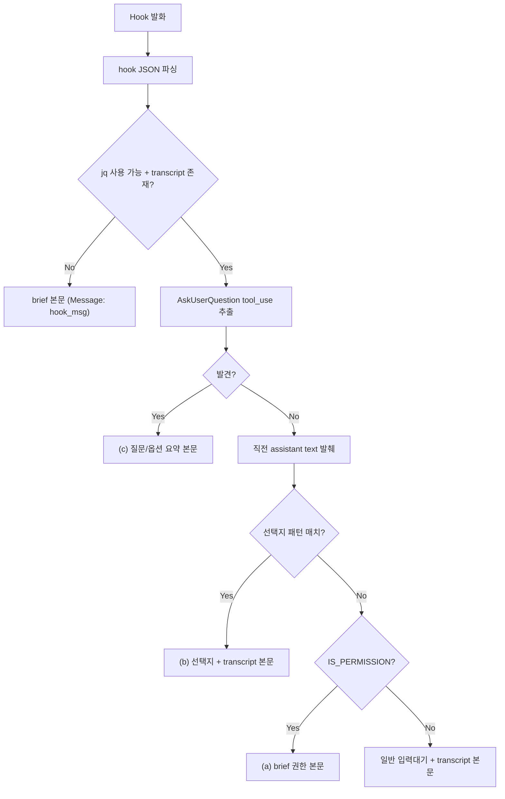

# Implementation Plan: spec-x-notify-choice-context

## 📋 Branch Strategy

- 신규 브랜치: `spec-x-notify-choice-context`
- 시작 지점: `main` (현재 HEAD: 5608d1b, spec-x-md-lf-normalize 머지 후)
- PR base: fork main (LeoYoon7/harness-kit)
- 첫 task 가 브랜치 생성을 수행

## 🛑 사용자 검토 필요

> [!IMPORTANT]
> - [ ] **양방향 강화** — 입력 측 (hook) + 출력 측 (fragment §9). 사용자 추가 지적 (Telegram msg, 2026-05-28) 반영, Reconciliation option A
> - [ ] **본문 분기 우선순위** — (c) AskUserQuestion > (b) 텍스트 선택지 > (a) 순수 권한 > 일반
> - [ ] **AskUserQuestion 포맷** — `질문 N개\n1. <Q>\n   옵션: <opt1> / <opt2>` 형태. description 미포함 (라벨만)
> - [ ] **응답 알림 트리거** — 명시적 선택지 응답만. 일반 대화 / merge signal 제외
> - [ ] **응답 알림 레벨** — 기존 `info` 재사용 (신규 레벨 미추가)

> [!WARNING]
> - [ ] **dedupe 영향** — 본문 변경으로 fingerprint 가 달라짐. 현재 TTL 300초 cover.
> - [ ] **silent skip 보존** — jq / transcript 미존재 시 fallback brief.
> - [ ] **출력 측은 에이전트 절차** — hook 자동화 아님. 사용자가 절차 위반 발견 시 walkthrough/RCA 캡처.

## 🎯 핵심 전략 (Core Strategy)

### 본문 분기 흐름



### 주요 결정

| 컴포넌트 | 전략 | 이유 |
|:---:|:---|:---|
| **AskUserQuestion 추출** | jq 로 `tool_use` + `name=="AskUserQuestion"` 의 `input.questions[]` 파싱 | tool_use 입력은 transcript JSON 에 그대로 보존되므로 직접 접근 가능 |
| **선택지 패턴 매치** | 한정된 regex set 으로 grep -E | 휴리스틱 — 패턴 진화 시 추가 가능. 명백한 false positive 우려 낮음 |
| **(a) 분기 위치** | 가장 마지막 (b/c 미발견 시) | 권한 모드의 brief 본문은 안전망 — 새 케이스에 false positive 안 만들도록 우선순위 낮춤 |
| **본문 line count** | 본문은 ~10줄 이내 유지 (CLAUDE.fragment.md "간결성" 정책) | 옵션 라벨 자체가 길면 자연스럽게 늘어남 — Telegram 4096자 한계 내라 무방 |

### 📑 ADR 후보

- [x] ADR 가치 있는 결정 있음 → `notification-twofold-decision-flow` (type: `convention`)
- 이유: 의사결정 요청 + 응답 ack 양방향 패턴이 cross-spec / long-lived. 향후 모든 알림 spec 의 컨벤션.
- 작성 시점: 본 spec 머지 시점 → `docs/decisions/ADR-004-notification-twofold-decision-flow.md`

## 📂 Proposed Changes

### [MODIFY] `sources/hooks/notify-on-input-wait.sh`

기존 lines 62-97 (IS_PERMISSION + CONTEXT + 본문 분기) 를 다음으로 교체:

```bash
# 권한 요청 감지 (기존 유지)
IS_PERMISSION=0
if [ "$EVENT" = "Notification" ] && \
   echo "$HOOK_MSG" | grep -qiE 'permission|approve|requesting|needs|allow|승인|허가|권한'; then
    IS_PERMISSION=1
fi

# transcript 분석 — AskUserQuestion + text context 동시 추출
ASK_USER_Q_BODY=""
CONTEXT=""
HAS_TEXT_CHOICE=0
if [ -n "$TRANSCRIPT" ] && [ -f "$TRANSCRIPT" ] && command -v jq >/dev/null 2>&1; then
    # (c) AskUserQuestion 최근 호출 추출
    AUQ_JSON=$(tail -100 "$TRANSCRIPT" 2>/dev/null | \
        jq -rs '[.[] | select(.type == "assistant") | .message.content[]? | select(.type == "tool_use" and .name == "AskUserQuestion")] | last // empty' 2>/dev/null || echo "")

    if [ -n "$AUQ_JSON" ]; then
        # .header (탭 라벨) 도 포함 — 없으면 빈 문자열
        ASK_USER_Q_BODY=$(echo "$AUQ_JSON" | jq -r '
            "[질문 " + (.input.questions | length | tostring) + "개]\n" +
            ([.input.questions | to_entries[] |
                (.value.header // "" | if . == "" then "" else "[" + . + "] " end) as $hdr |
                "\(.key + 1). \($hdr)\(.value.question)\n   옵션: " +
                (.value.options | map(.label) | join(" / "))
            ] | join("\n"))
        ' 2>/dev/null || echo "")
    fi

    # (b) 직전 assistant text 발췌 (기존 로직)
    CONTEXT=$(tail -100 "$TRANSCRIPT" 2>/dev/null | \
              jq -rs '[.[] | select(.type == "assistant") | (.message.content // []) | map(select(.type == "text") | .text) | join("\n") | select(. != "")] | last // "" | .[:3000]' 2>/dev/null || echo "")

    # 선택지 패턴 감지 — 마지막 단락 (직전 5줄) 만 매칭하여 false positive 차단
    # `^\d+\)` 제거 — 회고/예시 텍스트 false positive 원인 (Critique 발견)
    if [ -n "$CONTEXT" ]; then
        LAST_PARAGRAPH=$(echo "$CONTEXT" | tail -5)
        if echo "$LAST_PARAGRAPH" | grep -qE '\[선택지\]|\[권장\]|\[Recommendation\]|\[Y/n\]|\[y/N\]|\[의사결정 요청\]|\[Decision Request\]'; then
            HAS_TEXT_CHOICE=1
        fi
    fi
fi

# 본문 분기 — 우선순위: (c) > (b) > (a) > 일반
if [ -n "$ASK_USER_Q_BODY" ]; then
    NOTIFY_BODY="사용자 질문 대기
Branch: $BRANCH

$ASK_USER_Q_BODY"
elif [ "$HAS_TEXT_CHOICE" = "1" ]; then
    NOTIFY_BODY="사용자 선택 대기
Branch: $BRANCH

[최근 Claude 메시지]
$CONTEXT"
elif [ "$IS_PERMISSION" = "1" ]; then
    NOTIFY_BODY="권한 승인 대기
Branch: $BRANCH
$HOOK_MSG"
elif [ -n "$CONTEXT" ]; then
    NOTIFY_BODY="사용자 입력 대기 중
Branch: $BRANCH

[최근 Claude 메시지 일부]
$CONTEXT"
else
    NOTIFY_BODY="사용자 입력 대기 중
Branch: $BRANCH
Message: $HOOK_MSG"
fi
```

핵심 변경:
1. AskUserQuestion 추출 로직 추가 (`AUQ_JSON` + `ASK_USER_Q_BODY`).
2. 텍스트 선택지 패턴 감지 (`HAS_TEXT_CHOICE`).
3. CONTEXT 추출을 IS_PERMISSION 조건에서 분리 — 항상 추출 (분기에서만 사용 결정).
4. 본문 분기 우선순위 재정렬: (c) → (b) → (a) → 일반.

### [SYNC] `.harness-kit/hooks/notify-on-input-wait.sh`

`cp sources/hooks/notify-on-input-wait.sh .harness-kit/hooks/notify-on-input-wait.sh` — 도그푸딩 sync.

### [MODIFY] `sources/claude-fragments/CLAUDE.fragment.md` — 신규 §9 추가

§8 "/hk-phase-ship Go/No-Go" 직후, "### Strict Loop 중 Task 완료 알림 정책" 직전에 다음 섹션을 삽입:

```markdown
#### 9. 사용자 응답 직후 — 진행 시작 알림 (info) 【필수】

사용자가 명시적 의사결정에 응답하면 **에이전트는 즉시 다음 명령을 실행**합니다.
multi-device 환경에서 PC 응답 시 모바일 측에 진행 상태를 동기화하기 위한 핵심 알림.

```bash
bash .harness-kit/bin/notify-telegram.sh "✅ [ack] 사용자 응답: <선택지 요약>
진행: <다음 단계 한 줄 요약>" info
```

**트리거 (반드시 발송)**:
- 명시적 선택지 응답 (`1`/`2`/`3`/`권장`/`Y`/`N`/`yes`/`no` 등)
- AskUserQuestion 응답
- Plan Accept / Critique / spec-critique 등 명시적 게이트 응답
- Go/No-Go 다이얼로그 의사결정 응답
- Opinion Divergence Reconciliation 옵션 선택 (constitution §5.6)

**제외 (발송 안 함)**:
- 일반 대화 / 질문 (선택지 형식 아님)
- task 완료 / merge signal (별도 `merge` 레벨 알림 존재)
- 자유 형식 텍스트 응답 (특정 선택지로 매핑 안 됨)

**판단 기준**: *직전 에이전트 발화가 선택지 제시 (`[선택지]` / `[권장]` / `[Y/n]` / AskUserQuestion / numbered options) 였는가?* 그렇다면 사용자의 다음 응답은 의사결정 응답이라 발송 필요.

**판단 책임**: 에이전트가 직접 판단. 본 절차 위반 사례를 사용자가 발견하면 walkthrough.md / RCA 에 캡처하여 학습.

**Multi-device 가치**: PC 에서 응답해도 모바일에서 "어떤 선택지로 진행 중" 즉시 확인 가능. multi-device 사용자의 상태 불확실성 제거.

**누락 비용 비대칭**: 다른 절차 (One Task = One Commit, fragment §1-§8 알림 등) 누락은 PC 세션에서 회복 가능. **§9 누락은 모바일 사용자가 응답 여부 자체를 모름 → 회복 불가**. 따라서 절차 위반 발견 시 walkthrough.md 외에 RCA 작성도 우선 고려.

**예시**:
```bash
# Plan Accept 응답 후
bash .harness-kit/bin/notify-telegram.sh "✅ [ack] 사용자 응답: 1번 (Plan Accept)
진행: Strict Loop 시작 — Task 1 브랜치 생성" info

# Reconciliation 옵션 선택 후
bash .harness-kit/bin/notify-telegram.sh "✅ [ack] 사용자 응답: A (현재 spec 에 통합)
진행: spec/plan/task 갱신 → Plan Accept 재요청" info

# AskUserQuestion 응답 후
bash .harness-kit/bin/notify-telegram.sh "✅ [ack] 사용자 응답: Repo 전체 (archive/ 포함)
진행: spec-x-md-lf-normalize spec/plan/task 작성" info
```
```

### [SYNC] `.harness-kit/CLAUDE.fragment.md`

`cp sources/claude-fragments/CLAUDE.fragment.md .harness-kit/CLAUDE.fragment.md` — 도그푸딩 sync.

## 🧪 검증 계획 (Verification Plan)

### 단위 테스트 (해당 없음)

bash hook 이라 자동 단위 테스트 미적용.

### 수동 검증 시나리오

**입력 측 (hook)**: 세 케이스 시뮬레이션 — temp transcript 파일에 각 케이스 jsonl 작성 후 hook 직접 호출.

1. **(a) 순수 권한**
   - 입력: `{"hook_event_name":"Notification","message":"Claude needs your permission to use Bash"}` + transcript 에 선택지 / AskUserQuestion 없음
   - 기대 본문: `"권한 승인 대기\nBranch: ...\nClaude needs..."`
2. **(b) 텍스트 선택지**
   - 입력: 권한 메시지 + transcript 의 마지막 assistant text 에 `[선택지]\n1. A\n2. B\n[권장]` 포함
   - 기대 본문: `"사용자 선택 대기\n...\n[최근 Claude 메시지]\n...[선택지]..."`
3. **(c) AskUserQuestion**
   - 입력: transcript 의 마지막 assistant tool_use 가 AskUserQuestion (question="모드?", options=[label="A","B"])
   - 기대 본문: `"사용자 질문 대기\n...\n[질문 1개]\n1. 모드?\n   옵션: A / B"`

세 케이스 모두 `notify-telegram.sh` 또는 `notify.sh` 가 실제 발송하지 않고 echo dry-run 으로 검증 (env 분리).

**출력 측 (fragment §9 절차)**: 본 spec 자체로 메타 dogfood.

4. **본 spec Plan Accept 응답 직후** — 에이전트가 `notify-telegram.sh "✅ 사용자 응답: ..."` 호출 확인
5. **Reconciliation 옵션 선택 (방금 진행됨)** — 사용자가 "A" 선택 시 에이전트가 응답 알림 발송 확인 (이 시점은 spec 작성 *전*이라 미적용 — 본 사례를 walkthrough 에 미발송 케이스로 명시)
6. **Smoke test 외 추가 절차 위반 발견 시** — walkthrough 에 캡처

### Lint / Format

- `shellcheck` 미설치 환경 — pre-commit hook 이 자동 skip.

## 🔁 Rollback Plan

- 본 PR revert 로 hook 1 파일 + sync 1 파일 되돌리기 가능. 다른 영역 영향 없음.

## 📦 Deliverables 체크

- [x] task.md 작성 (다음 단계)
- [ ] 사용자 Plan Accept 받음
- [ ] (실행 후) 모든 task 완료
- [ ] (실행 후) walkthrough.md / pr_description.md ship
