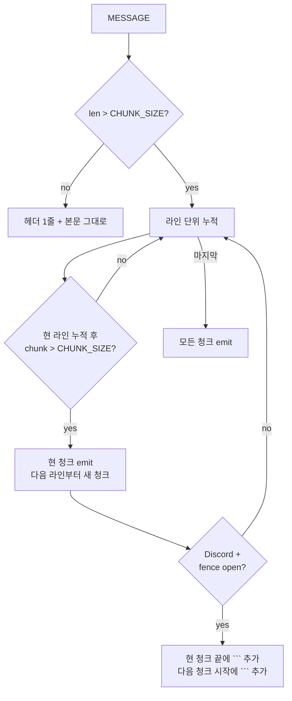

# Implementation Plan: spec-x-notify-chunk-line-aware

## 📋 Branch Strategy

- 신규 브랜치: `spec-x-notify-chunk-line-aware` (브랜치 이름 = spec 디렉토리 이름, `feature/` prefix 없음)
- 시작 지점: `main`
- 첫 task 가 브랜치 생성을 수행함

## 🛑 사용자 검토 필요 (User Review Required)

> [!IMPORTANT]
> - [ ] 라인 경계 후퇴 알고리즘 — 한 라인이 `CHUNK_SIZE` 를 넘는 *예외 케이스* 에서는 그 라인만 단순 절단 fallback. 한국어 한 줄이 1700 코드포인트를 넘는 경우는 드물지만 발생 시 변경 전 동작 (강제 절단) 과 동일.
> - [ ] 코드 펜스 균형은 *Discord 만*. Telegram 은 `markdown_simplify` 가 펜스 라벨을 제거하므로 펜스 균형이 의미 없음. 두 helper 의 분할 로직이 미세하게 다른 이유.

> [!WARNING]
> - [ ] 분할 결과 청크 수가 변경될 수 있음 (라인 경계 후퇴로 청크가 짧아져서 청크 수가 +1 될 가능성). 알림 발송 횟수 +1 의 가능성 — rate limit 영향 미미 (각 helper 가 청크 사이 0.3s sleep).
> - [ ] Discord 펜스 보호 시 추가 ` ``` ` 4글자가 청크 끝/시작에 들어가 청크 본문 실효 길이가 감소. 안전 마진 (`CHUNK_SIZE=1700` vs 2000 한계) 으로 흡수.

## 🎯 핵심 전략 (Core Strategy)

### 아키텍처 컨텍스트



### 주요 결정

| 컴포넌트 | 전략 | 이유 |
|:---:|:---|:---|
| **분할 알고리즘** | `awk` 로 라인 단위 누적, `length($0)+1` 누계가 `CHUNK_SIZE` 초과 직전에 emit | bash 3.2 호환 (mapfile / 배열 인덱싱 불필요). 한 패스로 청크 인덱스 + 본문 모두 처리. |
| **라인 길이 측정** | `awk` 의 `length()` 는 byte 단위 (locale 의존). 본 키트의 한글 메시지가 많아 *코드포인트 단위* 와 mismatch. | 단순화를 위해 byte 누계 사용. `CHUNK_SIZE` 안전 마진 (Discord 1700/2000, Telegram 3800/4096) 이 한글 UTF-8 byte 팽창 (1.5~3x) 을 흡수. 정확도가 필요하면 jq `length` 사용 가능하나 한 라인씩 jq 호출은 비용 큼. |
| **펜스 카운트 (Discord)** | `awk` 누계 중 `/^[[:space:]]*```/` 매칭 라인을 카운트. 홀수면 청크 끝 시점 펜스 open. | Discord `markdown_to_discord` (현재 미호출이지만 보존된) 의 펜스 라인 매칭 패턴과 동일. 한 helper 내 일관성. |
| **헤더 prepend** | 기존 동작 그대로. 각 청크 본문 앞에 `${PREFIX} [${REPO_NAME}] [N/M]\n` prepend. | trailing 으로 옮기는 게 본 spec 범위 외. 청크 식별성 (스크롤 시 헤더가 먼저 보임) 유지. |
| **두 helper 의 분할 로직** | 공통 함수 추출 X. 각 helper 안에 인라인 awk 블록 유지. | helper 별 차이 (펜스 보호 유무, CHUNK_SIZE) 가 명확해야 함. lib/ 공통화는 향후 *더 많은 helper 가 추가될 때* 별도 spec 으로 평가. |
| **bash 3.2+ 호환** | `mapfile` / `${arr[@]}` 패턴 회피. awk 가 청크 본문을 stdout 으로 emit, bash 가 한 청크씩 send. | 본 키트의 모든 스크립트 호환 정책 (`sources/CLAUDE.md`). |
| **`archive/` + merged spec 문서** | 미수정 (동결). | specs/CLAUDE.md 의 머지 후 immutable 원칙. |

### 📑 ADR 후보

- [ ] ADR 가치 있는 결정 있음
- [x] 없음 — helper 내부 구현 디테일. cross-spec 의존성 없음.

## 📂 Proposed Changes

### dispatcher 호출하는 두 helper

#### [MODIFY] `sources/bin/notify-telegram.sh` + `.harness-kit/bin/notify-telegram.sh`

분할 알고리즘을 awk 라인 누적으로 교체.

```text
# 변경 전 (notify-telegram.sh:128-161 chunk loop)
while [ "$i" -lt "$NUM_CHUNKS" ]; do
    START=$(( i * CHUNK_SIZE ))
    END=$(( (i + 1) * CHUNK_SIZE ))
    CHUNK=$(jq -nr --arg s "$MESSAGE" --argjson a $START --argjson b $END '$s[$a:$b]')
    ...
done

# 변경 후 (개념)
# 1. awk 가 MESSAGE 를 라인 단위로 읽으며 누계 byte 가 CHUNK_SIZE 초과 직전마다
#    "===CHUNK==={i}" 같은 sentinel 을 stdout 에 emit.
# 2. bash 가 awk 출력에서 sentinel 로 split 해 각 청크를 순차 send.
# 3. 한 라인이 CHUNK_SIZE 를 넘으면 그 라인 자체를 단순 절단 (현 fallback 보존).
```

awk 블록 (helper 안에 인라인):

```awk
BEGIN { acc = ""; idx = 0; n = 0 }
{
    line_len = length($0) + 1  # +1 for \n
    if (n + line_len > CHUNK_SIZE && acc != "") {
        printf "===CHUNK %d===\n", idx++
        printf "%s", acc
        acc = ""
        n = 0
    }
    if (line_len > CHUNK_SIZE) {
        # 한 라인이 너무 김 — 단순 절단 fallback
        printf "===CHUNK %d===\n", idx++
        printf "%s\n", substr($0, 1, CHUNK_SIZE - 1)
        # 나머지는 다음 청크 시작
        acc = substr($0, CHUNK_SIZE) "\n"
        n = length(acc)
        next
    }
    acc = acc $0 "\n"
    n += line_len
}
END {
    if (acc != "") {
        printf "===CHUNK %d===\n", idx++
        printf "%s", acc
    }
    printf "===CHUNK %d===\n", idx  # 종결 sentinel (개수 계산용)
}
```

#### [MODIFY] `sources/bin/notify-discord.sh` + `.harness-kit/bin/notify-discord.sh`

위 라인 누적 + 펜스 보호 추가.

```awk
BEGIN { acc = ""; idx = 0; n = 0; fence_open = 0 }
{
    line_len = length($0) + 1
    is_fence = ($0 ~ /^[[:space:]]*```/) ? 1 : 0

    if (n + line_len > CHUNK_SIZE && acc != "") {
        # 청크 emit — 펜스가 열려 있으면 닫고, 다음 청크는 ```로 열기
        if (fence_open) {
            acc = acc "```\n"
        }
        printf "===CHUNK %d===\n", idx++
        printf "%s", acc
        if (fence_open) {
            acc = "```\n"  # 다음 청크 시작에 펜스 재오픈
            n = 4  # ```\n = 4 byte
        } else {
            acc = ""
            n = 0
        }
    }

    # 라인 추가
    acc = acc $0 "\n"
    n += line_len
    if (is_fence) {
        fence_open = !fence_open
    }
}
END {
    if (acc != "") {
        printf "===CHUNK %d===\n", idx++
        printf "%s", acc
    }
    printf "===CHUNK %d===\n", idx
}
```

bash 측 처리:

```bash
# awk 가 sentinel 로 구분된 stream 을 만들고, bash 가 awk 출력을 sentinel 로 split
# 각 청크를 헤더와 함께 curl POST.

CHUNKS_RAW=$(printf '%s\n' "$MESSAGE" | awk -v CHUNK_SIZE="$CHUNK_SIZE" '<위 awk 블록>')
NUM_CHUNKS=$(printf '%s' "$CHUNKS_RAW" | grep -c '^===CHUNK ')
NUM_CHUNKS=$(( NUM_CHUNKS - 1 ))  # 종결 sentinel 차감
[ "$NUM_CHUNKS" -lt 1 ] && NUM_CHUNKS=1

i=0
# awk 출력에서 청크 본문만 추출
printf '%s' "$CHUNKS_RAW" | awk -v total="$NUM_CHUNKS" '
    /^===CHUNK [0-9]+===$/ {
        if (cur != "") { printf "%s\x00", cur; cur = "" }
        idx = $2 + 0
        next
    }
    { cur = cur $0 "\n" }
    END { if (cur != "") printf "%s\x00", cur }
' | while IFS= read -r -d '' CHUNK; do
    if [ "$NUM_CHUNKS" -eq 1 ]; then
        HEADER="${PREFIX} [${REPO_NAME}]"
    else
        HEADER="${PREFIX} [${REPO_NAME}] [$((i + 1))/${NUM_CHUNKS}]"
    fi
    FULL_MESSAGE="${HEADER}
${CHUNK}"
    # ... curl POST 그대로
    i=$((i + 1))
done
```

> **주의**: bash 의 `read -r -d ''` 는 bash 3.2 에서 동작. `mapfile` / `readarray` 미사용.

## 🧪 검증 계획 (Verification Plan)

### 단위 테스트

본 키트엔 shell unit test 프레임워크 없음 — 수동 검증 시나리오로 대체.

### 수동 검증 시나리오

각 시나리오는 두 helper 모두 검증. helper 가 실제 channel 로 발송하지 않게 .env 미설정 환경에서 검증하거나, dry-run mode 가 없으므로 stub helper / mock curl 로 본문 확인.

가장 단순한 방법: 두 helper 의 분할 알고리즘 부분만 stub 로 빼서 stdout 출력 확인.

1. **단일 청크 회귀** — 본문 100자 짧은 메시지 → 헤더 1줄 + 본문 그대로, NUM_CHUNKS=1.
2. **라인 경계 후퇴 (Telegram)** — 4000자 본문 (라인 50줄, 평균 80자) → 라인 경계로만 분할되어 단어 끊김 없음. NUM_CHUNKS=2.
3. **라인 경계 후퇴 (Discord)** — 2000자 본문 (라인 30줄) → 라인 경계로만 분할. NUM_CHUNKS=2.
4. **펜스 보호 (Discord)** — 본문 안에 ```` ```sql ```` 블록이 청크 경계에 걸리는 케이스 → 청크 1 끝에 ```` ``` ````, 청크 2 시작에 ```` ``` ```` 자동 추가.
5. **펜스 무손상 (Telegram)** — Telegram 은 `markdown_simplify` 가 펜스 라인을 제거하므로 펜스 균형 보호 X. 결과: 변경 전과 동일하게 펜스 없는 plain text 청크.
6. **한 라인 > CHUNK_SIZE fallback** — 한 라인이 1700 (Discord) / 3800 (Telegram) 초과 → 그 라인만 강제 절단. 현 동작과 동일.
7. **빈 본문 / 1 라인 본문** — exit 정상, 단일 청크.

### 통합 테스트

Required = no.

### 동기화 검증

- `diff sources/bin/notify-telegram.sh .harness-kit/bin/notify-telegram.sh` → 0줄
- `diff sources/bin/notify-discord.sh .harness-kit/bin/notify-discord.sh` → 0줄

## 🔁 Rollback Plan

- 분할 알고리즘 변경만 — `git revert <commit>` 로 즉시 단순 절단 동작 복원.
- 청크 sentinel 기반 새 알고리즘에 버그 발견 시 라인 누적 awk 블록만 빼내 단순 절단으로 일시 회귀 가능 (helper 내부 swap).

## 📦 Deliverables 체크

- [ ] task.md 작성 (다음 단계)
- [ ] 사용자 Plan Accept 받음
- [ ] (실행 후) 모든 task 완료
- [ ] (실행 후) walkthrough.md / pr_description.md ship
