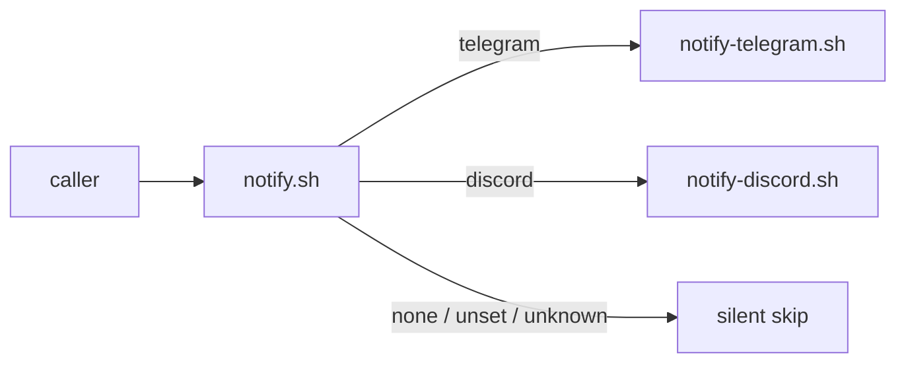

# Implementation Plan: spec-x-notify-launcher-only

## 📋 Branch Strategy

- 신규 브랜치: `spec-x-notify-launcher-only` (브랜치 이름 = spec 디렉토리 이름, `feature/` prefix 없음)
- 시작 지점: `main`
- 첫 task 가 브랜치 생성을 수행함

## 🛑 사용자 검토 필요 (User Review Required)

> 본 Plan 을 Accept 하기 전에 사용자가 명시적으로 확인해야 할 항목들.

> [!IMPORTANT]
> - [ ] `.env.telegram` 만 있고 직접 `claude` 명령으로 세션을 시작하던 사용자는 본 변경 이후 알림이 끊긴다. *이는 의도된 break* — launcher 선택의 명시성을 발송 측 원칙으로 세움. 마이그레이션: `./telegram.sh` / `./discord.sh` 로 전환.
> - [ ] 알 수 없는 `NM_NOTIFY_CHANNEL` 값 입력 시 이전엔 telegram fallback 으로 자동 흡수되었으나, 이후엔 silent skip. 오타 / 잘못된 launcher 설정이 silent 로 사라지지만 *의도 미명시* 와 동일 취급.
> - [ ] 이미 merged 된 spec 문서 (`spec-x-notify-drop-both` 의 "telegram fallback (역호환)" 주석 등) 와 `archive/` 의 fallback 언급은 *동결* — 사후 수정 금지 (specs/CLAUDE.md 원칙).

> [!WARNING]
> - [ ] 본 변경은 **behavior change**: 미설정 → 이전엔 telegram fallback, 이후엔 silent skip.
> - [ ] 변경된 동작에 대한 신호는 ADR-004 amendment + walkthrough 문서로만 제공 (코드 상 deprecation 경고 없음 — bash 스크립트 단순성 우선).

## 🎯 핵심 전략 (Core Strategy)

### 아키텍처 컨텍스트



### 주요 결정

| 컴포넌트 | 전략 | 이유 |
|:---:|:---|:---|
| **`notify.sh` default** | `${NM_NOTIFY_CHANNEL:-telegram}` → `${NM_NOTIFY_CHANNEL:-none}` 으로 변경. | launcher 가 명시 export 한 경우에만 발송. 직접 `claude` 실행 = silent skip. 발송 측 의도가 환경변수 명시 설정 한 가지로 좁혀짐. |
| **알 수 없는 값 fallback** | 기존 `*) telegram` → silent skip (`:` 또는 명시 `none` 분기 통합). | 오타/잘못된 설정도 *의도 미명시* 와 동일 취급. 의도하지 않은 채널로 흘러가지 않음. |
| **명시적 값 (`telegram` / `discord` / `none`)** | 기존 동작 그대로 유지. | 본 변경은 default 와 unknown 만 해당. 명시 값은 의도 표현으로 존중. |
| **dispatcher 헤더 주석** | 라우팅 표 갱신: 미설정 = none = silent skip, 알 수 없는 값 = silent skip. "직접 claude 실행 시 미설정 → telegram 기본 (역호환)" 안내 제거. | 향후 코드 리딩 시 *왜 silent skip 인지* 즉시 추적 가능. |
| **launcher 스크립트** | 미수정 (`telegram.sh` / `discord.sh` 가 이미 `NM_NOTIFY_CHANNEL` 을 명시 export). | 본 변경은 *launcher 가 항상 명시한다는 전제* 위에 default 를 좁히는 것. launcher 측 변경 불필요. |
| **ADR-004 Amendment** | 기존 양방향 컨벤션의 *발송 측 명시성 원칙* 으로 한 절 추가 (5-8줄). 새 ADR 생성 안 함. | ADR-004 가 양방향 알림 컨벤션. 본 변경은 발송 측 의도 표현 원칙 — 같은 ADR 의 연속 amendment 가 자연스러움. |
| **`archive/` + merged spec 문서** | 미수정 (동결). | specs/CLAUDE.md 의 머지 후 immutable 원칙 + grep false-positive 보존소 정책. |

### 📑 ADR 후보

- [x] ADR 가치 있는 결정 있음 → 후보 한 줄 요약: 기존 **ADR-004 의 Amendment 절에 추가** (type: convention)
- [ ] 없음

## 📂 Proposed Changes

### dispatcher (도그푸딩 동기화 단위)

#### [MODIFY] `sources/bin/notify.sh` + `.harness-kit/bin/notify.sh`

default 와 unknown 값 fallback 을 silent skip 으로 전환 + 헤더 주석 갱신.

```text
# 변경 전 (notify.sh:38, 47-55)
CHANNEL="${NM_NOTIFY_CHANNEL:-telegram}"

case "$CHANNEL" in
    telegram) call_helper "notify-telegram.sh" ;;
    discord)  call_helper "notify-discord.sh" ;;
    none)     : ;;
    *)
        # 알 수 없는 값 (과거 'both' 포함) 은 telegram 으로 fallback (방어적 기본값)
        call_helper "notify-telegram.sh"
        ;;
esac

# 변경 후
CHANNEL="${NM_NOTIFY_CHANNEL:-none}"

case "$CHANNEL" in
    telegram) call_helper "notify-telegram.sh" ;;
    discord)  call_helper "notify-discord.sh" ;;
    none)     : ;;
    *)
        # 알 수 없는 값은 silent skip — launcher 가 명시한 채널만 발송 (spec-x-notify-launcher-only)
        : ;;
esac
```

헤더 주석 (line 11-22) — 라우팅 표 + 주석 정정:

```text
# 변경 전
# 채널 라우팅 (환경변수 NM_NOTIFY_CHANNEL):
#   미설정 또는 telegram      → notify-telegram.sh 만 호출
#   discord                   → notify-discord.sh  만 호출
#   none                      → 발송 안 함 (silent skip)
#   기타 값 (예: 과거 'both') → telegram fallback (역호환)
#
# 채널은 보통 launcher 가 export (예: telegram.sh / discord.sh).
# 직접 claude 실행 시 미설정 → telegram 기본 (역호환).

# 변경 후
# 채널 라우팅 (환경변수 NM_NOTIFY_CHANNEL):
#   telegram                  → notify-telegram.sh 호출
#   discord                   → notify-discord.sh  호출
#   none / 미설정 / 알 수 없는 값 → 발송 안 함 (silent skip)
#
# 채널은 launcher 가 export (예: telegram.sh / discord.sh — NM_NOTIFY_CHANNEL=telegram/discord).
# 직접 claude 실행 시 미설정 → silent skip (spec-x-notify-launcher-only 이후).
# 발송 측 명시성 원칙 — launcher 가 채널을 명시 선언했을 때만 발송.
```

### ADR 갱신

#### [MODIFY] `docs/decisions/ADR-004-notification-twofold-decision-flow.md`

기존 Amendments 절 끝에 새 amendment 추가:

```text
### 2026-05-29 (spec-x-notify-launcher-only)

**발송 측 명시성 원칙 — launcher 가 명시 선언한 경우만 발송**

**배경**: 이전 정책은 `NM_NOTIFY_CHANNEL` 미설정 시 telegram fallback. launcher (`./telegram.sh` / `./discord.sh`) 선택의 명시성이 발송 정책에 반영되지 않음 — `.env.telegram` 만 있어도 직접 `claude` 실행이 발송 결과를 만들어 의도 불투명.

**결정**: `notify.sh` 의 default 를 `telegram` → `none` 으로 전환. 알 수 없는 값 fallback 도 silent skip. launcher 가 `NM_NOTIFY_CHANNEL=telegram` / `discord` 를 명시 export 한 경우에만 발송. 발송 측 의도 표현이 환경변수 명시 설정 한 가지로 좁혀짐. ADR-004 의 응답 측 단일 소스 원칙과 *대칭* 되는 발송 측 명시성 원칙.

**관련 spec**: `specs/spec-x-notify-launcher-only/` — dispatcher default 전환.

**상태**: Accepted (2026-05-29, spec-x-notify-launcher-only 머지 시점).
```

## 🧪 검증 계획 (Verification Plan)

### 단위 테스트 (필수)

본 변경은 bash dispatcher 의 default + fallback 정책 변경. 별도 단위 테스트 프레임워크 없음 — *수동 검증 시나리오* (아래) 로 대체.

### 통합 테스트

Required = no. 통합 테스트 미실시.

### 수동 검증 시나리오

각 시나리오는 sources/ 와 .harness-kit/ 양쪽에서 동일하게 동작해야 함. helper 호출 여부는 `bash -x` 또는 helper 내부 stub (echo) 으로 확인.

1. **telegram 명시** — `NM_NOTIFY_CHANNEL=telegram bash .harness-kit/bin/notify.sh "test" info`
   - 기대 결과: `notify-telegram.sh` 호출. helper 가 .env.telegram 부재로 silent skip 이어도 exit 0.
2. **discord 명시** — `NM_NOTIFY_CHANNEL=discord bash .harness-kit/bin/notify.sh "test" info`
   - 기대 결과: `notify-discord.sh` 호출.
3. **none 명시** — `NM_NOTIFY_CHANNEL=none bash .harness-kit/bin/notify.sh "test" info`
   - 기대 결과: 어느 helper 도 호출되지 않음. exit 0.
4. **미설정 (behavior change)** — `unset NM_NOTIFY_CHANNEL; bash .harness-kit/bin/notify.sh "test" info`
   - 기대 결과: silent skip. 변경 전엔 telegram fallback, 변경 후엔 어느 helper 도 호출되지 않음. exit 0.
5. **알 수 없는 값 (behavior change)** — `NM_NOTIFY_CHANNEL=unknown bash .harness-kit/bin/notify.sh "test" info`
   - 기대 결과: silent skip. 변경 전엔 telegram fallback, 변경 후엔 어느 helper 도 호출되지 않음. exit 0.
6. **launcher 회귀** — `./telegram.sh` / `./discord.sh` 의 첫 몇 줄을 점검하여 `export NM_NOTIFY_CHANNEL=telegram` / `discord` 가 그대로 있음을 확인. 본 변경의 *전제* 가 깨지지 않았음을 보장.

### 동기화 검증

`diff sources/bin/notify.sh .harness-kit/bin/notify.sh` → 0 줄 (동일).

## 🔁 Rollback Plan

- 모든 변경은 단순 텍스트 / default 값 변경. `git revert <commit>` 로 즉시 복원 가능.
- ADR-004 amendment 만 잘못된 경우 amendment 절만 별도 revert / 정정 PR.
- 본 변경 이후 알림이 끊긴 사용자 사례 발견 시 마이그레이션 안내: 직접 `claude` 대신 `./telegram.sh` / `./discord.sh` 사용.

## 📦 Deliverables 체크

- [ ] task.md 작성 (다음 단계)
- [ ] 사용자 Plan Accept 받음
- [ ] (실행 후) 모든 task 완료
- [ ] (실행 후) walkthrough.md / pr_description.md ship
