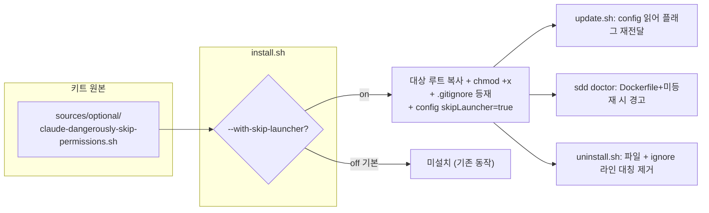

# Implementation Plan: spec-x-skip-perms-launcher

## 📋 Branch Strategy

- 신규 브랜치: `spec-x-skip-perms-launcher` (브랜치 이름 = spec 디렉토리 이름, `feature/` prefix 없음)
- 시작 지점: `main`
- 첫 task 가 브랜치 생성을 수행함

## 🛑 사용자 검토 필요 (User Review Required)

> 본 Plan 을 Accept 하기 전에 사용자가 명시적으로 확인해야 할 항목들.

> [!IMPORTANT]
> - [ ] **`.dockerignore` 처리 방식**: install 이 직접 `.dockerignore` 에 쓰지 않고, `sdd doctor` 가 "런처 설치 + Dockerfile 존재 + 미등재" 시 **경고**한다 (기존 `.harness-kit/` 컨벤션과 동일). 런처는 어차피 `.gitignore` 대상이라 clean CI 체크아웃에는 존재하지 않아 빌드 컨텍스트가 기본 안전하다. *install 이 `.dockerignore` 를 직접 자동 기록하길 원하시면 여기서 변경*.
> - [ ] **런처는 대상 repo 에 커밋하지 않음** (`.gitignore` 등재). 팀 공유가 목적이라면 변경 필요.
> - [ ] **명명 확정**: 플래그 `--with-skip-launcher`, config 키 `skipLauncher`, 런처 파일명 `claude-dangerously-skip-permissions.sh`.

> [!WARNING]
> - [ ] **보안 함의**: 본 런처는 Claude Code 의 권한 확인을 전면 우회한다. opt-in + gitignore 로 노출을 최소화하나, 설치를 선택한 사용자 본인이 위험을 인지해야 한다.

## 🎯 핵심 전략 (Core Strategy)

### 아키텍처 컨텍스트



### 주요 결정

| 컴포넌트 | 전략 | 이유 |
|:---:|:---|:---|
| **런처 위치** | `sources/optional/` (`sources/root/` 와 분리) | `sources/root/*.sh` 는 §12b 에서 무조건 glob 설치됨 → 분리해야 opt-in 보장 |
| **설치 트리거** | `--with-skip-launcher` (기본 off) | 거버넌스 키트가 권한 우회를 기본값으로 배포하지 않음 (기존 사용자 영향 0) |
| **커밋 차단** | 대상 `.gitignore` 의 `# harness-kit` 블록에 등재 | 팀원 무심코 실행/커밋 방지. clean CI 체크아웃에서 부재 → Docker 기본 안전 |
| **선택 영속화** | `harness.config.json` 의 `skipLauncher` | `update.sh` 가 보존 (기존 `gitignore` 보존 패턴 재사용) |
| **`.dockerignore`** | install 자동기록 X, `sdd doctor` 경고 O | 기존 `.harness-kit/` 점검과 동일 패턴 (일관성) + gitignore 로 안전 이미 확보 |
| **대칭 제거** | uninstall 백업(L61)/제거(L86)/awk(L159~) 패턴 추가 | ADR-005 orphan 방지 — install 이 추가한 ignore 라인은 uninstall 이 제거 |

### 📑 ADR 후보

- [ ] ADR 가치 있는 결정 있음
- [x] 없음 (기존 ADR-005 + dockerignore 컨벤션 재사용, walkthrough 근거 기록으로 충분)

## 📂 Proposed Changes

### 런처 원본

#### [NEW] `sources/optional/claude-dangerously-skip-permissions.sh`
권한 확인 우회 실행 런처. 한국어 헤더 + `set -euo pipefail` + `exec claude --dangerously-skip-permissions "$@"`.

```bash
#!/usr/bin/env bash
# Claude Code 를 권한 확인 절차 없이 실행하는 로컬 런처 (opt-in, 개인 편의용)
set -euo pipefail
exec claude --dangerously-skip-permissions "$@"
```

### install.sh

#### [MODIFY] `install.sh`
- 기본값 영역: `HK_SKIP_LAUNCHER=0` 추가.
- arg 파싱 case(L64~): `--with-skip-launcher) HK_SKIP_LAUNCHER=1 ;;` 추가. `-h|--help` 헤더 주석(L2-17)에도 옵션 한 줄 추가.
- 신규 섹션(§12c, §12b 직후): `HK_SKIP_LAUNCHER=1` 이면 `sources/optional/*.sh` 를 대상 루트로 `do_cp` + `chmod +x`. dry-run 분기 포함.
- §16 `.gitignore`: `HK_SKIP_LAUNCHER=1` 일 때 `_gi_ensure '^/claude-dangerously-skip-permissions\.sh$' '/claude-dangerously-skip-permissions.sh'` 추가 (블록 내, 기존 라인 뒤).
- §17 `harness.config.json`: `_sl_bool` 계산 후 두 printf 분기에 `"skipLauncher":%s` 추가.
- §4 설치 계획 출력: 런처 항목을 조건부 한 줄 표기.

### update.sh

#### [MODIFY] `update.sh`
- config 읽기 영역(L63~, gitignore 보존 직후): `skipLauncher` 를 읽어 `HK_SKIP_LAUNCHER_ARG="--with-skip-launcher"` 또는 빈 값 설정.
- install.sh 재호출(L141): `$HK_SKIP_LAUNCHER_ARG` 추가 전달.

### uninstall.sh

#### [MODIFY] `uninstall.sh`
- 백업 목록(L61): `claude-dangerously-skip-permissions.sh` 추가.
- 루트 런처 제거 목록(L86): `claude-dangerously-skip-permissions.sh` 추가.
- `.gitignore` awk(L159~): `inblk==1 && /^\/claude-dangerously-skip-permissions\.sh$/ { next }` 규칙 추가 (대칭).

### sdd doctor

#### [MODIFY] `sources/bin/sdd` (+ 설치본 `.harness-kit/bin/sdd` 는 install 로 동기화)
- dockerignore 점검(L2238~) 인접: 런처 파일이 대상 루트에 존재 + Dockerfile 존재 + `.dockerignore` 에 런처 미등재 시 `_doc_warn`. 기존 `.harness-kit` 관대 패턴과 동일 스타일.

### 문서

#### [MODIFY] `README.md`
- 설치 옵션 표/문단에 `--with-skip-launcher` 설명 + 보안 주의 + 컨테이너 빌드 가이드에 런처 `.dockerignore` 항목 안내.

#### [MODIFY] `CHANGELOG.md`
- 본 spec 변경 요약 1 항목 추가.

## 🧪 검증 계획 (Verification Plan)

### 단위 테스트 (필수)
```bash
# 신규 테스트 (본 spec 의 핵심 검증)
bash tests/test-skip-launcher.sh

# 회귀 — 영향받는 기존 테스트
bash tests/test-gitignore-config.sh
bash tests/test-gitignore-idempotent.sh
bash tests/test-install-layout.sh
bash tests/test-doctor-ignore-coverage.sh
bash tests/test-uninstall-cmd-list.sh
bash tests/test-update-stateful.sh
```

신규 `tests/test-skip-launcher.sh` 시나리오 (기존 `test-gitignore-config.sh` 패턴 + `tests/lib/fixture.sh`):
- **A** install (플래그 없음) → 런처 파일 부재 + config `skipLauncher=false`
- **B** install `--with-skip-launcher` → 런처 존재 + 실행권한 + `.gitignore` 에 `/claude-...sh` 1회 + config `skipLauncher=true`
- **C** `--with-skip-launcher` 재설치 멱등 → `.gitignore` 라인 정확히 1회
- **D** update (B 설치본) → 런처·config·gitignore 보존
- **E** uninstall (B 설치본) → 런처 파일 제거 + `.gitignore` 런처 라인 제거 (헤더/타 라인 잔존 검증)
- **F** doctor: 런처 설치 + Dockerfile 존재 + `.dockerignore` 미등재 → WARN / 등재 → PASS

### 통합 테스트
Integration Test Required = no. 위 bash 테스트가 install/update/uninstall/doctor 전 경로를 커버.

### 수동 검증 시나리오
1. `bash install.sh --yes --with-skip-launcher tests/fixtures/_run` — 기대: 루트에 런처 생성, `.gitignore` 에 등재, config `skipLauncher=true`.
2. `bash install.sh --yes tests/fixtures/_run` (플래그 없음) — 기대: 런처 미생성.
3. 설치 후 `./claude-dangerously-skip-permissions.sh --help` 모킹 불가 시 `cat` 으로 내용 확인 — 기대: `exec claude --dangerously-skip-permissions "$@"`.

## 🔁 Rollback Plan

- 모든 변경이 키트 원본(`sources/`, `install.sh`, `update.sh`, `uninstall.sh`, `sources/bin/sdd`, 문서)에 한정. 브랜치 revert 로 완전 원복.
- 대상 프로젝트 영향: 플래그 기본 off 라 미사용 시 변경 없음. 이미 설치한 사용자는 다음 update 시 config 의 `skipLauncher` 부재 → false 로 간주(미설치 유지).
- 데이터/상태 영향 없음 (런타임 state 무관).

## 📦 Deliverables 체크

- [ ] task.md 작성 (다음 단계)
- [ ] 사용자 Plan Accept 받음
- [ ] (실행 후) 모든 task 완료
- [ ] (실행 후) walkthrough.md / pr_description.md ship
