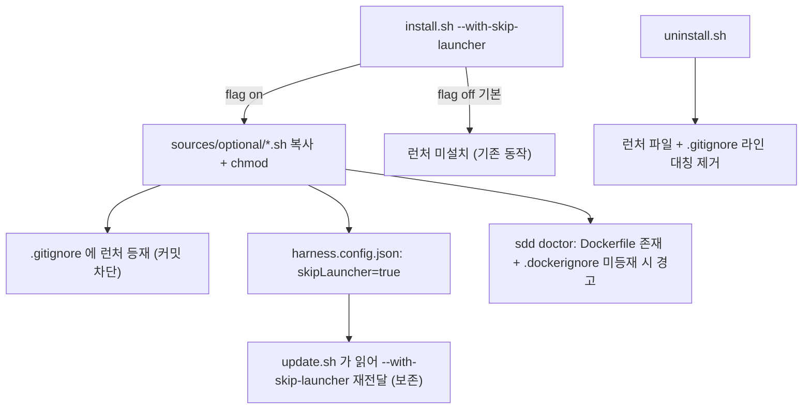

# spec-x-skip-perms-launcher: 권한 우회 런처 opt-in 설치

## 📋 메타

| 항목 | 값 |
|---|---|
| **Spec ID** | `spec-x-skip-perms-launcher` |
| **Phase** | 없음 (spec-x, Phase 비소속) |
| **Branch** | `spec-x-skip-perms-launcher` |
| **상태** | Planning |
| **타입** | Feature (소규모, install 메커니즘) |
| **Integration Test Required** | no (기존 `tests/test-*.sh` 가 본 spec 의 검증 수단) |
| **작성일** | 2026-06-02 |
| **소유자** | Leo |

## 📋 배경 및 문제 정의

### 현재 상황
- 키트는 `sources/root/*.sh` 를 install.sh §12b 에서 glob 으로 대상 루트에 무조건 복사한다 (현재 `telegram.sh`, `discord.sh`). `update.sh` 는 `install.sh` 를 재호출(line 141)하므로 update 시에도 자동 반영된다.
- 루트 런처는 대상 repo 에 **커밋된다**. install.sh §16 의 `.gitignore` 관리 대상은 `.harness-kit/`, `.env.*`, 백업 등으로 한정되며 루트 런처는 미포함이다.
- `.dockerignore` 는 `sdd doctor`(sources/bin/sdd line 2238~)가 "Dockerfile 존재 시 `.harness-kit/` 등재 여부"만 **경고**한다. 키트가 `.dockerignore` 를 직접 쓰지는 않는다.

### 문제점
- 사용자는 `claude --dangerously-skip-permissions` 를 빠르게 띄우는 런처를 원한다.
- 그러나 이 키트는 **거버넌스/신뢰성 레이어**다. 권한 우회 런처를 `sources/root/` 에 그대로 넣으면 **모든 대상 프로젝트에 기본 설치 + repo 에 커밋**되어, 키트를 설치한 누구나 권한 시스템을 한 명령으로 우회할 수 있게 된다. 키트 취지와 정면 충돌하고, 팀원이 무심코 실행하거나 Docker 빌드 컨텍스트에 유입될 위험이 있다.

### 해결 방안 (요약)
런처를 `sources/root/` 와 분리된 `sources/optional/` 에 두고, install.sh 의 **명시 플래그 `--with-skip-launcher`(기본 off)** 로만 설치한다. 설치 시 대상 `.gitignore` 에 등재해 커밋을 차단하고, 선택 여부를 `harness.config.json` 에 영속화해 `update.sh` 가 보존한다. Docker 빌드 컨텍스트 유입은 기존 `.harness-kit/` 컨벤션과 동일하게 `sdd doctor` **경고**로 안내한다.

## 📊 개념도 (선택)

## 🎯 요구사항

### Functional Requirements
1. `sources/optional/claude-dangerously-skip-permissions.sh` 런처 원본을 추가한다. 내용은 `exec claude --dangerously-skip-permissions "$@"` (bash shebang, 한국어 헤더, `set -euo pipefail`).
2. install.sh 에 `--with-skip-launcher` 플래그를 추가한다 (기본 `HK_SKIP_LAUNCHER=0`).
3. 플래그가 **켜진 경우에만** `sources/optional/*.sh` 를 대상 루트로 복사 + `chmod +x` 한다. 꺼진 경우 런처는 설치되지 않는다.
4. 런처 설치 시 대상 `.gitignore` 의 `# harness-kit` 블록에 `/claude-dangerously-skip-permissions.sh` 를 라인 멱등 등재한다 (커밋 차단).
5. 선택 여부를 `harness.config.json` 에 `skipLauncher: true/false` 로 기록한다.
6. `update.sh` 는 `harness.config.json` 의 `skipLauncher` 를 읽어, 이전에 켜져 있었으면 `--with-skip-launcher` 를 install.sh 에 전달해 **선택을 보존**한다 (기존 `gitignore` 보존 패턴과 동일).
7. `uninstall.sh` 는 런처 파일과 `.gitignore` 등재 라인을 **대칭 제거**한다 (백업 목록 line 61 + 제거 목록 line 86 + `.gitignore` awk line 159~ 에 패턴 추가).
8. `sdd doctor` 는 "런처가 설치되어 있고 Dockerfile 이 존재하는데 `.dockerignore` 에 런처가 미등재" 인 경우 경고한다 (기존 `.harness-kit/` 점검과 동일한 관대 패턴, 경고 전용).

### Non-Functional Requirements
1. **기본 비활성**: 플래그 없이 install/update 하면 런처는 절대 설치되지 않는다 (기존 사용자 영향 0).
2. **멱등성**: 재설치/다중 update 후에도 `.gitignore` 라인이 정확히 1회 유지된다 (기존 멱등 테스트 패턴 준수).
3. **대칭성 (ADR-005)**: install 이 추가하는 모든 ignore 라인은 uninstall 이 제거해야 한다. 누락 시 orphan 잔재 발생.
4. **bash 3.2 호환** + `set -euo pipefail` (CLAUDE.md 작업 원칙 §3).

## 🚫 Out of Scope
- `telegram.sh`/`discord.sh` 등 기존 루트 런처의 `.dockerignore` 커버리지 확장 (동일 갭이나 별도 항목 — Icebox 기록).
- install.sh 가 `.dockerignore` 파일을 **직접 생성/수정**하는 방식 (본 spec 은 doctor 경고 방식 채택 — plan.md 주요 결정 참조).
- `sources/root/` 의 무조건 glob 설치 메커니즘 자체 변경.
- 런처에 권한 우회 외 기능(로깅, 프로파일 선택 등) 추가.

## 📑 ADR 후보 (Architecture Decision Records)

> 본 spec 의 `.dockerignore` 처리 방식(install 자동 기록 vs doctor 경고)은 키트의 ignore 관리 컨벤션에 닿는 결정이나, 기존 `.harness-kit/` 점검과 **동일 패턴(doctor 경고)** 을 따르므로 신규 ADR 없이 walkthrough 에 근거 기록으로 충분하다고 판단.

- [ ] ADR 가치 있는 결정 있음
- [x] 없음 (기존 ADR-005 대칭 등록 원칙 + 기존 dockerignore 컨벤션 재사용)

## 🔍 Critique 결과 (선택)

<!-- /hk-spec-critique 미실행. 필요 시 Plan Accept 전에 호출 가능. -->

## ✅ Definition of Done

- [ ] 모든 단위 테스트 PASS (`tests/` 의 install/update/uninstall/doctor 관련)
- [ ] 플래그 유무별 설치 동작 검증 (off=미설치, on=설치+chmod+gitignore)
- [ ] update 후 `skipLauncher` 선택 보존 검증
- [ ] uninstall 후 런처 파일·gitignore 라인 잔재 0 검증
- [ ] `walkthrough.md` 와 `pr_description.md` 작성 및 ship commit
- [ ] `spec-x-skip-perms-launcher` 브랜치 push 완료
- [ ] 사용자 검토 요청 알림 완료
