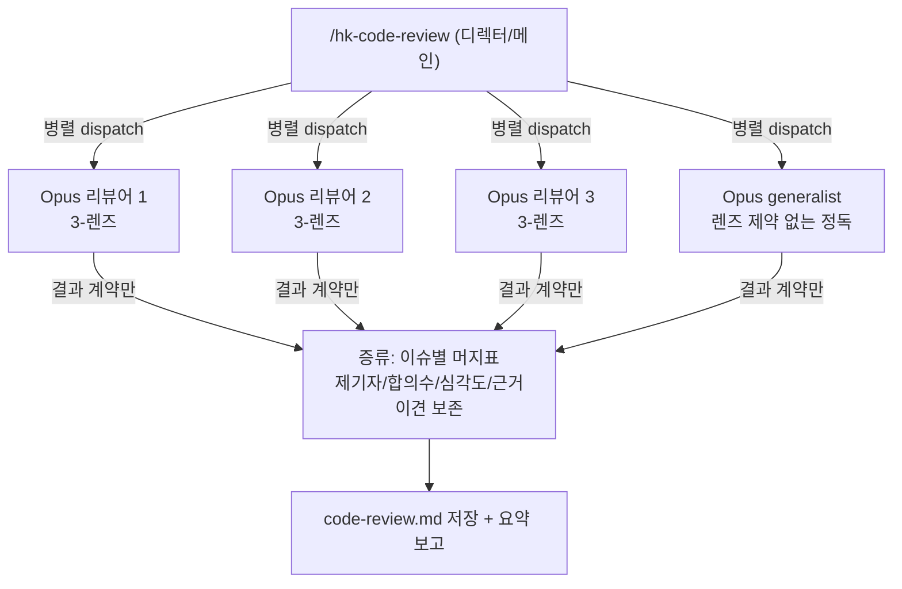

# Implementation Plan: spec-x-review-b1-default

## 📋 Branch Strategy

- 신규 브랜치: `spec-x-review-b1-default` (브랜치 이름 = spec 디렉토리 이름, `feature/` prefix 없음)
- 시작 지점: `main`
- 첫 task(Task 1)가 브랜치 생성을 수행함

## 🛑 사용자 검토 필요 (User Review Required)

> 본 Plan 을 Accept 하기 전에 사용자가 명시적으로 확인해야 할 항목들.

> [!IMPORTANT]
> - [ ] **기본 리뷰 비용 1→4 서브에이전트** — B1 은 Opus×3(self-consistency) + generalist×1. ship 마다 도는 기본 게이트 비용 4배. **깊이 회복 주역은 generalist(강근거), N=3 self-consistency 는 약근거 기본값**(#48 분리 미측정 / 외부 문헌상 frontier 증분 작음). 수용? (적응형 N 은 NFR4 문서 옵션, 본 spec 미구현)
> - [ ] **범위 = `hk-code-review` 단독** — `hk-phase-review` 는 Out of Scope(미검증 + 비용). phase 회고도 B1 으로 묶기를 원하면 지금 지정. (권장: 단독 유지)
> - [ ] **페르소나 opt-in 위치 = `hk-code-review.md` 내 섹션** — 별도 doc 파일 대신 커맨드 co-location. (권장: co-location — 발견성↑)

> [!WARNING]
> - [ ] **거버넌스 본문 무변경** — constitution/agent.md 미수정. §6.3 의 "`/hk-code-review` (Opus)" 표기는 B1 도 Opus 라 유효. 불변식은 ADR 로만 외부화.

## 🎯 핵심 전략 (Core Strategy)

### 아키텍처 컨텍스트



### 주요 결정

| 컴포넌트 | 전략 | 이유 |
|:---:|:---|:---|
| **리뷰어** | 기존 3-렌즈 프롬프트를 Opus×3 self-consistency 로 | 비결정성 보정 보조 lever — 독립 실행이 서로 다른 이슈 표면화. **N=3 은 약근거 기본값**(generalist 가 진짜 win) |
| **generalist** | 렌즈 제약 없는 정독 1패스(Opus) 신규 | 깊이 lever(강근거) — 단일 리뷰어가 놓친 구체 impl/locale/엣지 회복(#48 두 표본 PASS) |
| **반환** | 결과 계약 `{issue,severity,rationale,source}` only. source enum=`spec대비\|품질\|테스트\|정독` | ADR-010 정합 — transcript 재흡수 금지, context 격리 |
| **증류** | 디렉터가 이슈별 머지표 통합 + **조작적 정의**(dedup/합의/심각도충돌/이견보존) | 재현성 — 규칙 없으면 매 실행 디렉터 재량으로 합의 분포 흔들림(critique blocking 갭) |
| **fallback** | 부분 반환(k/4)도 증류 진행, 합의 분모=k, 미반환 명시 | ship 게이트는 부분 결과로도 동작 필요 |
| **독립성 분담** | 동일-모델 self-consistency 한계 → cross-model(`hk-gemini-review`)이 분담 | PoLL 문헌: 동일 모델 N회는 correlated blind spot. ADR-014 포섭 |
| **페르소나** | opt-in 문서화(미구현, 수동 dispatch) | #48 = 폭 지배 리뷰 한정 순기여. 블랭킷 채택은 ROI 음 |
| **불변식** | ADR-013/014 (type: invariant) | #48 방법론 교훈 자산화 — 향후 리뷰 변경 시 순환 평가 차단 |

### 📑 ADR 후보

- [x] ADR 가치 있는 결정 있음:
  - `review-value-baseline` (type: `invariant`) → `docs/decisions/ADR-013-review-value-baseline.md`
  - `review-eval-independence` (type: `invariant`) → `docs/decisions/ADR-014-review-eval-independence.md`
- [ ] 없음

## 📂 Proposed Changes

### 리뷰 커맨드 (B1 메커니즘)

#### [MODIFY] `sources/commands/hk-code-review.md`
"2. 독립 리뷰 수행" 섹션을 B1 dispatch 로 교체:
- 단일 Agent 호출 → **병렬 4 dispatch**(Opus×3 동일 3-렌즈 프롬프트 self-consistency + Opus×1 generalist 정독 프롬프트).
- 각 서브에이전트는 결과 계약(`{issue, severity, rationale, source}`)만 반환(ADR-010 명시). source enum 고정.
- "3. 결과 저장" 앞에 **증류** 단계 추가: dedup/합의/심각도충돌/이견보존 조작적 정의 + 부분실패 fallback.
- 요약 보고에 합의 분포 + 미반환 워커 수 추가.
- 신규 섹션 "## opt-in: 페르소나 패널 (폭 지배 리뷰 한정)" — 언제/어떻게(페르소나 3 수동 dispatch)/미구현 명시/#48 링크.

```text
## 2. B1 리뷰 수행 (self-consistency + generalist 정독)
독립 서브에이전트 4개를 한 메시지에서 병렬 dispatch:
  - 리뷰어 R1~R3 (model: opus): 아래 3-렌즈 프롬프트 동일 (self-consistency), source = spec대비|품질|테스트
  - generalist G (model: opus): 렌즈 제약 없는 전반 정독, 구체 impl/locale/엣지/테스트 갭 집중, source = 정독
각 서브에이전트 반환 = 결과 계약 배열만 (전체 transcript 반환 금지 — ADR-010):
  [{ "issue": "...", "severity": "Critical|Major|Minor", "rationale": "...", "source": "spec대비|품질|테스트|정독" }]

## 3. 증류 (디렉터) — 조작적 정의
- dedup: 동일 이슈 판정 = `파일:라인` 근접 우선, 모호 시 의미 일치 디렉터 판단 → 단일 이슈로 병합.
- 합의 수: dedup 후 (그 이슈 제기 워커 수) / (반환 워커 수 k). 예: 2/4.
- 심각도 충돌: 최고 심각도 채택 + 이견을 별도 행/주석으로 보존.
- 이견 보존(평탄화 금지): 1워커만 제기한 이슈도 표에서 제거 금지.
- fallback: 4 중 일부 실패/빈 반환 → 반환된 k개로 증류 진행, 합의 분모=k, 미반환 워커 명시.
- 머지표: | 이슈 | 제기 워커·source | 합의(N/k) | 심각도 | 근거 |

## 4. 결과 저장 + 보고
- code-review.md 저장(기존 경로).
- 요약: 전체 평가 / Critical·Major·Minor 수 / 합의 분포(`4/4: N건, 3/4: M건, 2/4: K건, 1/4: L건`) / 미반환 워커 수.
```

#### [MODIFY] `.claude/commands/hk-code-review.md`
도그푸딩 미러 — `sources/commands/hk-code-review.md` 와 **byte-identical** 동기화(ADR-003). 같은 commit.

### ADR (불변식 형식화)

#### [NEW] `docs/decisions/ADR-013-review-value-baseline.md`
type: `invariant`, status: accepted. Decision: 다관점/다에이전트 리뷰 기법 도입은 baseline 대비 value 측정을 Go 전제로 한다. **baseline 정의 = *직전 채택된 리뷰 구성*(상대적)** — self-consistency 자체를 baseline 으로 고정하면 self-consistency 의 가치가 무엇 대비 측정되는지 순환(critique 보강). #48 이 블랭킷 페르소나 패널을 이 틀로 기각한 실증 사례.

#### [NEW] `docs/decisions/ADR-014-review-eval-independence.md`
type: `invariant`, status: accepted. Decision: 리뷰 value 측정은 채점자/ground-truth 가 피측정 모델과 독립(cross-model 또는 사람 blind)이어야 한다. **동일-모델 self-consistency 는 독립 채점자가 아님을 명시 포섭**(PoLL/self-preference 문헌) — 그 독립성 결핍을 cross-model(`hk-gemini-review`)이 분담. #48 이 Gemini blind 로 적용해 순환 평가를 피한 사례.

### 테스트 (grep 기반 구조 검증)

#### [NEW] `tests/test-review-b1.sh`
`test-director-protocol.sh` 패턴 차용. 검증:
- C1: `hk-code-review.md` 에 B1 용어(self-consistency / generalist 정독 / 결과 계약 / 증류) 존재.
- C2: 페르소나 opt-in 섹션 존재(폭 지배 / opt-in / 미구현).
- C3: ADR-010 참조 존재(결과 계약 only 근거).
- C4: 미러 parity — `sources/commands/hk-code-review.md` == `.claude/commands/hk-code-review.md`.
- C5: ADR-013 존재 + `type: invariant`.
- C6: ADR-014 존재 + `type: invariant`.
- C7: 증류 조작적 정의 용어(dedup / 합의 / 심각도) 존재 — 재현성 blocking 갭 enforcement.
- C8: fallback 용어(부분 / 미반환 또는 fallback) 존재.

## 🧪 검증 계획 (Verification Plan)

### 단위 테스트 (필수)
```bash
bash tests/test-review-b1.sh
```

### 회귀 확인
```bash
bash tests/test-governance-dedup.sh
```

### 수동 검증 시나리오
1. `hk-code-review.md` 정독 — 4 dispatch + 결과 계약 + 증류 흐름이 모호하지 않게 읽히는가. 기대: 에이전트가 그대로 실행 가능한 지시.
2. `git diff --stat` — 변경이 커맨드 2개(미러) + ADR 2개 + 테스트 1개로 한정. scope creep 없음.
3. 미러 diff — `diff sources/commands/hk-code-review.md .claude/commands/hk-code-review.md` → 차이 0.

## 🔁 Rollback Plan

- 마크다운/테스트만 변경 — `git revert` 로 단순 원복. 런타임 상태/데이터 영향 없음.
- 미반영 시 기존 단일 Opus 리뷰로 즉시 회귀(호출 측 무변경이라 부작용 없음).

## 📦 Deliverables 체크

- [ ] task.md 작성 (다음 단계)
- [ ] 사용자 Plan Accept 받음
- [ ] (실행 후) 모든 task 완료
- [ ] (실행 후) walkthrough.md / pr_description.md ship
